# History of Economic Analysis
[toc]

## Introduction

Within Academia, History of Economic Thought (HET) is today a very specialized field in economics pursued by a group of scholars who publish in technical journals and attend specialized conferences. The field is so special that only a few economics departments at major universities offer a HET course in their curriculum. If they do so, it is usually at the undergraduate level.[^fn1] This view of HET is not recent; according to the great late economist Paul Samuelson (1915-2009), "History of thought was a dying industry" already in 1935 when he began his graduate studies in Chicago. Samuelson also thought that the field of economics "burst to life"  following "the monopolistic competition revolution, the Keynesian macro revolution, the mathematization revolution, and the econometric inference revolution," implying that what existed before these revolutions was not truly alive. More broadly, if economics is a cumulative scientific process, it implies that the present is "the latest and best final thing". If this view is correct, we should start from today's frontier to understand and study economics and not look back at past theories.

 *But is this view correct? Should we focus solely on the current frontier of economics, or is there value in exploring the history of economic ideas?*

Another giant of economics, Joseph Schumpeter (1883-1950), who wrote the seminal "History of Economic Analysis" (1954), offers compelling reasons for studying HET:

> Well, why do we study the history of any science? [...] First, [...] Unless that recent treatise itself presents a minimum of historical aspects, no amount of correctness, originality, rigor, or elegance will **prevent a sense of lacking direction and meaning from spreading among the students** or at least the majority of students.[...] Second, our minds are apt to derive **new inspiration** from the study of the history of science. [...] Third, the highest claim that can be made for the history of any science or of science in general is that it teaches us much about **the ways of the human mind**.

1. Without historical context, students may lack a sense of direction and meaning in their studies.
2. Engaging with the history of economics can inspire new ideas and insights.
3. Studying HET teaches us about the workings of the human mind and the evolution of thought.

Consider, for example, the concept of utility maximization, a cornerstone of modern microeconomics. For a new student, this might seem like an abstract and arbitrary assumption. But by tracing its historical origins and development, we can better understand its rationale and limitations. 

Moreover, in an era of increasing specialization and technical complexity in economics, the history of thought offers a route to a broader, more holistic understanding. As a graduate student, I recall a gifted colleague presenting a cutting-edge growth model that cleverly incorporated Adam Smith's ideas on specialization - ideas he gleaned from directly engaging with "The Wealth of Nations." This example illustrates how a generalist perspective, cultivated through the study of HET, can enrich and expand the scope of modern technical economics.

Studying HET also allows us to engage with primary sources and form our own interpretations, rather than relying solely on secondary accounts. While the writing style of earlier economists can be challenging for modern readers, directly grappling with original texts is invariably rewarding. I have put some of the original citations in the footnotes to reduce their number and make reading these notes somewhat lighter. 
I also think that the exercise of rendering some older ideas into modern mathematical language is useful and fun. On the one hand, the simplified mapping of the older writing into mathematical models (here following Samuelson) permits the gain of precision of simpler mechanisms and ideas and may identify logical errors in the arguments. On the other hand, it acknowledges the loss in complexity and depth, a characteristic of any model. In these notes, I aim to provide a curated selection of key original passages, complemented by explanations and mathematical interpretations that translate core ideas into the language of modern economics using mostly Paul Samuelson small models. As we progress chronologically, the need for mathematical elaboration will diminish, as the original works themselves increasingly employ formal methods.

The overarching goal, to borrow Schumpeter's phrase, is to survey the

>**intellectual efforts** that men have made in order to understand economic phenomena or, which comes to the same thing, the history of the analytic or scientific aspects of economic thought.

We will trace the development of two principal strands of intellectual effort in economics: deduction (first using philosophy, then using mathematics) and induction (first using direct empirical observation, then using statistical analysis).

*So let us embark on this fascinating journey through the history of economic analysis - exploring the key ideas, debates, and figures that shaped the evolution of economic thought, and in doing so, enriching our understanding of the economic forces that shape our world.*

The figures above shows a tree diagram with some of the key thinkers we will encounter. While we won't delve into every author in equal depth, and you may not remember every detail, engaging with these original texts and models will provide a rich understanding of the foundations of economic thought. Models are oriented to economists while students with different background can skip them if they wish so.

## PART I: The Age of Political Economy

The first part of our course is dedicated to the era known as the Age of Political Economy, the precursor to what we now call Economics.

Before diving into the Age of Political Economy, it's essential to understand the intellectual landscape that preceded it. We will begin by examining the ethical and philosophical foundations laid in ancient Greece, which had a lasting impact on economic thought. These early ideas, particularly those of Aristotle, addressed crucial questions such as fair prices, usury, and the role of economics in society. Aristotle's works, including "Politics" and "Nicomachean Ethics," provided a more explicit and systematic treatment of economic issues than earlier thinkers, setting the stage for centuries of debate and development.

Aristotle's ethical precepts on economic matters, such as the concept of a "fair price" and the prohibition of usury, became the bedrock of medieval economic thought in Europe. His ideas were later adopted and expanded upon by influential scholars like Thomas Aquinas, who integrated them into the framework of Christian theology and ethics.

Following this, we will briefly explore the ideas of a few key 17th-century thinkers who paved the way for the emergence of Political Economy. While these examinations will be brief, they will highlight the crucial intellectual shifts that set the stage for the birth of this new field of inquiry.

### Ethics (350 BC - 1500 AD)

**Aristotle (350 BC)** defines *oikonomikos*, the household's management, as having two components. The first component relates to the role of the husband (there was very little space for women in Ancient Greece beyond royalty) in managing the household and acquiring private property, which is composed of instruments (think of capital), and slaves (think of labor). This first component is *natural* (wealth-getting) *ktetike*, the art of becoming rich by producing goods and services.  Let us read our first extract and marvel at the analytical capabilities of Aristotle.         

> Seeing then that the state is made up of households, before speaking of the state we must speak of the **management of the household**. The parts of household management correspond to the persons who compose the household, and a complete household consists of slaves and freemen. Now we should begin by examining everything in its fewest possible elements; and the first and fewest possible parts of a family are master and slave, husband and wife, father and children. We have therefore to consider what each of these three relations is and ought to be: I mean the relation of master and servant, the marriage relation, and thirdly, the procreative relation. And there is another element of a household, the so-called **art of getting wealth**, which, according to some, is identical with household management, according to others, a principal part of it; the nature of this art will also have to be considered by us.
*Politics Book I-III*

In this passage from his "Politics," Aristotle is setting out his view of the proper management of a household, which he sees as the foundation of the state. 

1. Aristotle asserts that the state is composed of households, so to understand the state, we must first understand household management.

2. He identifies the key relationships within a household: master and slave, husband and wife, and father and children. Aristotle believes each of these relationships has a natural hierarchy and proper roles that need to be understood.

3. Aristotle introduces the idea of the "art of getting wealth" or "chrematistike" in Greek. This is the economic aspect of household management. 

4. There was debate even then about whether wealth-getting was the same as household management or just a part of it. Aristotle flags this as an issue to be investigated.

5. The mention of "slaves and freemen" and the "master and slave" relationship reflects the fact that slavery was a fundamental part of the ancient Greek household and economy.

Overall, Aristotle is laying out a framework for analyzing the household as an economic and social unit, and flagging key issues he will discuss, such as the proper roles and relationships within a household, and the place of wealth-getting or economic activity in household management. This focus on the household as the foundation of the state and economics is a distinctively Aristotelian perspective that would shape thinking for centuries.

> Property is a part of the household, and **the art of acquiring property is a part of the art of managing the household**; for no man can live well, or indeed live at all, unless he be provided with necessaries. And as in the arts which have a definite sphere the workers must have their own proper instruments for the accomplishment of their work, so it is in the management of a household. Now instruments are of various sorts; some are living, others lifeless; in the rudder, the pilot of a ship has a lifeless, in the look-out man, a living instrument; for in the arts the servant is a kind of instrument. Thus, too, a possession is an instrument for maintaining life. And so, in the arrangement of the family, **a slave is a living possession**, and property a number of such instruments; and the servant is himself an instrument which takes precedence of all other instruments.
*Politics Book I-IV*

In this passage, Aristotle further elaborates on the economic aspect of household management:

1. Property is a necessary part of the household, and acquiring property is a key aspect of household management, because property is necessary for life.

2. Just as workers need proper tools, a household needs proper instruments, which can be living (like slaves) or non-living (like tools).

3. Aristotle considers slaves to be "living possessions" or "living instruments," reflecting the deeply entrenched institution of slavery in Ancient Greece.

4. Slaves are seen as the most important instruments of a household, taking precedence over inanimate possessions.

This passage provides insight into Aristotle's view of the integral role of property and slaves in the Greek household economy. It's a stark reminder of how deeply the institution of slavery was woven into the social and economic fabric of the ancient world, and how this was justified philosophically.

Aristotle identifies a second method to accumulate wealth. This second method relates to the accumulation of wealth typically achieved through *commerce* or *finance*. This is an unnatural (wealth-getting) *krematistike*, the art of becoming rich from trade and usury, which he writes is the *most hated*.

> **There are two sorts of wealth-getting, as I have said; one is a part of household management, the other is retail trade**: the former necessary and honourable, while that which consists in exchange is justly censured; for it is unnatural, and a mode by which men gain from one another. **The most hated sort**, and with the greatest reason, is **usury**, which makes a gain out of money itself, and not from the natural object of it. For money was intended to be used in exchange, but not to increase at interest. And this term interest, which means the birth of **money from money**, is applied to the breeding of money because the offspring resembles the parent. Wherefore of a modes of getting wealth this is the most unnatural.
*Politics Book I-X*

In this passage, Aristotle distinguishes between two types of wealth acquisition:

1. Oikonomia: Household management, which involves acquiring goods to satisfy the needs of the household. This form of wealth-getting is seen as natural and morally acceptable.

2. Chrematistike: The art of retail trade or money-making, which involves the exchange of goods for profit. This form of wealth-getting is seen as unnatural and morally suspect.

Aristotle is particularly critical of usury, the practice of charging interest on loans. He argues that money is meant to be a medium of exchange, not a means of generating more money. The Greek word for interest, "tokos," literally means "birth" or "offspring," and Aristotle uses this metaphor to argue that charging interest is unnatural, as it makes money "breed" money, like a living thing.

This passage reflects several key ideas in Aristotelian economic thought:

1. The distinction between the "natural" economy of the household and the "unnatural" world of trade and money-making.
2. The ethical suspicion of trade and profit-making as a source of wealth.
3. The idea that money is sterile and should not bear interest, an idea that would profoundly influence medieval Christian thought on usury.

Aristotle's views here reflect the economic realities of the largely agrarian, non-commercial society of ancient Greece, and his philosophical commitment to the idea that everything, including economic activities, should follow "natural" purposes. 

This is a very negative view of trade and financial activities, which of course existed in Antiquity. Aristotle does not like the idea that in a trade there might be a surplus, namely one of the party that gains more.  The part on trade merits further attention for Aristotle's message is that there should be justice in exchange. Drawing on the commutative principle, Aristotle argued for a "just price" - that you should give in value what you receive in value. He also mention a unit, demand, that can be identified as the use value, the ability to satisfy a specific need, that Adam Smith will refer to 2000 years later. He also recognized that money was just a convention, neither good nor bad in itself. Here 

 > For it is not two doctors that associate for exchange, but a doctor and a farmer, or in general people who are different and unequal; but these must be equated. This is why **all things that are exchanged must be somehow comparable**. It is for this end that **money** has been introduced, and it becomes in a sense an **intermediate**, for it **measures** all things, and therefore the excess and the defect-how many shoes are equal to a house or to a given amount of food. The number of shoes exchanged for a house (or for a given amount of food) must therefore correspond to the ratio of builder to shoemaker. For if this be not so, there will be no exchange and no intercourse.[...] All goods must therefore be measured by someone thing, as we said before. Now **this unit is in truth demand**, which holds all things together (for if men did not need one another's goods at all, or did not need them equally, there would be either no exchange or not the same exchange); but **money has become by convention a sort of representative of demand**.
 *The Nichomachean Ethics, Book V-5*

These negative ethical views on an exchange, if the exchange is not executed at a fair price, and on interest rates, will have long-lasting consequences. For centuries scholars will try to explain how prices are determined, if these prices are fair, and why it is just to charge an interest rate. In the ideas of economics, there will be not much progress for 1500 years. While Western Europe descended into the Dark Ages in the 5th-6th C., the doctrines of classical philosophy were resurrected by Islamic scholars. Through them, the 13th and 14th century Scholastic theologians recovered classical Greek works and brought their thinking (notably Aristotle) back into the mainstream of European intellectual life. Here, the classic reference is **Thomas Aquinas (1224-1274)**. In his monumental Summa Theologica, he represents the idea that gain by trade is seen as deplorable, maybe even in a stronger sense as it can be, and even a sin. In his words:

> We must now consider those sins which relate to voluntary commutations. First, we shall consider cheating, which is committed in buying and selling: secondly, we shall consider usury, which occurs in loans. In connection with the other voluntary commutations no special kind of sin is to be found distinct from rapine and theft. Under the first head there are four points of inquiry: (1) Of unjust sales as regards the **price**; namely, whether it is lawful to sell a thing for more than its worth? (2) Of unjust sales on the part of the thing sold; (3) Whether the seller is bound to reveal a fault in the thing sold? (4) Whether it is lawful in trading to sell a thing at a higher **price** than was paid for it?
 *Summa Theologica - By Sins Committed in Buying and Selling  Q77, T. Aquinas*

 > We must now consider the sin of **usury**, which is committed in **loans**: and under this head there are four points of inquiry: (1) Whether it is a sin to take money as a price for money lent, which is to receive usury? (2) Whether it is lawful to lend money for any other kind of consideration, by way of payment for the loan? (3) Whether a man is bound to restore just gains derived from money taken in usury? (4) Whether it is lawful to borrow money under a condition of usury?[...] I answer that, **To take usury for money lent is unjust in this is to sell what does not exist, and this evidently leads to inequality which is contrary to justice.**
 *Summa Theologica - By Sins Committed in Loans Q78, T. Aquinas* 

These views echo Aristotle and had implications for the development of trade. And again, lending for interest was seen as an aberration,  having long-lasting implications for the development of finance. There were attempts to overcome this logic by arguing that interests were remunerating time (but time is a common good) or compensation for a default/accident probability, *damnum emergens*.  Slowly Europe was beginning to crawl out of the Dark Ages. Trade was re-emerging, and with it came a new class of people - merchants, with fortunes - who seemed to have no assigned place in the traditional feudal order. And so some Scholastics deployed their new knowledge to try to make sense of this strange new world of markets and money and take different views than Aquinas. 

These restrictive attitudes began to change with the Renaissance and the rise of a new philosophical approach based on reason and empiricism. A momentous shift was underway, from the religious and ethical concerns of the medieval world to a new paradigm that would give birth to Political Economy...

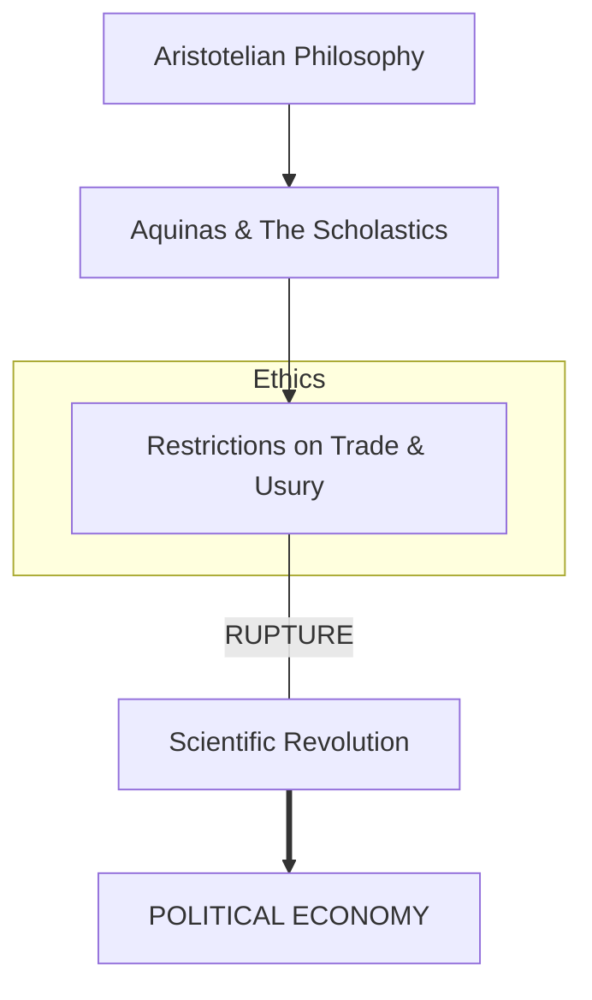
```mermaid
flowchart TD
    A[Aristotelian Philosophy] --> B[Aquinas & The Scholastics]   
    subgraph Ethics
        E[Restrictions on Trade & Usury]
    end
    B --> E
    E --RUPTURE--- C[Scientific Revolution]
    C ==> H[POLITICAL ECONOMY]
```

### Interlude: From Ethics to Reason, or from *Oikonomikos* to Political Economy

Let me take a small detour from the HET and present a small series of extracts from Renaissance thinkers. A sharp turning away from the medieval tradition that put God and the afterlife at the center of everything occurred during the 15th century. This new vision is revealed with flamboyant confidence by **Pico della Mirandola** (1463-1494) a Florentine thinker who wrote 
> We (God) have made you a creature neither of heaven nor of earth, neither mortal nor immortal, in order that you may,  as the free and proud shaper of your own being, fashion yourself in the form you may prefer.  It will be in your power to descend to the lower, brutish forms of life; you will be able, through your own decision,  to rise again to the superior orders whose life is divine. (the man answers) Oh unsurpassed generosity of God the Father,   oh wondrous and unsurpassable felicity of man, to whom it is granted to have what he chooses, to be what he wills to be!
On the Dignity of Man (1480)

According to this view, man is not merely the measure of all things as the Greek Sophist Protagoras had proclaimed in the fifth century. He is, in fact says Pico, more than mortal. He is unlimited by nature. He is entirely free to shape himself and to acquire whatever he wants. Please observe too that it is not his reason that will determine human actions but his will alone, free of the moderating control of reason.

Another Florentine, **Niccolo  Machiavelli** moved further in the same direction for him:             

> ...because fortune is a woman, and if you wish to keep her under it is necessary to beat and ill-use her;  and it is seen that she allows herself to be mastered by the adventurous rather than by those who go to work more coldly.
> The Prince (1532)

Machiavelli is basically saying that we can control our own fate. 

Francis Bacon, although influenced by Machiavelli, tilts the balance towards reason. He urges human beings to employ their reason to force nature to give up its secrets. To master nature in order to improve man's material life. He assumes that such a course will lead to progress and the general improvement of the human condition. That sort of thinking lay at the heart of the scientific revolution and remains the faith upon which modern science and technology rests. A couple of other English political philosophers, Hobbs and Locke, applied a similar novelty and modernity to the sphere of politics. They based their understanding on the common passions of man for comfortable self-preservation and discovering something they called natural rights that belonged to a man either as part of nature or as the gift of a benevolent and a reasonable god. Man was seen as a solitary creature, not inherently a part of society. In that environment of emancipation where the speculative method applies and rational deductive procedure is applied to an object of study, some wanted **to emancipate economics from the individual sphere and project it also to public activity.**

### Before Political Economy

In the 17th and 18th centuries, a diverse group of thinkers - philosophers, public servants, merchants, and even physicians - sought to understand the economy in a more systematic and analytical way. Moving beyond the narrow ethical concerns of earlier periods, they asked new questions about the sources of national wealth, the effects of government intervention, the role of money and trade, and the flows of goods and money between sectors. This marked the birth of Political Economy as a distinct field of inquiry. One of the first question regarded foreign trade.

### Mercantilism

In the 17th century, one puzzling question was the performance of the Dutch. Holland was a small country that had only come into existence in the 1580s after a revolt against its Spanish Hapsburg rulers.  But it had managed to spectacularly transform itself into one of the wealthiest countries in the world, with outposts that stretched across the globe, from Nagasaki to New Amsterdam, from the Artic Circle to South Africa, and whose citizens enjoyed probably the highest standard of living of that time. Holland had a small population, very little land, and virtually no natural resources. However, Holland maintained a favorable balance of trade with foreign countries: they exported expensive 'high-value' manufactured goods (notably finished cloth and iron goods like tools, guns, etc.) and only imported cheap 'low-value' primary commodities (raw wool and iron ore, inputs needed for their industries). That meant foreign money (gold & silver) constantly flowed into Holland. The 'Mercantilist' policy formula was quickly devised: Export as much as possible and import as little as possible. Make sure your exports are high-value goods – luxuries, manufactures – which will bring in a lot of money. If you must import, import only essential low-value goods that are absolutely necessary for your industries – that is, only raw materials and other basic necessities you simply cannot find at home.

The Mercantilists expected - or demanded - that the government take an active role in this, and make "protectionism" a central part of government policy.  The government was at various times by different authors called upon to forbid or restrict anybody from taking money out of the country by all sorts of controls and laws,  impose tariffs and quotas to discourage imports and hand out export subsidies ('bounties') to domestic exporters. In an extreme version of mercantilism, Bullionism, Gold is identified as the primary form of wealth and the primary policy prescription is to run an external surplus. You could run deficits with countries that were providing raw materials if it permitted to run surpluses with others. An important mercantilist was **Thomas Mun** (1571-1641) who was for a time the director of the East India Company.
>Although a Kingdom may be enriched by gifts received, or by purchase taken from some other Nations,  yet these things are uncertain and of small consideration when they happen. **The ordinary means therefore to encrease our wealth and treasure is by Forraign Trade**, wherein **we must ever observe this rule: to sell more to strangers yearly than we consume of theirs in value**.  For suppose that when this Kingdom is plentifully served with the Cloth, Lead, Tinn, Iron, Fish and other native commodities, we doe yearly export the overplus to forraign Countries to the value of twenty two hundred thousand pounds;  by which means we are enabled beyond the Seas to buy and bring in forraign wares for our use and Consumptions,  to the value of twenty hundred thousand pounds; By this order duly kept in our trading, we may rest assured that the Kingdom shall be enriched yearly two hundred thousand pounds, which must be brought to us in so much Treasure;  because that part of our stock which is not returned to us in wares must necessarily be brought home in treasure.
England Treasure by Forraign Trade - Chapter II, The means to enrich this Kingdom, and to encrease our Treasure, T. Mun

This view favors the merchants, hence the name mercantilism, which basically prescribes protectionism,  and led to the creation of great national companies such as the British East India Company in 1600.  They also recommended that the government actively help domestic private businessmen set up high-value import-substitution and export-oriented industries. The crown was urged to subsidize these industries, whether directly or indirectly. Infrastructure investment, like roads and ports, to facilitate the export trade, was to be encouraged.  In order to minimize "destructive competition" at home, many Mercantilists believed that charter companies had a better chance of succeeding abroad if they were granted a charter with exclusive government-guaranteed monopolies over particular areas of industry and trade.  The Mercantilist emphasis on trade surpluses and government intervention would soon face challenges from a new generation of thinkers who saw free trade and market forces as the keys to national prosperity.

### Prices and the quantity theory

Quickly reverse thinking occurred: **towards the end of the 17th century, the idea that state intervention was harmful to economic development started to spread.** Economic thinking also started to be more analytical, for example, the effort to understand how prices were determined returned in vogue leaning towards the explanation that prices were determined by production more than demand factors. - Intrinsic value, or fundamental value is the price as the value of production although market price can differ depending on demand factors. Here is what **Richard Cantillon** (1680-1734) has to say about the determination of prices:

> If **two Acres of Land are of equal goodness**, one will feed as many Sheep and produce as much Wool as the other, **supposing the Labour to be the same**, and the Wool produced by one Acre will sell at the **same price** as that produced by the other. If the Wool of the one acre is made into a suit of coarse Cloth and the Wool of the other into a suit of fine Cloth, as the latter will require **more work and dearer workmanship** it will be sometimes **ten times dearer**,  though both contain the same quantity and quality of Wool. [...] The price of a pitcher of Seine Water is nothing, because there is an immense supply which does not dry up;  but in the Streets of Paris people give a sou for it—the price or measure of the Labour of the Water carrier. By these examples and inductions it will, I think, be understood that **the Price or intrinsic value of a thing is the measure of the quantity of Land and Labour entering into its production, having regard to the fertility or produce of the Land and to the quality of the Labour**. **But it often happens that many things which have actually this intrinsic value are not sold on the Market according to that value: that will depend on the Humours and Fancies of men and on their consumption**.
>
> Essay on the Nature of Commerce Part I, Chapter X

We are far from the ethical preoccupations of earlier times. Still, the analytical effort to understand how prices are determined is remarkable. prices are determined by the quantity of land and labor which are seen as the two production factors.  However, the degree to which people want or like a good might also matter. The intellectual effort is also turned to "macro" phenomena like the level of activity, and here the deduction of the effects of the quantity of Money, at that time backed by gold, on the level of activity are deemed to be important. Again Cantillon:
                   
> If mines of gold or silver be found in a State and considerable quantities of minerals drawn from them, the Proprietor of these Mines, the Undertakers, and all those who work there, will not fail to increase their expenses in proportion to the wealth and profit they make: they will have over and above what they need to spend. **All this money, whether lent or spent, will enter into circulation and will not fail to raise the price of products and merchandise in all the channels of circulation which it enters. Increased money will bring about increased expenditure and this will cause an increase in Market prices** in the highest years of exchange and gradually in the lowest.[...]  **Mr. Locke lay it down as a fundamental maxim that the quantity of produce and merchandise in proportion to the quantity of money serves as the regulator of Market price** [...] If the increase in actual money comes from Mines or gold or silver in the State the Owner of these Mines,  the Adventurers, the Smelters, Refiners, and all other workers will increase their expenses in proportion to their gains. They will consume in their households more Meat, Wine, or Beer than before, will accustom themselves to wear better cloaths,  finer linen, to have better furnished Houses and other choicer commodities. They will consequently give employment to several Mechanicks who had not so much to do before and who for the same reason will increase their expenses: all this increase in Meat, Wine, Wool, etc.[...] diminishes of necessity the share of the other inhabitants of the State who do not participate at first in the wealth of the Mines in question. The altercations of the market, or the demand for Meat, Wine, Wool, etc., being more intense than usual, will not fail to raise their prices. These high prices will determine the Farmers to employ more land to produce them in another year: these same Farmers will profit by this rise of prices and will increase the expenditure of their Families like the others.
>
> Essay on the Nature of Commerce Part II, Chapter VI, R. Cantillon

This line of reasoning can be cast in our first equation, the famous 
$$
M*\gamma = P*Q
$$

where *M* is money, $\gamma$ velocity, *P* price level, and *Q* output (the level of activity).  The first algebraic rendering of this equation is probably due to irving Fisher in 1911. Reading the passage above, we understand that Cantillon debates on what adjusts and when.  He says that an increase in Money Supply will ultimately result in an increase in Prices, but will also increase activity in the short run. We will use this equation in our first model just below. 

### Free Trade: The Price-Specie adjustment mechanism

The Price-Specie Flow Mechanism, a self-correcting process for trade imbalances, is one of the most influential economic ideas put forward by the Scottish philosopher David Hume (1711-1776). This elegant theory, which demonstrated how market forces could automatically balance trade between nations without the need for government intervention, stood in stark contrast to the Mercantilist policies of the time. The Price-Specie Flow Mechanism's significance and lasting impact on economic thought makes it worthy of special attention. To better understand its workings, we will explore a "modern" economic model of the mechanism, drawing on the exposition by renowned economist Paul Samuelson. Before delving into the model, let us first consider Hume's original description of the concept:

> IT is very usual, in nations ignorant of the nature of commerce, to prohibit the exportation of commodities, and to preserve among themselves whatever they think valuable and useful[...]It is well known to the teamed, that the ancient laws of  ATHENS rendered the exportation of figs criminal; that being supposed a species of fruit so excellent in ATTICA, that the ATHENIANS deemed it too delicious for the palate of any foreigner[...]  The same jealous fear, with regard to money, has also prevailed among several nations;   and it required both reason and experience to convince any people, that these prohibitions serve to no other purpose than to raise the exchange against them, and produce a still greater exportation.... But there still prevails, even in nations well acquainted with commerce, a strong jealousy with regard to the balance of trade, and a fear, that all their gold and silver may be leaving them...**Suppose four-fifths of all the money in BRITAIN to be annihilated in one night**, and the nation reduced to the same condition, with regard to specie, as in the reigns of the HARRYS and EDWARDS, what would be the consequence? **Must not the price of all labour and commodities sink in proportion, and every thing be sold as cheap as they were in those ages?** **What nation could then dispute with us in any foreign market, or pretend to navigate or to sell manufactures at the same price, which to us would afford sufficient profit?** In how little time, therefore, must this bring back the money which we had lost, and raise us to the level of all the neighbouring nations? Where, after we have arrived, we immediately lose the advantage of the cheapness of labour and commodities; and the farther flowing in of money is stopped by our fulness and repletion.
>
> Political Essays - Of the balance of trade,  Hume

In Hume's description, we can readily identify the key components of the re-equilibrating mechanism. When a country experiences a trade surplus, it receives an inflow of gold as payment for its exports. This influx of gold increases the money supply within the country, which, in turn, leads to a rise in prices. Conversely, a country with a trade deficit sees an outflow of gold, reducing its money supply and causing prices to fall.

The resulting changes in prices have an impact on the competitiveness of each country's goods in international markets. As prices rise in the surplus country, its exports become more expensive and less attractive to foreign buyers. Simultaneously, the deficit country's falling prices make its goods more competitive and appealing to international consumers. This shift in relative prices encourages exports from the deficit country and discourages imports, while the opposite occurs in the surplus country.

Over time, these adjustments in competitiveness serve to rebalance trade between the two countries. The surplus country's exports decrease, and its imports increase, while the deficit country experiences a growth in exports and a reduction in imports. This automatic rebalancing process, driven by market forces, ultimately brings the trade relationship back into equilibrium.

The implications of Hume's Price-Specie Flow Mechanism are significant, as they provide a strong argument for the benefits of free trade. By allowing market forces to operate without interference, countries can naturally correct trade imbalances and maintain a healthy, mutually beneficial exchange of goods and services. This stands in sharp contrast to the Mercantilist policies of the previous century, which advocated for government intervention, protectionism, and the hoarding of precious metals.

To further clarify the workings of the Price-Specie Flow Mechanism, let us now turn to a simple mathematical exposition designed by Paul Samuelson. This modern economic model will help us better understand the dynamics at play and the key variables involved in the re-equilibrating process.

##### The Price-Specie Model Statement

- Let $P$ stand for the gold price(s) at home and $P^{*}$ for the price(s) abroad.
- $M$ represents the domestic gold supply, while $M^{*}$ stands for the foreign gold money supply.
- $Q$ and $Q^{*}$ denote the total outputs at home and abroad, respectively.
- Ignoring capital movements, let $B$ be the gold value of the balance of trade – the surplus of exports over imports if positive, or deficit if negative.

$$ B = f\left(\frac{P}{P^{*}}\right),\ \text{with}\ f'< 0 \ \text{and} \ f(1)=0 $$

This equation represents the idea that the trade balance improves if the domestic economy is more competitive, i.e., when goods cost less than abroad.

$$ PQ = \gamma M $$

This is the famous quantity theory of money. The central question (see Hume and Cantillon quotes above) is when $M$ changes, what adjusts (and when)? $P$, $Q$, or $\gamma$? For Hume, in this citation but not in other parts of his writings, it is $P$.

$$ B = \dot{M} = -\dot{M}^{*} $$

This equation represents the outflow of money (gold) to pay the deficit or the inflow that corresponds to a surplus.

$$ M + M^{*} = \bar{M} $$

This equation represents the equilibrium in the total amount of gold in the system (world).

Let us collect all the equations of our model:

$$ \begin{aligned} B &= f\left(\frac{P}{P^{*}}\right) \\ PQ &= \gamma M \\ P^{*}Q^{*} &= \gamma M^{*} \\ B &= \dot{M} = -\dot{M}^{*} \\ M + M^{*} &= \bar{M} \end{aligned} $$

We have an aggregate equation per region that links prices, output, and money; an equation that represents the trade balance; an equation that relates the trade balance to payments (the current account); and the aggregate (two regions sum) supply of money.

According to Hume's reasoning, if $M$ decreases suddenly (he wants to describe the outflow of gold), then $P$ will fall. If $Q$ is maintained, $B$ will become positive as the relative price decrease makes the country more competitive, reversing the initial outflow of money.

Let's solve the system using all the equations and get an equation for the flow of money (in equilibrium):

$$ \dot{M} = f\left(\frac{MQ^{*}}{\left(\bar{M}-M\right)Q}\right) $$

##### The Price-Specie Model Steady State

In the stationary steady state (think of the long run when the adjustment is completed):

$$ B = f(1) = 0 $$

$$ f\left(\frac{MQ^{*}}{\left(\bar{M}-M\right)Q}\right) = 0 $$

Therefore, the solution for $M$ in the long run is:

$$ M^{LR} = \frac{Q}{Q^{*} + Q}\bar{M}, $$

which shows that in the long run, the money quantity adjusts towards a constant proportion of the World stock of gold given by the production level (taken as given).

Consider now the dynamic adjustment assuming an initial condition $M_0$ different from the long-run value. If $M_0 < M^{LR}$, i.e., the stock of gold is below the long-run value, the relative price ratio is $\frac{MQ^{*}}{\left(\bar{M}-M\right)Q} < 1$, which favors exports and implies an external surplus with an accumulation of gold: $\dot{M} > 0$. The shape of the adjustment depends on the properties of $f$, but it occurs until the relative price reaches unity. If $M_0 > M^{LR}$, the adjustment occurs through trade deficits.

You can try to plot what was just described using a specific functional form, for example:

$$ f(P/P^*) = (P/P^*)^{(\alpha-1)} - 1, $$

where $\alpha < 1$. Here is a simulation from two different starting points, one corresponding to a surplus and one to a deficit.

We just described a long-run adjustment without friction, and the mathematical model gives a neat representation and permits an intellectual check of the reasoning. 
>As Schumpeter used to put it, we can applaud Hume’s performance in specifying a self-correcting mechanism that impressed people for two hundred years."
> P.A. Samuelson

One caveat is the focus on the long-run, as in reality the short run might be more complex. In fact, Hume was very aware that the short run was important:

> Accordingly we find, that, in every kingdom, into which money begins to flow in greater abundance than formerly,  every thing takes a new face; labour and industry gain life; the merchant becomes more enterprising,  the manufacturer more diligent and skilful, and even the farmer follows his plough with greater acrity and attention. This is not easily to be accounted for, if we consider only the influence which a greater abundance of coin has in the kingdom itself, by heightening the price of commodities, and obliging every one to pay a greater number of these little yellow or white pieces for every thing he purchases. And as to foreign trade, it appears, that great plenty of money is rather disadvantageous, by raising the price of every kind of labour. To account, then, for this phenomenon, we must consider, that,  though the high price of commodities be a necessary consequence of the encrease of gold and silver, yet it follows not immediately upon that encrease; but **some time is required before the money circulates through the whole state,  and makes its effect be felt on all ranks of people**. At first, no alteration is perceived; by degrees the price rises,  first of one commodity, then of another; till the whole at last reaches a just proportion with the new quantity of specie which is in the kingdom. **In my opinion, it is only in this interval or intermediate situation, between the acquisition of money and rise of prices, that the encreasing quantity of gold and silver is favourable to industry**.
>
> Hume Political Essays - Of Money, D. Hume

In the chapter on Money, Hume acknowledges a short-run effect on economic activity that he did not consider in the price-specie adjustment mechanism. Samuelson extends the model to incorporate this additional insight, but for the sake of brevity, we will not delve into the details here. Instead, let us pause for a moment to reflect on the process we just undertook. To be precise, it was Samuelson who mapped Hume's theory, originally expressed in words, into mathematical form. This exercise has taught us that we can indeed scrutinize the reasoning behind a theory, but doing so requires explicitly spelling out a set of assumptions.

However, this is where a potential pitfall lies: if we fail to constantly keep in mind the limited scope of reality that our assumptions imply, we risk misusing the model. For instance, we might overlook the fact that the activity level can be influenced by current imbalances through channels other than competitiveness, or that the described adjustment process implies that prices differ across countries during the transition period. It is crucial to ask ourselves whether these implications are reasonable. If they are not, then we are left with a result that hinges on a flawed hypothesis.

### The economy as a circular system - input/output

The last pre-Classic movement we will mention, the Physiocratic school, might be the first "true" school, with **Francois Quesnay** (1694-1774) as the central figure. Quesnay and his disciples had very innovative ideas, for example, they introduced the notions of productive and unproductive labour, by means of which the real source of wealth was found in the net product obtained by applying labour to land. You can think of a production function where the special factor of production is land and a second factor of production, productive labour, complements the land and results in value-added, *produit net*.  Another type of labour, the one not applied to land would be unproductive in their view: sterile. Why would manufacturing and commerce be sterile sectors? Their arguments were grounded in metaphysics. They differentiated between the *ordre naturel* (natural order, or the social order dictated by nature's laws) and the *ordre positif* (positive order, or the social order dictated by human ideals). The idea of interdependence among the various productive sectors and the related idea of macroeconomic equilibrium was extremely innovative by representing the economic exchanges as a circular flow of money and goods among the various economic sectors. Also the displacement of scientific interest from the stock of wealth to the flow of net product is of great importance. Finally, they championed the idea of *laissez-faire*, namely minimizing the state intervention and the *impot unique*, one single tax to finance a minimal government. Their representation of the flows between sectors was rendered in the famous Tableau Economique , a primordial Input-Output System:
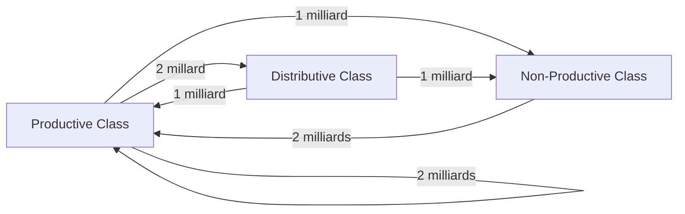
```mermaid
graph LR;

    A[Productive Class] -- 1 milliard --> B[Non-Productive Class]
    A -- 2 milliards --> A
    B -- 2 milliards --> A
    A -- 2 millard --> C[Distributive Class]
    C -- 1 milliard --> A
    C -- 1 milliard --> B
```
Here a small explanation of the Tableau:

- The *productive* class pays two *milliard* in rent to the *distributive* class and one *milliard* to the *sterile* class to buy manufactured articles and spends two *milliard* within the agricultural sector to buy raw materials, wage goods, and means of production.

- The distributive class will spend its income in the following way: one *milliard* to the sterile class and the other one *milliard* to the productive class to buy, respectively, manufactured goods and agricultural products.

- The sterile class, which has received two *milliard*, half from the distributive class and half from the farmers, will spend it all on the productive class to buy its inputs and necessary consumer goods.

- The three *milliard* that the productive class has spent outside the agricultural sector will come back to it; so that the cycle can begin again.
  He viewed this system as a natural order and therefore laissez-faire would be best. A second implication was to simplify tax system and create a unique tax on the produit net.  And here a picture of the original one published in 1758:
  
  
### Political Economy

The industrial revolution that started in the United Kingdom in the second part of the 18th century strongly impacted economic thinking. In 1776, **Adam Smith** (1723-1790), a former professor of Moral Philosophy at the University of Glasgow, published the Wealth of Nations (WoN).  The WoN is usually identified as the first "textbook" in Political Economy, composed of 5 books on the workings of a Society of Perfect Liberty. It represents a synthesis that organized economic thought for the following 40 years. While it is usually identified with the "invisible hand," its contents are better described as an overarching effort to conceptualize the forces and the social organization that result in the phenomena of economic growth. Smith's treatise went against the British laws that restricted internal and external commerce, many of which had been introduced during the Mercantilist era, and proposed a new reformed system of 'natural liberty.' The latter required the careful exposition of the economic principles underlying the system.  

#### Adam Smith

While "The Wealth of Nations" is sometimes criticized for being a messy and inconsistent book, I believe that this view is misguided. Although there are indeed some inconsistencies, such as in Smith's explanation of what determines prices, the overall logic of his overarching argument about how nations prosper is remarkably coherent and insightful[^fnwon1].

At its core, Smith's theory posits that the division of labor and the consequent increase in productivity are the central factors driving the wealth of nations. By breaking down production processes into specialized tasks, workers can become more skilled and efficient, leading to higher output and economic growth. However, Smith recognizes that for this increased production to be sustainable, there must be a sufficiently large market to absorb the goods and services produced.

This brings us to the importance of scale in Smith's analysis. The size of the market, which is influenced by factors such as geography and transportation, plays a crucial role in determining the extent to which the division of labor can be implemented. A larger market allows for greater specialization and economies of scale, leading to higher productivity and economic growth.

In addition to market size, Smith identifies demography as another critical factor in the growth of living standards. A larger population provides a greater pool of labor, which can be employed in increasingly specialized roles. This, in turn, allows for a more extensive division of labor and the associated benefits of increased productivity.

A key implication of the division of labor is the necessity of trade. As workers become more specialized, they rely on the exchange of goods and services to meet their diverse needs. This realization leads Smith to attempt to postulate a theory of value or price determination, which is essential for understanding how trade operates and how prices are set in the market.

To better understand Smith's arguments, let us focus on a schematic view of Book 1 of "The Wealth of Nations," which lays out the foundational principles of his economic theory.

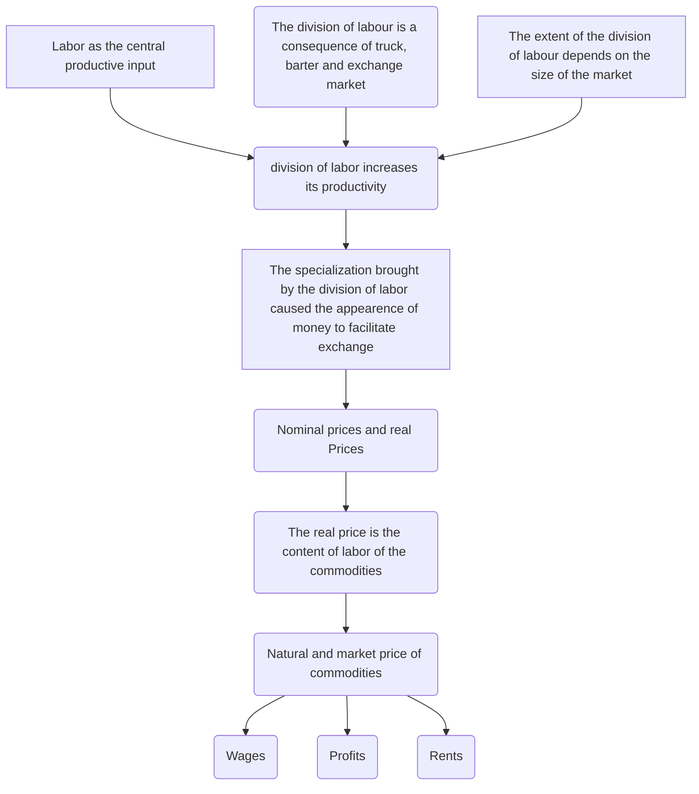
```mermaid
graph TD
    A[Labor as the central productive input] --> B(division of labor increases its productivity)
    C(The division of labour is a consequence of truck, barter and exchange market) --> B
  D[The extent of the division of labour depends on the size of the market]-->B
    B --> E[The specialization brought by the division of labor caused the appearence of money to facilitate exchange]
    E --> F(Nominal prices and real Prices)
    F --> G(The real price is the content of labor of the commodities)
    G --> H(Natural and market price of commodities)
    H --> L(Wages)
    H --> K(Profits)
    H --> M(Rents) 

```

Let us read a few passages on labor specialization.

> To take an example, therefore, from a very trifling manufacture; but one in which the **division of labour** has been very often taken notice of,  **the trade of the pin-maker**; a workman not educated to this business[...] could scarce, perhaps, with his utmost industry, make one pin in a day, and certainly could not make twenty. [...]But in the way in which this business is now carried on,
> not only the whole work is a peculiar trade, but it is divided into a number of branches, of which the greater part are likewise peculiar trades. One man draws out the wire, another straights it, a third cuts it, a fourth points it, a fifth grinds it at the top for receiving the head; to make the head requires two or three distinct operations; to put it on is a peculiar business, to whiten the pins is another; it is even a trade by itself to put them into the paper; and the important business of making a pin is, in this manner, divided into about eighteen distinct operations[...]Those ten persons, therefore, could make among them upwards of forty-eight thousand pins in a day.
>
> This great increase of the quantity of work which, in consequence of the division of labour, the same number of people are capable of performing, is owing to three different circumstances; first, to the **increase of dexterity** in every particular workman; secondly, to the **saving of the time** which is commonly lost in passing from one species of work to another; and lastly,            to the **invention of a great number of machines which facilitate and abridge labour**, and enable one man to do the work of many.
>
> Wealth of Nations - Of the Division of Labour chapter I, A. Smith

Smith identifies in the division of labor three consequences that increase productivity. First, each worker becomes more skilled in the specific task. Second the process of production is accelerated. Finally, it incentivizes the invention of machines/instruments to perform a specific task.  Growth and the living standard increase occur through productivity growth[^nfwon2]. But why would we specialize to produce more? Here, the explanation is central to the system of liberty: human nature that follows its own interest. This view reflects Smith's beliefs on man as an individual whose morality springs from the hedonic calculus.

> **This division of labour**, from which so many advantages are derived, is not originally the effect of any human wisdom, which foresees and intends that general opulence to which it gives occasion. It **is the necessary**, though very slow and gradual **consequence of a certain propensity in human nature** which has in view no such extensive utility; **the propensity to truck, barter, and exchange one thing for another**.
>
> It is not from the benevolence of the butcher, the brewer, or the baker that we expect our dinner, but from their regard to their **own interest**. We address ourselves, not to their humanity but to their self-love,  and never talk to them of our own necessities but of their advantages.
>
> Wealth of Nations - Of the Principle which gives occasion to the  Division of Labour - chapter II

Finally for this process of specialization to happen you need a market of a certain scale[^fnwon3]. 

Regarding the determination of prices, or the value of goods exchanged, I find little innovation in Smith's work compared to Cantillon's earlier contributions. Smith distinguishes between value in use, which is linked to what we would call the demand price, and value in exchange[^fn3]. He presents four different theories of value: the labor-commanded[^fn4] theory, the labor-embodied theory, the adding-up (cost of production [^fn5]) theory, and a disutility of work theory. While this variety of theories might confuse the reader, Smith ultimately favours the cost of production theory and dedicates the remainder of Book I to providing theories for determining the components of natural price.

However, if value represents the price of production inputs, the question arises: how are these inputs prices determined? Specifically, what determines the wage, the rate of profit, and the rent? What factors influence the natural price levels? Smith proposes the following mechanisms to determine the "natural" price of each of the three inputs. For wages, he observes that employers have greater bargaining power than workers and that unions are essentially prohibited. Furthermore, workers are paid weekly and, therefore, cannot resist living without wages for an extended period. Consequently, in the long run, wages tend towards the subsistence level, which allows for reproduction but not much more—a theory that Malthus will later refine. Smith concedes that economic progress can improve wages over time and acknowledges that labor is not homogeneous, implying that wages are not uniform across all occupations. Factors such as the difficulty of a job, the skills required by a profession, or even chance can lead to wage disparities. In modern terms, he nearly specifies a Mincerian equation. The other two natural prices—profit and rent—are not explained in great detail, although the profit rate is understood as a reward for risk, and rent is seen as a residual value after paying wages and interest. Finally, Smith argues that competition (the system of perfect liberty, which cannot be taken for granted, as he writes[^fn6]) causes market prices to tend toward their natural level, although they can fluctuate below and above the natural level implied by the natural level of input prices. Smith's exposition will remain a central part of the classical theory of distribution until the marginalist revolution.

> There is in every society or neighbourhood an ordinary or average rate both of wages and profit in every different employment of labour and stock...There is likewise in every society or neighbourhood an ordinary or average rate of rent... **These ordinary or average rates may be called the natural rates of wages, profit, and rent,** at the time and place in which they commonly prevail. When the price of any commodity is neither more nor less than what is sufficient to pay the rent of the land, the wages of the labour, and the profits of the stock employed in raising, preparing, and bringing it to market,     according to their natural rates, the commodity is then sold for what may be called its **natural price**[...]. **The actual price at which any commodity is commonly sold is called its market price**. **It may either be above, or below, or exactly the same with its natural price.** The market price of every particular commodity is regulated by the proportion between the quantity which is actually brought to market, and the demand of those who are willing to pay the natural price of the commodity, or the whole value of the rent, labour, and profit, which must be paid in order to bring it thither. Such people may be called the effectual demanders, and their demand the **effectual demand**; since it may be sufficient to effectuate the bringing of the commodity to market. It is **different from the absolute demand**. A very poor man may be said in some sense to have a demand for a coach and six; he might like to have it; but his demand is not an effectual demand, as the commodity can never be brought to market in order to satisfy it.  

> **When the quantity of any commodity which is brought to market falls short of the effectual demand**, all those who are willing to pay the whole value of the rent, wages, and profit, which must be paid in order to bring it thither, cannot be supplied with the quantity which they want. Rather than want it altogether, some of them will be willing to give more. **A competition will immediately begin** among them, **and the market price will rise more or less above the natural price**, according as either the greatness of the deficiency, or the wealth and wanton luxury of the competitors, happen to animate more or less the eagerness of the competition. [...]**When the quantity brought to market exceeds the effectual demand**, it cannot be all sold to those who are willing to pay the whole value of the rent, wages, and profit, which must be paid in order to bring it thither. **Some part must be sold to those who are willing to pay less, and the low price which they give for it must reduce the price of the whole.** **The market price will sink more or less below the natural price**, according as the greatness of the excess increases more or less the competition of the sellers, or according as it happens to be more or less important to them to get immediately rid of the commodity. [...]**When the quantity brought to market is just sufficient to supply the effectual demand, and no more, the market price naturally comes to be either exactly, or as nearly as can be judged of, the same with the natural price**.

 > **All the different parts of its price will soon sink to their natural rate, and the whole price to its natural price. The natural price, therefore, is, as it were, the central price, to which the prices of all commodities are continually gravitating**. Different accidents may sometimes keep them suspended a good deal above it, and sometimes force them down even somewhat below it. But whatever may be the **obstacles** which hinder them from settling in this centre of repose and continuance, they are constantly tending towards it...**A monopoly** granted either to an individual or to a trading company has the same effect as a secret in trade or manufactures. **The monopolists, by keeping the market constantly understocked, by never fully supplying the effectual demand, sell their commodities much above the natural price, and raise their emoluments, whether they consist in wages or profit, greatly above their natural rate...**

Smith also writes in Book II on capital accumulation, which goes hand in hand with the division of labor. In this part, he remarks that Money is not to be confounded with revenue or, in more modern terms, output, but he considers it as part of the capital stock. Most notably, he recognizes the important role of Banks in financing the economy, allowing production to increase and, therefore, the reason for banks to receive a "legal" interest rate[^fn7]. Finally in Book IV, Smith presents the list of tasks that the sovereign should have: police, army, justice, and remarkably public work, where he seems to foresee the theory of public goods. 

> ...First, the duty of protecting the society from violence and invasion of other independent societies; secondly, the duty of protecting, as far as possible, every member of the society from the injustice or oppression of every other member of it, or the duty of establishing an exact administration of justice; and, thirdly, the duty of erecting and maintaining certain **public works** and certain public institutions which it can never be for the interest of any individual, or small number of individuals, to erect and maintain; because the profit could never repay the expense to any individual or small number of individuals,though it may frequently do much more than repay it to a great society.
> Wealth of Nations -  Book 4 - Chapter IX

We cannot not mention the quote of the invisible hand:

> As every individual, therefore, endeavours as much as he can both to employ his capital in the support of domestic industry, and so to direct that industry that its produce may be of the greatest value; every individual necessarily labours to render the annual revenue of the society as great as he can. He generally, indeed, neither intends to promote the public interest, nor knows how much he is promoting it. By preferring the support of domestic to that of foreign industry, he intends only his own security; and by directing that industry in such a manner as its produce may be of the greatest value, he intends only his own gain, and he is in this, as in many other cases, led by an **invisible hand** to promote an end which was no part of his intention. **Nor is it always the worse** for the society that it was no part of it. By pursuing his own interest he **frequently** promotes that of the society more effectually than when he really intends to promote it.
>
> Wealth of Nations - Of Restraints upon the Importation from Foreign Countries of such Goods as can be produced at Home Book IV - Chapter II

The popular interpretation is that what is best for the individual is also best for society. In modern rendering the connection between competition and social efficiency. An important aspect is that this quote comes from the Book where Smith attacks the Mercantilist system and encourages free trade.

#### Thomas Malthus

Thomas Malthus (1766-1834), the author of the influential "Essay on the Principle of Population" (1798), made two significant contributions to economic thought that deserve brief mention. First, Malthus developed a theory of population growth that would later become the central hypothesis for the "iron law of wages," refining Smith's concept of the natural wage rate determination. According to Malthus, the natural (unchecked) rate of population growth invariably exceeds the growth of means of subsistence. This disparity implies that actual (checked) population growth is kept in line with food supply growth through two mechanisms: "positive checks," such as starvation and disease, which elevate the death rate; and "preventive checks," like the postponement of marriage, which keep the birth rate down.

Malthus's hypothesis suggests that the actual population always tends to push above the available food supply. As a result, any efforts to improve the conditions of the lower classes by increasing their incomes or enhancing agricultural productivity would ultimately prove futile, as the induced population growth would completely absorb the additional means of subsistence. Malthus argued that as long as this tendency persists, society's improvement and "perfectibility" will remain out of reach. He pessimistically concluded that the future of mankind would always be marred by "misery and vice" due to this fundamental imbalance between population growth and the means of subsistence[^fn8]" 

#### David Ricardo

David Ricardo (1772-1823) and his "Principles of Political Economy and Taxation" (1817) deserves a more in-depth examination due to the highly articulated and rigorous nature of his formulation of classical theories. Although Ricardo does not employ algebra, his exposition achieves a level of analytical clarity that brings his book closer to a modern textbook. The stated objective of Ricardo's work is to determine the law of distribution between different classes: workers, who spend their wage income on necessities; capitalists, who save most of their profit income and reinvest it; and rentiers[^fn11], who spend their rental income on luxuries.

To achieve this goal, Ricardo needed a precise theory of prices (value), as opposed to the three or four theories presented by Smith. For Ricardo, the most appropriate theory was the "labor-embodied" theory of value, which argues that the relative "natural" prices of commodities are determined by the relative hours of labor expended in their production. However, Ricardo recognized a problem that arose when considering capital: as different industries apply varying amounts of capital per laborer, the rate of profit would also differ across industries. If Ricardo then assumed that the rates of profit across different industries were equalized (as free competition would imply), the relative prices would vary with wages.

Principles of Political Economy and Taxation - On Value - Chapter I

> **The value** of a commodity, or the quantity of any other commodity for which it will exchange, **depends on the relative quantity of labour** which is necessary for its production, and not on the greater or less compensation which is paid for that labour.

> Not only the labour applied immediately to commodities affect their value, but the **labour** also which is **bestowed on the implements, tools, and buildings**, with which such labour is assisted.

> The principle that the quantity of labour bestowed on the production of commodities regulates their relative value considerably modified by the employment of machinery and other fixed and durable capital.

Ricardo understood that the labor theory of value would only work if the degree of capital intensity were the same across all sectors. He proposed two ways to address this dilemma. First, he made the empirical argument that firms apply capital roughly proportional to the amount of labor invested. In this case, when profits are equalized, the resulting prices would not differ significantly from the values implied by the labor embodied. Using numerical examples, Ricardo demonstrated that the deviation of relative prices from the value of labor content due to capital was small, on the order of 6%-7%, and thus concluded that using the simple form of the labor value theory was an acceptable approximation. This approach is what Stigler (1958) has called Ricardo's "93% labor theory of value."

The second solution was to find a commodity that has the *average* capital per worker, so that its price would reflect the labor-embodied value and not vary with changes in distribution. Ricardo called this the "invariable standard of value" but acknowledged that it was impossible to find one[^fn12]. As a result, he settled on gold as the closest approximation. The logical construction of Ricardo's arguments is noteworthy: he delves into as many logical details as possible and makes simplifying hypotheses to reach precise conclusions. For example, he assumes that capital's contribution to value can be measured in labor units and approximated to 6%-7%, and that gold can measure absolute value as its labor content is taken to be invariable.

Although not entirely robust, Ricardo uses his price theory to determine class distribution, making one of his most important contributions in the process: the theory of rents, which introduces the concept of decreasing returns to land cultivation. Ricardo defines rent as the difference in productive power between the best land and the marginal land in use (an extensive margin), and emphasizes that rent should not be confused with the amount paid to the landlord, which might contain remuneration for capital improvements (an intensive margin).

Principles of Political Economy and Taxation - On Rent - Chapter II

> Rent is that portion of the produce of the earth, which is paid to the landlord for the use of the original and indestructible powers of the soil. It is often, however, confounded with the interest and profit of capital, and, in popular language, the term is applied to whatever is annually paid by a farmer to his landlord. If, of two adjoining farms of the same extent, and of the same natural fertility, one had all the conveniences of farming buildings, and, besides, were properly drained and manured, and advantageously divided by hedges, fences and walls, while the other had none of these advantages, more remuneration would naturally be paid for the use of one, than for the use of the other; yet in both cases this remuneration would be called rent. But it is evident, that a portion only of the money annually to be paid for the improved farm, would be given for the original and indestructible powers of the soil; the other portion would be paid for the use of the **capital which had been employed in ameliorating the quality of the land**, and in erecting such buildings as were necessary to secure and preserve the produce.[...] **It is only, then, because land is not unlimited in quantity and uniform in quality, and because in the progress of population, land of an inferior quality, or less advantageously situated, is called into cultivation, that rent is ever paid for the use of it.** When in the progress of society, land of the second degree of fertility is taken into cultivation, rent immediately commences on that of the first quality, and the amount of that rent will depend on the difference in the quality of these two portions of land. When land of the third quality is taken into cultivation, rent immediately commences on the second, and it is regulated as before, by the **difference in their productive powers**. At the same time, the rent of the first quality will rise, for that must always be above the rent of the second, by the difference between the produce which they yield with a given quantity of capital and labour....

The following figure, which we will also use in the model at the end of this section on the Classics, shows how to determine the rent according to Ricardo.  The horizontal axis shows the extensive usage of land *T*, with decreasing productivity going East, and the vertical axis shows the amount of grain *G*  (net of seeds) produced. We divide the cultivated land into five types: A, B, C, D, and E, scaled in decreasing order of fertility.  *$w_r$* is the long-run wage rate determined by the iron law[^fnric1]. Ricardo's assumption is that on the last piece of cultivated land, there is no rent. So land E produces a value of $G_e$ and therefore, the profits are $\pi = G_e -w_r$.  Now, the second best land produces $G_d>G_e$  and the difference between the value of these two productions is the rent paid to D.  Because of competition, all the capitalists will earn the same profit rate since the product that can be obtained from intramarginal lands over and above that of the marginal land will be entirely paid up in rent.

Ricardo then adds a theory of growth: population increases, more land is cultivated which leads to a decrease in the profit rate and an increase in the rent.  In the limit, Ricardo argued, a "stationary state" would be reached where capitalists will be making near-zero profits and no further accumulation would occur, but he saw this stationary state as far away in the future.

Principles of Political Economy and Taxation - On Rent - Chapter II
> **The rise of rent is always the effect of the increasing wealth of the country**, and of the difficulty of providing food for its augmented population. It is a symptom, but it is never a cause of wealth; for wealth often increases most rapidly while rent is either stationary, or even falling. Rent increases most rapidly, as the disposable land decreases in its productive powers. Wealth increases most rapidly in those countries where the disposable land is most fertile, where importation is least restricted, and where through agricultural improvements, productions can be multiplied without any increase in the proportional quantity of labour, and where consequently the progress of rent is slow.

Principles of Political Economy and Taxation - On Wages - Chapter V

> ...if we should attain the **stationary state**, from which I trust we are yet far distant...

Principles of Political Economy and Taxation - On Profits - Chapter VI

> The natural **tendency of profits then is to fall**; for, in the progress of society and wealth, the additional quantity of food required is obtained by the sacrifice of more and more labour.

---
**Labor Embodied Theory**

For classical economists, the concept of "labour commanded" refers to the relative price of a good, expressed in terms of the labor that can be purchased with it. They argued that the price of a good depends on the incomes paid to produce it, which includes wages, profits, and rents. For simplicity, we will focus on wages and profits in an imaginary economy where only one good, corn, is produced using itself and labor.

Let's define some variables:
- k: the capital coefficient, the quantity of seeds needed to produce one ton of corn. 
- l: the labor coefficient, the quantity of labor-hours directly used to produce one ton of corn
- λ: the labor directly and indirectly embodied in a ton of corn
- r: the rate of profit
- w: the monetary wages
- p: the monetary price of one ton of corn

The labor embodied in a ton of corn can be calculated as:
λ = l + λk = l / (1 - k)

The price of corn (p) is equal to the sum of the costs (labor and capital) and the profits earned by the capitalists:
p = wl + pk + pkr

Expressing the price in terms of labor commanded (p/w), we get:
p/w = l + (p/w) * k * (1 + r) = l / [1 - k(1 + r)]

This equation shows that labor commanded is greater than the embodied labor due to the presence of profit, and it increases as the profit rises. The equation can also be used to determine the rate of profit (r), given the real wage (w/p).

When cultivation intensifies, the productivity of the marginal unit of labor decreases from 1/l to 1/l' (where l' > l). Assuming real wages (w/p) and the capital coefficient (k) remain constant, the new equation becomes:
p/w = l' + (p/w) * k * (1 + r')

In this scenario, the rate of profit (r') decreases as a result of the decrease in labor productivity. In Ricardian terms, the profit decreases because the share of the product necessary to pay for wages increases due to the intensification of cultivation.

---
Ricardo suggested two things that might hold this law of diminishing returns at bay and keep accumulation going, at least for a while: technical progress and foreign trade. On foreign trade, Ricardo set forth his famous theory of *comparative advantage*.  Using his famous example of two nations (Portugal and England) and two commodities (wine and cloth), Ricardo argued that trade would be beneficial even if Portugal held an absolute cost advantage over England in both commodities. Ricardo's argument was that there are gains from trade if each nation specializes completely in the production of the good in which it has a "comparative" cost advantage in producing and then trades with the other nation for the other good. Notice that the differences in initial position mean that the labor theory of value is not assumed to hold across countries -- as it should be, Ricardo argued, because factors, particularly labor, are not generally mobile across borders[^fn13]. As far as growth is concerned, foreign trade may promote further accumulation and growth if wage goods (not luxuries) are imported at a lower price than they cost domestically -- thereby leading to a lowering of the real wage and a rise in profits.

Principles of Political Economy and Taxation - On Foreign Trade - Chapter VII

> **Under a system of perfectly free commerce, each country naturally devotes its capital and labour to such employments as are most beneficial to each**. This pursuit of individual advantage is admirably connected with the universal good of the whole. By stimulating industry, by rewarding ingenuity, and by using most efficaciously the peculiar powers bestowed by nature, it distributes labour most effectively and most economically: while, by increasing the general mass of productions, it diffuses general benefit, and binds together by one common tie of interest and intercourse, the universal society of 157 nations throughout the civilized world. **It is this principle which determines that wine shall be made in France and Portugal, that corn shall be grown in America and Poland, and that hardware and other goods shall be manufactured in England.**

Let us analyse the comparative advantage argument put forward by Ricardo. The critical point to be understood is that it is not the absolute advantage that matters but the relative productivity that determines the location of production. Here is the numerical example that he presents in the quote below. The number in the table represents the number of man/hour needed to produce one unit of a good. Notice that Portugal has an absolute advantage: he is more productive in both industries. The assumptions are that labor is mobile only domestically and that goods are free to move internationally.

|       | England | Portugal |
| ----- | ------- | -------- |
| Wine  | 120     | 80       |
| Cloth | 100     | 90       |

A few elementary computations tell us:

- England needs 220 men to produce one unit of each good Portugal 170. In Autarky they produce 2 units of Cloth and 2 units of Wine.
- If each one specializes England produces 2.2 unit of Cloth and Portugal 2.125 units of Wine. Comparative advantage
- The model is incomplete (relative prices are not determined) but the insight was extremely influential.

Principles of Political Economy and Taxation - On Foreign Trade - Chapter VII
                      
> England may be so circumstanced, that to produce the cloth may require the labour of 100 men for one year; and if she attempted to make the wine, it might require the labour of 120 men for the same time. England would therefore find it her interest to import wine, and to purchase it by the exportation of cloth.

> To produce the wine in Portugal, might require only the labour of eighty men for one year, and to produce the cloth in the same country, might require the labour of ninety men for the same time. It would therefore be advantageous for her to export wine in exchange for cloth. This exchange might even take place, notwithstanding that the commodity imported by Portugal could be produced there with less labour than in England. Though she could make the cloth with the labour of ninety men, she would import it from a country where it required the labour of 100 men to produce it, because it would be advantageous to her rather to employ her capital in the production of wine, for which she would obtain more cloth from England, than she could produce by diverting a portion of her capital from the cultivation of vines to the manufacture of cloth.

On technical progress, Ricardo was ambivalent. One the one hand, he recognized that technical improvements would help push the marginal product of land cultivation upwards and thus allow for more growth. But, in his famous Chapter 31 "On Machinery" (added in 1821 to the third edition of his *Principles*), he noted that technical progress requires the introduction of labor-saving machinery. This is costly to purchase and install, and so will reduce the wages fund. As a result, either wages must fall or workers must be fired. Some of these unemployed workers may be mopped up by the greater amount of accumulation that the extra profits will permit, but it might not be enough. A pool of unemployed might remain, placing downward pressure and wages and leading to the general misery of the working classes. 

Principles of Political Economy and Taxation - On Machinery - Chapter XXXI

> Ever since I first turned I have been of opinion, that such an application of machinery effect of saving labour, was a general good, accompanied only with that portion of inconvenience which in most cases attends the removal of capital and labour from one employment to another. It appeared to me, that provided the landlords had the same money rents, they would be benefited by the reduction in the prices of some of the commodities on which those rents were expended, and which reduction of price could not fail to be the consequence of the employment of machinery. **The capitalist, I thought, was eventually benefited precisely in the same demand for labour as before, and that wages would be no lower, I thought that the labouring class would, equally with the other classes, participate in the advantage, from the general cheapness of commodities arising from the use of machinery.** These were my opinions, and they continue unaltered, as far as regards the landlord and the capitalist; but **I am convinced, that the substitution of machinery for human labour, is often very injurious to the interests of the class of labourers.** My mistake arose from the supposition, that whenever the net income of a society increased, its gross income would also increase; I now, however, see reason to be satisfied that the one fund, from which landlords and capitalists derive their revenue, may increase, while the other, that upon which the labouring class mainly depend, may diminish, and therefore it follows, if I am right, that the same cause which may increase the net revenue of the country, may at the same time render the population redundant, and deteriorate the condition of the labourer.

The final contribution of Ricardo that had long lasting impact regards taxation and especially what has come to be called Ricardian equivalence. Ricardian equivalence is an economic theory that says that financing government spending out of current taxes or future taxes (and current deficits) will have equivalent effects on the overall economy. This means that attempts to stimulate an economy by increasing debt-financed government spending will not be effective because investors and consumers understand that the debt will eventually have to be paid for in the form of future taxes

 Principles of Political Economy and Taxation - Chapter XVII

> *Taxes which are levied on a country for the purpose of supporting war or for the ordinary expenses of the state, and which are chiefly devoted to the support of unproductive labourers, are taken from the productive industry of the country; ... When, for the expenses of a year’s war, twenty millions are raised by means of a loan, it is the twenty millions which are withdrawn from the productive capital of the nation...The million per annum which is raised by taxes to pay the interest of this loan is merely transferred from those who pay it to those who receive it, from the contributor to the tax to the national creditor...Government might at once have required the twenty millions in the shape of taxes; in which case it would not have been necessary to raise annual taxes to the amount of a million. This, however, would not have changed the nature of the transaction.*

Let us analyse in modern terms the Ricardian equivalence result with a small dynamic budget constraint. Assume that War at time 1 requires spending $G_{1}$ and can be financed by increases in taxes or debt (assume must be repaid in period 4). Also assume initial debt is zero. On one hand if you finance $G_{1}$ (that increases by 20) with $T_{1}$ , debt next period does not change: 

$$B_{2}=(1+i)B_{1}+G_{1}-T_{1}$$

On the other hand, if you financed war through debt, $B_{2}$ increases by 20 and you will need to raise taxes eventually to repay it (here in 3 periods). 

$$B_{3}=(1+i)B_{2}+G_{2}-T_{2}$$

$$0=(1+i)B_{3}+G_{3}-T_{3}$$

$$B_{2}=\frac{T_{2}}{(1+i)}+\frac{T_{3}}{(1+i)(1+i)}$$

so the 20 will be repaid increasing taxes in period 2 and period 3. A person that fully anticipates this will behave accordingly.
 #### John Stuart Mill
The last Classical economist we will briefly cover is **John Stuart Mill** (1806-1873). J.S. Mill was more a philosopher than an economist, but he must be mentioned for he published Principles of Political Economy (1848), which became the most important textbook in economics for at least 30 years. Mill's book can be seen as the final revision of Smith's classical ideas, especially Ricardo's. His main focus is distribution as he believed that production was mostly a technical, almost engineering science. Distribution, on the other hand, depended on human choices[^fn14]. 

Mill improved on the notion of price determination, introducing the idea of an equation[^fn15] and refined Ricardo's international trade theory. Ricardo had left the relative price under trade undetermined and assumed that the price would settle between the two countries' cost of production price.  Mill refers to the equality of demand and supply in the two countries (reciprocal demand as supply), anticipating a general equilibrium theory.  In our previous example this implies using a budget constraint:

$$\bar{p}^w * wine_x + \bar{p}^c * cloth_x =0 $$      where a bar indicates a world price and the subscript x stands for exports. We still need demand of each country to determine the exact relative price.

On the long run Mill is very much Ricardian, with the only difference that he saw the stationary state closer although postponed by technological improvement. He also, very philosophically, believed that once the stationary state would be reached, men could finally focus on interesting aspects of life and not on economical ones. 

Principles of Political Economy, Book IV, Chapter VI

> It must always have been seen, more or less distinctly, by political economists, that **the increase of wealth is not boundless: that at the end of what they term the progressive state lies the stationary state**, that all progress in wealth is but a postponement of this, and that each step in advance is an approach to it. We have now been led to recognise that this ultimate goal is at all times **near** enough to be fully in view; that we are always on the verge of it, and that if we have not reached it long ago, it is because the goal itself flies before us. 

> I cannot, therefore, regard the stationary state of capital and wealth
> with the unaffected aversion so generally manifested towards it by political economists of the old school. I am inclined to believe that it would be, on the whole, a very considerable improvement on our present condition[...] 

> It is scarcely necessary to remark that **a stationary condition** of capital and population **implies no stationary state of human improvement**. There would be as much scope as ever for all kinds of **mental culture**, and moral and social progress; as much room for improving  the **Art of Living**, and much more likelihood of its being improved, when minds ceased to be engrossed by the art of getting on. Even the industrial arts might be as earnestly and as successfully cultivated, with this sole difference, that instead of serving no purpose but the increase of wealth, industrial improvements would produce their legitimate effect, that of abridging labor. Hitherto it is questionable if all the mechanical inventions yet made have lightened the day’s toil of any human being. They have enabled a greater population to live the same life of drudgery and imprisonment, and an increased number of manufacturers and others to make fortunes. They have increased the comforts of the middle classes. But they have not yet begun to effect those great changes in human destiny, which it is in their nature and in their futurity to accomplish. Only when, in addition to just institutions, the increase of mankind shall be under the deliberate guidance of judicious foresight,
> can the conquests made from the powers of nature by the intellect and energy of scientific discoverers, become the common property of the species, and the means of improving and elevating the universal lot. 

Finally, on taxation Mill is famously in favour of a proportional tax rate that becomes progressive because of an exemption at the bottom of the income distribution[^fn16] and suggests inheritance taxes[^fnm1].

---

**Progressivity in taxation**

System 1: Flat 20% with 10,000 exemption 
System 2: Traditional brackets:

- $0-$10,000: 0%
- $10,001-$50,000: 15%
- 50,001+: 25%
Let's compare at different income levels:
1. At 20,000:
Flat with exemption:
* Tax = ($20,000 - $10,000) × 20% = 2,000
* Effective rate = 10%
Bracket system:
* First $10,000: $0
* Next $10,000: $1,500 (15%)
* Total tax = 1,500
* Effective rate = 7.5%
2. At 50,000:
Flat with exemption:
* Tax = ($50,000 - $10,000) × 20% = 8,000
* Effective rate = 16%
Bracket system:
* First $10,000: $0
* Next $40,000: $6,000 (15%)
* Total tax = 6,000
* Effective rate = 12%
3. At $100,000:
Flat with exemption:
* Tax = ($100,000 - $10,000) × 20% = 18,000
* Effective rate = 18%
Bracket system:
* First $10,000: $0
* Next $40,000: $6,000 (15%)
* Next $50,000: $12,500 (25%)
* Total tax = 18,500
* Effective rate = 18.5%
Key differences:
1. The flat system with exemption creates a smoother progression
2. The bracket system has more distinct "jumps" at the bracket boundaries
3. The bracket system can be more targeted to specific income ranges
4. The flat system with exemption approaches but never reaches the full 20% rate, while the bracket system can go above it

---

We now present the distributional and growth model that synthetize the thoughts of the Classics in the famous Samuelson's formulation

##### Canonical Model of Classical Growth and Redistribution (Samuelson)

We have reported through the above quotes that Adam Smith, David Ricardo, Thomas Robert Malthus, and John Stuart Mill shared a common dynamic model of growth and distribution. Samuelson presents us with a model "stripped down to its minimal essentials" to characterize in mathematical terms the ideas that were common to the Classical economists. Of course, any simple codification of the classical economists' discursive writings is an oversimplification. Still, as mentioned in the introduction, it can be useful to identify the main mechanisms and logical coherence. Let us list the model ingredients that map to the Classical economist's writings:
1. Real output $Q_t$ is divided interchangeably between consumption $C_t$ and capital formation $\dot{K}_{t}$ implying $$Q_{t}=C_{t}+\dot{K}_{t}$$.

2.  Output is produced by a production function $F$ involving land input $T$ and a "dose" (a terminology introduced by Ricardo) of labor-cum-capital input $V_t=g(L_t,K_t)$.

3.  There is competition among

    1.  landowners,

    2.  entrepreneurs/capitalists who hire labor and need raw materials to work on  rented land, 
    
    3.  workers and owners of capital goods.
    
    This competition results in the determination of the return of a) the combined dose of labor and capital and b) land rent. 
    
4.  In the long-run, the prices are set at their natural level, and the economy tends towards a  stationary state. Namely:

    1.  workers' wage rate is ultimately determined by $\bar{w}^{*}$ the real
         subsistence level.

    2.  the profit rate $\bar{r}^{*}$ is just low enough and is just high enough to
        cause capital to be maintained with zero net savings.  Basically, it covers depreciation in modern language.

    The long-run population (labor) and capital stock are such that the
    **diminishing** return equates the return on the dose to $\bar{w}^{*} + \bar{r}^{*}$, total rent is maximal, and the equilibrium prevails forever (stationary state).
    
5.  To some extent, Mill and Ricardo added that **technological innovation** could continue in the long-run steady state, implying rising output. In this model, this happens if the technical change is land-augmenting. A terminology that signifies that progress makes the same piece of land more productive using the same amount of labor and capital.
    
6.  The long-run equilibrium is **stable** in this version of the model, with
    factors that grow at the right rates, in the sense that the system, if disturbed from it, will spontaneously return toward it. That is something that the classic had not thought about, but the mathematization forces us to think about it. We will look at two versions of the transitional dynamics, the first version, in which wages adjust immediately to the long-run subsistence level, and the second where they share the short-run surplus with capitalists.

Let us start with a Figure and a verbal description of the model similar to our presentation of Ricardo's rent theory determination above.

On the horizontal axis, you now have as before implicitly Land.  However what is shown is the amount of capital and labor (the dose) applied in the same relative labor-capital proportions to each piece of land. Further, instead of having discrete lots of land here, we have a continuous amount of land (that is a very post-Classical feature) that declines continuously "eastward" in "fertility." The result is that fixed proportions of dose to land prevail at each grade's longitude, with the return of product per dose applied declining continuously as we move eastward. Then, when labor and capital are finished, all land to the east is not worth cultivating, but as labor and capital increase in availability, they are applied further eastward. For each total of doses available (Labor and Capital), there is an external frontier of zero-rent land. In the following graph the height of $DD'$ at any given dose is the average product of output per unit of dose. The horizontal line $WW'$ is the long run supply of labor. It represents the subsistence cost of the reproduction of labor in a steady state. By choosing the right units, the height of $WW$ represents the real wage rate per unit of labor, $\bar{w}^{*}$, the labor power's cost of reproduction in stationary equilibrium. The line $SS'$ is the long-run supply of the composite dose. $SS'-WW'$ is the long run profit long-run profit rate $\bar{r}^{*}$. It is such that net saving are zero but allow replacement of the depreciated capital and can include risk premia and cost of capital management. The residual of land rent is measured on the diagram by the area $SED$. It is the residual of what is left of total product $OK^*ED$ after paying capital and labor $OK^*ES$.

Let us look a the mathematical formulation of the model. Assume a single sector of production and fixed proportions between labor and capital. Implicitly, there is a production function where the output $Q$ is produced with land fixed $T$ of various grades: 

$$Q_{t}=F\left(L_{t},K_{t};T\right)$$,

and a composite dose of labor and capital goods,

$$V_{t}=Min\left[L_{t},K_{t}\right]\label{eq:dose}$$,

on each type of land. For simplicity, we assume that one dose involves one unit of labor and one unit of capital goods. We rewrite the "production" function as 

$$Q_{t}=f\left(V_{t}\right).\label{eq:production}$$

Also, assume $f$ to be concave. Concavity, which corresponds to the following properties $f'(V)\geq 0$, $f''(V)\leq 0$ , is used to represent the decreasing returns to successive types of land. Output is divided into consumption and net capital formation:

$$Q_{t}=C_{t}+\dot{K}_{t}\label{eq:resources}$$.

The real return to labor and capital of the total dose is $p_{V}$ expressed in unit of output:

$$p_{V}=w+r=f'\left(V\right)\label{eq:price}$$,

where $w$ is the real wage and $r$ is the real interest rate (or rental rate), $f'\left(V\right)$ is the increment in the product resulting from an extra dose of $V$ applied to fixed lands. Total land rent, $R$, is given residually by 

$$R=f\left(V\right)-Vf'\left(V\right)$$.

Let us start by the end as we did for the Hume model and find the stationary state of the model described in the Figure above. In the Long Run, given the assumption on supply, we have

$$f'\left(V^{*}\right)=\bar{w}^{*}+\bar{r}^{*}=p_{V}$$

$$R^{*}=f\left(V^{*}\right)-V^{*}f'\left(V^{*}\right)$$

$$L^{*}=K^{*}=V^{*}$$

$$Q^{*}=C^{*}+0=f\left(V^{*}\right)$$

where the variables with a * describe stationary state values. Notice that the classical paradigm denies smooth substitutability between $K$ and $L$ even in the Long Run. Was this something that the Classics had not thought about? The automation chapter of Ricardo indicates that they had foreseen long-run substitution between factors; but their reasoning was never perfectly coherent otherwise, the iron law of wages would not have applied. What can we do now with the mathematical version of the model? Comparative statistics exercises, for example. We can show that an increase in $\bar{w}^{*}$ or $\bar{r}^{*}$ must decrease $L^{*},K^{*},V^{*},Q^{*},C^{*}$ , and $R^{*}$ but the shares $\bar{r}^{*}K^{*}$ and $\bar{w}^{*}L^{*}$ can move in either direction relative to $R^{*}$ (you can try). What does it mean? If the subsistence wage increases, the long-run amount of labor decreases so that the labor share (the total income to labor) can go up or down. Samuelson on this aspect, tells us, "The Classical economists were focusing on the problem of distribution between land rent, labor wages, and profits, but their conceptual framework, as interpreted here, could not deliver definitive answers."

Turning to the transition: we can model the system's dynamics towards the stationary state. At least for Ricardo, this stationary state was really far into the future so transient dynamics must have been important to specify. Here, remember that the adjustments are due to competition between the different suppliers of production factors. When the real wage rate, $w$, is above the subsistence real wage rate, $\bar{w}^{*}$, the population grows (Malthus argument) and grows at a greater rate the greater is the excess in wage rates:

$$\epsilon\frac{\dot{L}_{t}}{L_{t}}=\lambda\left(w_{t}-\bar{w}^{*}\right)$$,

with $$\lambda\left(0\right)=0,\lambda'>0$$,

where $\epsilon$ is the slowness of the growth response of labor supply. Similarly when $r$ exceeds $\bar{r}^{*}$ the rate of saving-investment is positive as capitalists want to invest:

$$\frac{\dot{K}_{t}}{K_{t}}=\sigma\left(r_{t}-\bar{r}^{*}\right)$$,

with $$\sigma\left(0\right)=0,\sigma'>0$$.

This model is now a complete system of equations, or almost complete [^fn17]. If the economy started with the initial $L_0/K_0=1$ and always remained in this balanced configuration, the model determines the endogenous variables: $L_{t},K_{t},V_{t},w_{t},r_{t},p_{Vt},C_{t},Q_{t},R_{t}$. 

First consider Ricardo case ("short-circuited case") where population adjusts istantly so that $$w_{t}=\bar{w}^{*}$$ and $L_{t}$ always adjusts to $K_{t}$, therefore we have correct proportion of inputs:

$$L_{t}=K_{t}=V_{t}$$,

and a price of a dose given by:

$$p_{V}=\bar{w}^{*}+r_{t}$$,

where

$$r_{t}=f'\left(K_{t}\right)-\bar{w}^{*}$$. 

Plug it into our capital law of motion 

$$\frac{\dot{K}_{t}}{K_{t}}=\sigma\left(r_{t}-\bar{r}^{*}\right)$$ 

The dynamics can be represented as

$$\frac{\dot{K}_{t}}{K_{t}}=\sigma\left(f'\left(K_{t}\right)-\bar{w}^{*}-\bar{r}^{*}\right)$$ 

with

$K_{0}$ given. 
                        
and

$$Q_{t}=f\left(K_{t}\right)$$

$$C_{t}=f\left(K_{t}\right)-\dot{K}_{t}$$

$$R_{t}=f\left(K_{t}\right)-K_{t}f'\left(K_{t}\right)$$

Graphically it means that the adjustment to the stationary state occurs along the DD'.

We can go even further and assume a more realistic model where labor and capital share the transient surplus of the dose's return. Assume the system starts at $L_{0},K_{0}$ sufficiently close to $L^{*}$ and $K^{*}$. In this case, it will forever  grow with $K/L$ in the needed balance and with neither factor redundantly free 

$$L_{0}=K_{0}=V_{0},$$

$$r_{t}=f'\left(K_{t}\right)-w_{t},$$ 

$$p_{V}=w_{t}+r_{t},$$

$$\frac{\dot{K}_{t}}{K_{t}}=\frac{\dot{L}_{t}}{L_{t}}=\sigma\left(r_{t}-\bar{r}^{*}\right)=\epsilon^{-1}\lambda\left(w_{t}-\bar{w}^{*}\right)$$

so that

$$\sigma\left(f'\left(K_{t}\right)-w_{t}-\bar{r}^{*}\right)-\epsilon^{-1}\lambda\left(w_{t}-\bar{w}^{*}\right)=0$$

Implicitly define $w_{t}=\omega\left(K;\epsilon\right),$

for example assuming the following specific functional forms:

$$\left(f'\left(K_{t}\right)-w_{t}-\bar{r}^{*}\right)^{1+\beta}-\epsilon^{-1}\left(w_{t}-\bar{w}^{*}\right)^{1+\gamma}=0$$

you have

$$w_{t}=\frac{\bar{w}^{*}+\left(f'\left(K_{t}\right)-\bar{r}^{*}\right)\epsilon^{\frac{1}{1+\beta}}}{\left(1+\epsilon^{\frac{1}{1+\beta}}\right)}$$.
and now the adjustment towards the stationary state also regards the workers.
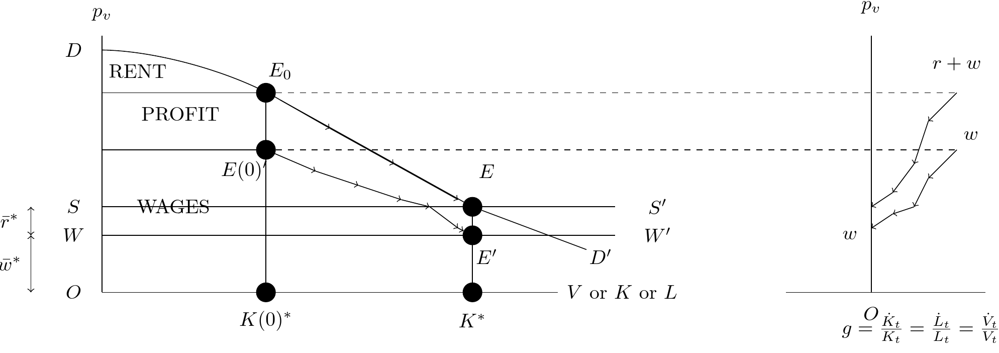
Even in this more realistic version where workers and capitalists share part of the extra return of the dose, the lon run implications are gloomy. Wages  decline towards the subsistance level, profits rate also decline towards their natural level that can be zero after allowing for depreciation and various premia, while the rent is maximized. As I mentioned above technical progress can delay the inevitable but the Classics never thougth that it could delay it forever. This conclusion is what earned Political Economy title of the dismal science.

#### Karl Marx

Karl Marx (1818-1883), known as one of the founding fathers of communism, is often debated as to whether he belongs in a course on the history of economic analysis. On one hand, Marx was more of a philosopher than an economist, which would suggest his exclusion. On the other hand, his analysis of the capitalist system, a term he coined to describe the market economy, had long-lasting consequences, making a strong case for his inclusion. What sets Marx apart from the previous Classical economists is his departure from the scientific revolution's approach of analyzing Political Economy through rational thinking and empirical observation. Instead, Marx adopts a Hegelian method in which the dynamic historical context plays a central role.

According to Marx's perspective, the dialectics of history demonstrated how the bourgeoisie (capitalists) had replaced the previous feudal productive system (landlords) and how the proletariat (workers) would, in turn, replace the capitalist system with a communist society. In his analysis, the dynamics of productive forces (i.e., technology) are crucial in driving these changes. Marx believed that this historical process would culminate in the proletariat achieving predominance, ushering in an age of harmony. However, he does not provide a detailed description of this harmonious state, focusing instead on his analysis of what he perceives as the functioning of capitalist society.

For the purposes of this discussion, we will concentrate on Marx's main "economic" contribution, "Das Kapital" (The Capital). The first volume was published in 1867, while volumes two and three were published posthumously by his friend Friedrich Engels. Marx's writings are often lengthy, intricate, and challenging to understand. To avoid subjective judgments, it is worth reproducing some parts in their entirety, allowing readers to form their own opinions. Here is the initial part of the first volume:

Capital, Volume 1 - Part I - chapter 1

> *The wealth of those societies in which the capitalist mode of production prevails, presents itself as "an immense accumulation of commodities," its unit being a single commodity. Our investigation must therefore begin with the analysis of a commodity.* **A commodity is, in the first place, an object outside us**, a thing that by its properties satisfies human wants of some sort or another. The nature of such wants, whether, for instance, they spring from the stomach or from fancy, makes no difference. Neither are we here concerned to know how the object satisfies these wants, whether directly as means of subsistence, or indirectly as means of production. Every useful thing, as iron, paper, &.c, may be looked at from the two points of view of quality and quantity. It is an assemblage of many properties, and may therefore be of use in various ways. To discover the various uses of things is the work of history. So also is the establishment of socially recognised standards of measure for the quantities of these useful objects. The diversity of these measures has its origin partly in the diverse nature of the objects to be measured, partly in convention. The utility of a thing makes it a use-value. But this utility is not a thing of air. Being limited by the physical properties of the commodity, it has no existence apart from that commodity. A commodity, such as iron, corn, or a diamond, is therefore, so far as it is a material thing, a use-value, something useful. This property of a commodity is independent of the amount of labour required to appropriate its useful qualities. Exchange-value, at first sight, presents itself as a quantitative relation, as the proportion in which values in use of one sort are exchanged for those of another sort, a relation constantly changing with time and place. Hence exchange-value appears to be something accidental and purely relative, and consequently an intrinsic value, i.e., an exchange-value that is inseparably connected with, inherent in commodities, seems a contradiction in terms. Let us consider the matter a little more closely.[...] **Let us take two commodities, e.g., corn and iron. The proportions in which they are exchangeable, whatever those proportions may be, can always be represented by an equation in which a given quantity of corn is equated to some quantity of iron: e.g., 1 quarter corn = x ton iron. What does this equation tell us? It tells us that in two different things—in 1 quarter of corn and x ton of iron, there exists in equal quantities something common to both. The two things must therefore be equal to a third, which in itself is neither the one nor the other. Each of them, so far as it is exchange-value, must therefore be reducible to this third.**

> *This common “something” cannot be a geometrical, physical, chemical or other natural property of commodities. Such properties come into consideration only to the extent that they make the commodities useful, i.e. turn them into use-values. But clearly, the exchange relation of commodities is characterized precisely by its abstraction from their use-values... If then we leave out of consideration the use-value of commodities, **they have only one common property left, that of being products of labour**. But even the product of labour itself has undergone a change in our hands. If we make abstraction from its use-value, we make abstraction at the same time from the material elements and shapes that make the product a use-value; we see in it no longer a table, a house, yarn, or any other useful thing. Its existence as a material thing is put out of sight. Neither can it any longer be regarded as the product of the labour of the joiner, the mason, the spinner, or of any other definite kind of productive labour. Along with the useful qualities of the products themselves, we put out of sight both the useful character of the various kinds of labour embodied in them, and the concrete forms of that labour; there is nothing left but what is common to them all; all are reduced to one and the same sort of labour, human labour in the abstract.

Marx's theory of prices, or more precisely, his theory of value, is a labor-embodied theory that closely follows Ricardo's approach. After presenting his theory of value, Marx proceeds to develop his theory of surplus value and labor exploitation. He defines capitalism as a system (or "mode of production") designed for capital accumulation rather than consumption. In more primitive systems, farmers and artisans produced commodities to exchange them for money, which they then used to buy other commodities that better suited their consumption needs (C-M-C)[^fn18].  In contrast, under capitalism, the production of commodities for exchange is merely an intermediary step in a process initiated by capitalists to make more money, which Marx calls the "circuit of capital" (M-C-M'). In this process, capitalists use money (M) to buy labor power and raw materials, which are then transformed through production into commodities (C) that are sold for a greater amount of money (M')[^fn19]. The difference between M' and M, denoted as  $\Delta M = M'-M$ is the surplus value.

Machinery and technological change play a critical role in this narrative. The transition from C-M-C to M-C-M' in the trade and industry sectors, and M-M' in the financial sector, was driven by the competitive nature of capitalism. The pursuit of profits emerged out of necessity, as capitalists had to accumulate money to reinvest in the latest technology or risk being undercut and driven out of business by their competitors. It was this cut-throat competition, rather than mere greed, that forced capitalists to strive for profits and shifted production towards generating profit instead of satisfying needs. However, any gains were short-lived; although a new cost-reducing technology might yield extraordinary profits for an individual capitalist, it was only temporary, as other capitalists would soon adopt the same technology, driving the profit rate back down.

While the dynamism of capitalism is the central theme of "Das Kapital," it is all built on the exploitation of workers, which is the aspect of Marx's thought that is most commonly associated with him. Although the M-C-M' process may appear straightforward, Marx identifies a puzzle: how is the increase in value from M to M' achieved? Having wholeheartedly embraced Ricardo's labor theory of value—the idea that labor-embodied is the only source of value—Marx argues that the exchange process cannot increase value. Instead, he turns to examining the production process and identifies "labor power"[^fn20] (as distinct from labor) as the only input with the capacity to create greater value than it costs the capitalist to hire. It is this difference that creates surplus and, consequently, profits.

The critical part of the labor exploitation story is that workers are paid full competitive wages, but that labor works more hours than what is needed to cover the wage bill [^fn21]. The competitive wage is kept low  by the existence of a vast pool of unemployed.

Capital, Volume 1 - Part II - chapter 15

> **The whole system of capitalist production is based on the fact that the workman sells his labour-power as a commodity**. Division of labour specialises this labour-power, by reducing it to skill in handling a particular tool. So soon as the handling of this tool becomes the work of a machine, then, with the use-value, the exchange-value too, of the workman’s labour-power vanishes; the workman becomes unsaleable, like paper money thrown out of currency by legal enactment. **That portion of the working-class, thus by machinery rendered superfluous, i.e., no longer immediately necessary for the self-expansion of capital, either goes to the wall in the unequal contest of the old handicrafts and manufactures with machinery, or else floods all the more easily accessible branches of industry, swamps the labour-market, and sinks the price of labour-power below its value**.
>
> [...]
>
> **It forms a disposable industrial reserve army, that belongs to capital quite as absolutely as if the latter had bred it at its own cost.** *Independently of the limits of the actual increase of population, it creates, for the changing needs of the self-expansion of capital, a mass of human material always ready for exploitation.[...]* **The more extensive, finally,the lazarus-layers of the working- class, and the industrial reserve army, the greater is official pauperism. This is the absolute general law of capitalist accumulation.**

 In this passage, Marx argues that the specialization of labor and the introduction of machinery render a portion of the working class superfluous, creating an "industrial reserve army" that is always available for exploitation by capitalists. This reserve army of unemployed workers keeps wages low and ensures a constant supply of labor for the expansion of capital.

Marx continues his analysis by predicting a continuous increase in the concentration of capital, which he believes will eventually lead to an incompatibility with the functioning of the market economy, necessitating its replacement by an alternative social arrangement[^fn22].

In terms of economic analysis, Marx's main contribution is probably the two-sector growth model presented in Volume 2.  Let me first present his verbal exposition and then Samuelson's mathematical rendering of Marx's model. 

Capital, Volume 2 - Part I - chapter 20

> *The question that confronts us directly is this:* **How is the capital consumed in production replaced in value out of the annual product and how does the movement of this replacement intertwine with the consumption of the surplus-value by the capitalists and of the wages by the labourers?**

> **The total product**, and therefore the total production, of society **may be divided into two major departments**: I. **Means of Production**, commodities having a form in which they must, or at least may, pass into productive consumption. II. **Articles of Consumption**, commodities having a form in which they pass into the individual consumption of the capitalist and the working-class.

> *In each department the capital consists of two parts: I)* **Variable Capital**. This capital, so far as its value is concerned, is equal to the value of the social labour-power employed in this branch of production; in other words, **it is equal to the sum of the wages paid for this labour-power**. So far as its substance is concerned, it consists of the labour-power in action, i.e., of the living labour set in motion by this capital-value. 2) **Constant Capital**. This is **the value of all the means of production employed for productive purposes in this branch**. These, again, are divided into fixed capital, such as machines, instruments of labour, buildings, labouring animals, etc., and circulating constant capital, such as materials of production: raw and auxiliary materials, semi-finished products, etc.

> *The value of the total annual product created with the aid of this capital in each of the two departments consists of one portion which represents the constant capital* **C** *consumed in the process of production and only transferred to the product in accordance with its value, and of another portion added by the* **entire labour of the year**. This latter portion is divided in turn into the replacement of the advanced variable capital **V** *and the excess over and above it, which forms the surplus-value* **S**. And just as the value of every individual commodity, that of the entire annual product of each department consists of **C + V + S**.

> *At this point in the study of the total social product and of its value, however, we are compelled, at least for the present, to leave out of account that portion of value which is transferred from the fixed capital to the annual product by wear and tear, unless fixed capital is replaced in kind during the year. In one of the following sections of this chapter we shall discuss this point in particular. We shall base our study of simple reproduction on the following scheme, in which* **C** *stands for constant capital,* **V** *for variable capital, and* **S** *for surplus-value, assuming the rate of surplus-value* **S/V** *to be 100 per cent. The figures may indicate millions of marks, francs, or pounds sterling....*

|Recapitulation: Total annual commodity-product|
|----------------------------------------------------|
|I. 4,000 C + 1,000 V + 1,000 S = 6,000 means of production|
|II. 2,000 C + 500 V + 500 S = 3,000 articles of consumption|

Capital, Volume 3 - Part III - chapter XIII

> *...The rate of surplus-value,* **S/V**, would = 100%. But, as we have seen, this rate of surplus-value would nonetheless express itself in very different rates of profit, depending on the different volumes of constant capital **C** *and consequently of the total capital* **K**, because the rate of profit = **S/K**. The rate of surplus-value is 100%: If c = 50, and v = 100, then p' = 100/150 = 66.6%; c = 100, and v = 100, then p' = 100/200 = 50%; c = 200, and v = 100, then p' = 100/300 = 33.3%; c = 300, and v = 100, then p' = 100/400 = 25%; c = 400, and v = 100, then p' = 100/500 = 20%. **This is how the same rate of surplus-value would express itself under the same degree of labour exploitation in a falling rate of profit**, because the material growth of the constant capital implies also a growth -- albeit not in the same proportion -- in its value, and consequently in that of the total capital.... then the gradual growth of constant capital in relation to variable capital must necessarily lead to a gradual fall of the general rate of profit, so long as the rate of surplus-value, or the intensity of exploitation of labour by capital, remain the same.

This oral presentation, certainly clearer and more analytical than what we have reported for Volume 1, according to Samuelson, links Mark directly with Leontief and the Harrod-Robinson-Solow growth theory, and indirectly with Keynes, Metzler, and Hicks. So let us make sense of it and check if the above model is logically consistent with some of the main predictions of Marx for what regards the capitalistic system.

##### Two sectors "growth" model (Samuelson)

-   time is discrete $t$

-   2 Sectors:
    -   sector 1: $I$ investment goods sector (physical machines) produces $K$
    
    -   sector 2: $C$ consumption good sector produces $Y$
    
-   Labor across industries is homogenous $L_{t}\geqq L_{1,t}+L_{2,t}$

-   Capital across industries is homogenous $K_{t}\geqq K_{1,t}+K_{2,t}$

The inequalities reflect the fact that one input might be redundant in supply. Production requires one period (time to build) and can be described as

$$K_{t+1}=F\left(L_{1,t},K_{1,t}\right)$$

$$Y_{t+1}=f\left(L_{2,t},K_{2,t}\right)$$

where the productions functions $F$ and $f$ are of the fixed-coefficient type:

 $$K_{t+1}=min\left(\frac{L_{1,t}}{a_{1}},\frac{K_{1,t}}{b_{1}}\right)$$ 

$$Y_{t+1}=min\left(\frac{L_{2,t}}{a_{2}},\frac{K_{2,t}}{b_{2}}\right)$$

If there is more labour available (or more capital) then it goes to waste. Marx thinks in aggregate terms so let us derive the total production. From the production function of sector 1 write $K_{t+1}\leqq\frac{L_{1,t}}{a_{1}}$ and $K_{t+1}\leqq\frac{K_{1,t}}{b_{1}}$  which are equivalent to

$$L_{1,t}\geqq a_{1}K_{t+1}\ \ \ K_{1,t}\geqq b_{1}K_{t+1}$$

similarly for the second sector: $$L_{2,t}\geqq a_{2}Y_{t+1}\ \ \ K_{2,t}\geqq b_{2}Y_{t+1}$$ summing factors requirements $L_{1,t}+L_{2,t}$:

 $$a_{1}K_{t+1}+a_{2}Y_{t+1}\leqq L_{t}$$ 

$$b_{1}K_{t+1}+b_{2}Y_{t+1}\leqq K_{t}$$

which represent the economy production possibilities. Given $K_{t}$ and $L_{t}$ this can be portrayed for example as in 1 (a) which shows what can be produced with the given inputs and with $K_{t+1}$ and $Y_{t+1}$ given as in 1 (b) which shows what inputs you need to produce those level of outputs. With growth the corner A will move northwest or southwest and the corner A' northeast. 

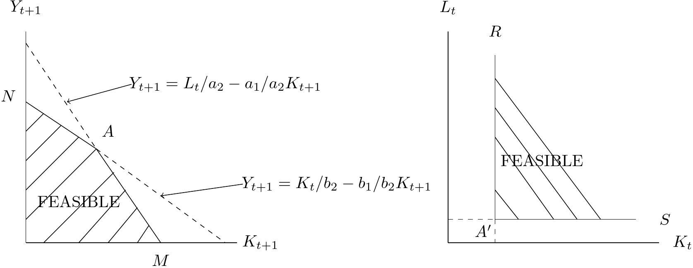

The relative prices $\frac{p_{2,t+1}}{p_{1,t+1}}$ must be equal to the slope of the Production possibility frontier at the production point actually observed. The relative prices of inputs $\frac{w_{t}}{p_{1,t}}$ can be any non negative number.

To simplify, let us focus on the stationary state without growth that Mark calls simple reproduction. Assume $L$ fixed in the steady state (stationary state) and that capital $K$ will accommodate to the supply of labor, namely that the economy reaches point $A$ where no input is redundant and therefore free. Therefore $p_{1},p_{2},w$ are positive. Simple reproduction implies

 $$L_{t}=L_{t+1}=...=L$$ 

$$K_{t}=K_{t+1}=...=K$$ 

$$Y_{t}=Y_{t+1}=...=Y$$ 

and

 $$a_{1}K+a_{2}Y=L$$ 

$$b_{1}K+b_{2}Y=K$$

So solving, the labor input equilibrium interms of capital gives:

 $$K=\frac{1}{a_{1}}L-\frac{a_{2}}{a_{1}}Y$$

whichb using the captal  input equilibrium implies:

$$Y=\left(\frac{1-b_{1}}{b_{2}}\right)K$$

combining we get aggregate consumption goods:

$$Y=\frac{1-b_{1}}{a_{1}b_{2}+\left(1-b_{1}\right)a_{2}}L$$ 

and production of investment goods:

 $$K=\frac{b_{2}}{a_{2}\left(1-b_{1}\right)+a_{1}b_{2}}L$$

We see that the national product (NP) in consumption unit is $Y$ and proportional to $L$. $K$ goes into the gross product but being an intermediate good needed to produce final consumption goods it is not included in NP. Marx assumed actual L used to be less than available L because of the existence of a "reserve army of the unemployed." He would interpret L as actual L and would have to add this magnitude as a further unknown variable of the system. A new equation is then needed. The Marxian literature relates the size of the reserve army to labor-saving innovations, depressions, and migration but does not appear to contain a determinate quantitative equation to explain why it is as large as it is, why it is not larger than it is.

Now let us turn to prices, wages and profit rate to analyze the possibility of capital "expropriating" labour. Remember that production takes one period (even if we are in the stationary state). Take $r$ the market interest rate **as given** and assume (CRS are coherent with this) competition among producers, investors, workers and owner of capital good. Then

$$p_{1}=\left(wa_{1}+p_{1}b_{1}\right)\left(1+r\right)$$ 

$$p_{2}=\left(wa_{2}+p_{1}b_{2}\right)\left(1+r\right)$$

Solve the first for $\frac{p_{1}}{w}$

$$\frac{p_{1}}{w}\left(1-\left(1+r\right)b_{1}\right)=a_{1}\left(1+r\right)$$

$$\frac{p_{1}}{w}=\frac{a_{1}\left(1+r\right)}{\left(1-\left(1+r\right)b_{1}\right)}$$

now use in the second

$$\frac{p_{2}}{w}=\left(a_{2}+\frac{p_{1}}{w}b_{2}\right)\left(1+r\right)$$

$$\frac{p_{2}}{w}=\left(a_{2}+\frac{a_{1}\left(1+r\right)}{\left(1-\left(1+r\right)b_{1}\right)}b_{2}\right)\left(1+r\right)$$ $$\frac{p_{2}}{w}=\frac{a_{2}\left(1+r\right)\left(1-\left(1+r\right)b_{1}\right)+a_{1}b_{2}\left(1+r\right)\left(1+r\right)}{\left(1-\left(1+r\right)b_{1}\right)}$$

which is the inverse of the real wage in terms of consumption goods. When $r=0$ we can see that $$\frac{w}{p_{2}}=\frac{Y}{L}$$ but $\frac{Y}{L}$ does not consider the time to production and if supply and demand among investors command a positive $r$ the workers will only receive the discounted productivity. Is it exploitation or discounting?

Also note that the relative price of two goods $\frac{p_{2}}{p_{1}}$ will not be proportional to their labor content if $r$ is positive.

$$\frac{p_{2}}{p_{1}}=\frac{a_{2}\left(1+r\right)\left(1-\left(1+r\right)b_{1}\right)+a_{1}b_{2}\left(1+r\right)\left(1+r\right)}{a_{1}\left(1+r\right)}$$

 if $r=0$ $$\frac{L_{1}+L_{2}}{L_{2}}=\frac{a_{2}\left(1-b_{1}\right)+a_{1}b_{2}}{a_{1}}$$ 	

A change in $r$ will change all relative prices. This fact casts arithmetic doubts on the relevance of the labor theory of value as a base point for a theory of labor exploitation. The proportionality between market price and labor content applies only when the surplus value is zero. 

Let us cast what derived using Marx terminology. Start from

$$L_{1}=a_{1}K$$

and

$$K_{1}=b_{1}K$$

If we compute the exchange value of of the two goods we have:

$$p_{1}K=\left(wL_{1}+p_{1}K_{1}\right)\left(1+r\right)$$

and

 $$p_{2}Y=\left(wL_{2}+p_{1}K_{2}\right)\left(1+r\right)$$

In Marxian terminology, we can write $C_{1}=p_{1}K_{1}$, the constant capital, and $V_{1}=wL_{1}$ as variable capital and $S_{1}=p_{1}K-C_{1}-V_{1}$, the surplus value, namely the difference between the capital industry sales and the constant and variable capitals. So we can write

$$p_{1}K=C_{1}+V_{1}+S_{1}$$

$$p_{2}Y=C_{2}+V_{2}+S_{2}$$

Now in Capital Vol. I Mark assumes equal rates of surplus value in different industries namely $S_{1}/V_{1}=S_{2}/V_{2}$ which we can see is generally not true

 $$\begin{aligned}
\frac{S_{1}}{V_{1}} & =\frac{p_{1}K-C_{1}-V_{1}}{V_{1}}=\frac{\left(wL_{1}+p_{1}K_{1}\right)\left(1+r\right)-p_{1}K_{1}-wL_{1}}{wL_{1}}\\
 & =\frac{r\left(wL_{1}+p_{1}K_{1}\right)}{wL_{1}}=\frac{r\left(wa_{1}+p_{1}b_{1}\right)}{wa_{1}}\\
 & =r+r\frac{p_{1}}{w}\frac{b_{1}}{a_{1}}=\frac{r}{1-b_{1}\left(1+r\right)}\end{aligned}$$

similarly $$\frac{S_{2}}{V_{2}}=\frac{S_{1}}{V_{1}}+r\frac{p_{1}}{w}\left(\frac{b_{2}}{a_{2}}-\frac{b_{1}}{a_{1}}\right)$$

so only in the very fortuitous case $\frac{b_{2}}{a_{2}}=\frac{b_{1}}{a_{1}}$this would be true. Or when $r=0$ and therefore there are no profits. Before moving to growth another contradiction exists: along with the “law of the falling rate of profit,” Marxian economists often speak of the “law of the falling (or constant) real wage of labor.”

Is there a law of the declining rate of profit as time goes on? well if $r$ decreases

$$\frac{w}{p_{2}}=\frac{\left(1-\left(1+r\right)b_{1}\right)}{a_{2}\left(1+r\right)\left(1-\left(1+r\right)b_{1}\right)+a_{1}b_{2}\left(1+r\right)\left(1+r\right)}$$ increases\...

Growth that maintains the fixed-proportion assumption can only be of the exponential type. (not a very appealing feature of our math)

$$L_{t+1}=(1+m)L_{t}=...=L_{0}(1+m)^t$$

$$K_{t+1}=(1+m)K_{t}=...=K_{0}(1+m)^t$$

and $$a_{1}(1+m)K_{t}+a_{2}Y_{t+1}=L_{t}$$

$$b_{1}(1+m)K_{t}+b_{2}Y_{t+1}=K_{t}$$

which implies 

$$Y_{t+1}=\frac{1-b_{1}(1+m)}{a_{2}\left[1-b_{1}(1+m)\right]+a_{1}b_{2}(1+m)}L_{t}$$ and

$$K_{t}=\frac{b_{2}}{a_{2}\left[1-b_{1}(1+m)\right]+a_{1}b_{2}(1+m)}L_{t}$$

Here the positive growth rate $m$ acts to blow up $b_1$ and $a_1$ into $(1+m)b_1$ and $(1+m)a_1$ but $b_2$ and $a_2$ are not affected. So the economy needs to accumulate capital and must save above the simple reproduction.

Marx did not complete really this part of the analysis. Later (Harrod-Domar) tried to get what determine the growth rate $m$. Namely the savings compatible with this "warranted rate of growth". This is a complicated issue that goes well beyond what is found in the Capital and maybe not really what Marx had in mind **but necessary to have a determined model**.

I finish this short presentation on Marx with a diagrammatic view of the Capital.

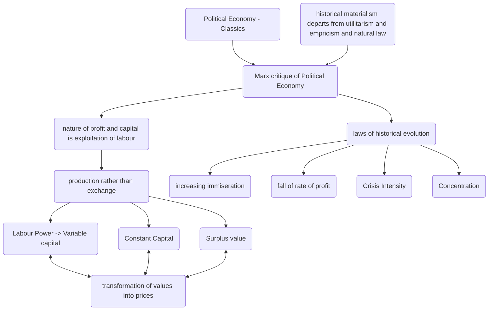
```mermaid
graph TD
    A(Political Economy - Classics)
    B(historical materialism departs from utilitarism and empricism and natural law)
    C(Marx critique of Political Economy)
    D(nature of profit and capital is exploitation of labour)
    E(laws of historical evolution)
    F(production rather than exchange)
    G(Labour Power -> Variable capital)
    H(Surplus value)
    L(Constant Capital)
    K(transformation of values into prices)
    M(increasing immiseration)
    N(fall of rate of profit)
    P(Crisis Intensity)
    Q(Concentration)

    A --> C
    B --> C
    C --> D
    C --> E
    D --> F 
    F --> G 
    F --> L
    F --> H
    G <--> K 
    L <--> K 
    H <--> K
    E --> M 
    E --> N 
    E --> P 
    E --> Q
```

## PART II: The Age of Economics

The second part of the course examines the emergence of "Economics" as a distinct discipline. While Alfred Marshall popularized the term, its modern usage was established in William Stanley Jevons's second edition of "Principles." This marked a fundamental shift from Classical Political Economy to modern Economics. Where Classical economists primarily focused on price formation (value theory), resource distribution across social classes, and mechanisms of economic growth, the new approach emphasized individual decision-making by consumers and firms, supported by mathematical formalization.

Economic historians identify the 1870s as the pivotal decade for this transformation. The change in focus and methodology was so profound that it came to be known as the "marginalist revolution" - a genuine scientific revolution in economic thinking. At its core was the premise that economic behavior could be modeled as optimization: firms maximizing profits and consumers maximizing utility. These optimization problems yielded decision rules based on marginal benefits and costs, expressed through first-order (and second-order) conditions.

This new framework differed from Classical economics in several key aspects. First, it was essentially microeconomic and static, contrasting with the Classics' dynamic, aggregate approach. Second, it suggested social harmony through market interactions rather than class conflict.  Third it gave credit to a special
version of utilitarian philosophy, one for which human behaviour is exclusively
reducible to rational calculation aimed at the maximization of utility. The consequence is a shift from an objective theory of value to a subjective one. While the marginalist revolution is conventionally dated to the 1870s, its intellectual foundations had been laid by several earlier thinkers whose contributions, though largely overlooked in their time, would later be recognized as prescient.

### Forerunners of marginalism

This different approach to economic problems started in the continent where isolated thinkers like Johann Heinrich Von Thunen (1783-1850), Antoine Augustine Cournot (1801-1877), Jules Dupuit (1804-1866), Hermann Heinrich Gossen (1810-1858) approached economic theory by posing less general and more practical questions but did not become mainstream until Jevons and Walras publications. Of the marginalist's forerunners, we will only look at Cournot as the unique insights of his major economics work, *Researches into the Mathematical Principles of Wealth* (1838) are, without parallel.  Although neglected in his time, the impact of Cournot's work on modern economics can hardly be overstated.

#### Antoine Augustin Cournot

The influence of Cournot on the development of modern microeconomics is significant. His main contribution was published in 1838, well ahead of the Principles of Mills, representing the final word on Classic Political Economy. To some extent, he was too ahead of his time, and his work did not substantially impact the profession before the advent of Walras, Jevons, and Marshall, who all report to have read Cournot and to have been greatly influenced by his work. Cournot believed in the prominent role of mathematics applied to the social sciences. He thought the purpose of using mathematics was to guide reasoning and illustrate arguments and not to obtain numerical values. He argued that mathematics allows us to identify analytical points more precisely and that observation is necessary for quantification. He also proposed differential calculus as the language of Economics (the theory of Wealth, in his words, as that name was not yet used).  Here is the flow chart of Cournot's first eight chapters.

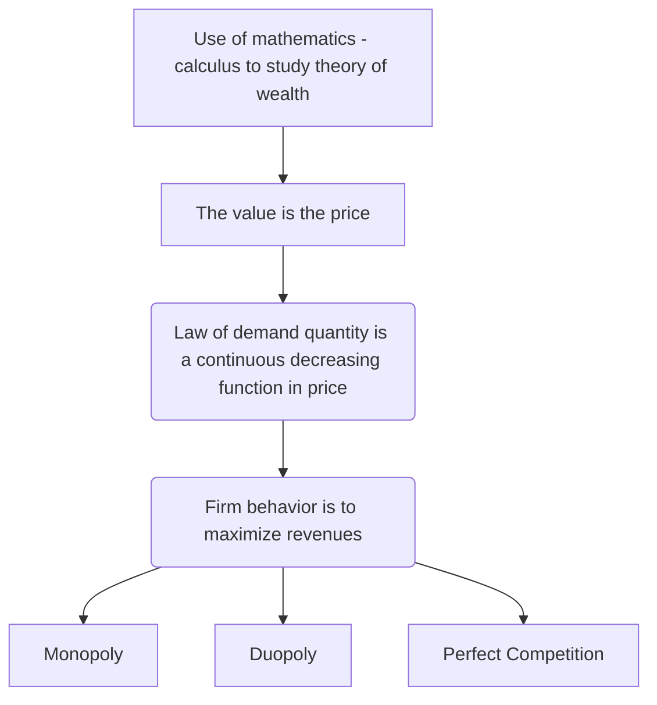
```mermaid
graph TD
    AA[Use of mathematics - calculus to study theory of wealth]
    A[The value is the price]
    B(Law of demand quantity is a continuous decreasing function in price)
    C(Firm behavior is to maximize revenues)
    D[Monopoly]
    E[Duopoly]
    F[Perfect Competition]
    AA --> A
    A --> B
    B --> C
    C --> D 
    C --> E 
    C --> F
```

In the preface Cournot[^cournot0] addresses a fundamental misunderstanding about the role of mathematical analysis in economic theory. Critics wrongly assumed that mathematical formalization in economics was limited to numerical calculations, and since exact numerical determinations were often impossible in economic theory, they dismissed mathematical approaches as futile or pedantic. However, Cournot argues that mathematical analysis serves a broader purpose: it reveals relationships between magnitudes and functions that cannot be expressed numerically, similar to how theoretical mechanics and probability theory provide useful general principles without requiring specific numerical values. The author's goal is to demonstrate that economic theory requires more sophisticated mathematical tools, particularly those dealing with arbitrary functions subject to specific conditions, rather than simple algebra, drawing parallels with how other sciences successfully use mathematics to derive general principles while still relying on experience for specific numerical applications.

He starts by recognizing that the theory of value must be simplified and adopts the convention that the value is simply the price.  It is in Chapter 4, ‘On the Law of Demand,’ that the modernity of his approach stands out. He first presents his central hypothesis, namely that the economic behaviour can be represented as a maximization problem of its profits. 

> *To lay the foundations of the theory of exchangeable values, we shall not accompany most speculative writers back to the cradle of the human race ; we shall undertake to explain neither the origin of property nor that of exchange or division of labour. All this doubtless belongs to the history of mankind, but it has no influence on a theory which could only become applicable at a very advanced state of civilization, at a period when (to use the language of mathematicians) the influence of the initial conditions is entirely gone. **We shall invoke but a single axiom, or, if you prefer a single hypothesis, i.e. that each one seeks to derive the greatest possible value from his goods or his labour***.
>
> Mathematical principles of the Theory of Wealth - Chapter IV

He is interested in demand as it is revealed in sales at a given price. He proposes to represent the relationship between sales and price by the continuous function $D=F(p)$ and observes that the function generally increases in size with a fall in price.  The assumption of continuity[^fnco1] will be precious to produce neat mathematical results. So here we see the clear use of mathematics to conceptualize a demand function. He then remarks that the empirical problem is determining the form of $F(p)$,  suggesting observing prices and quantity sold at a price and plotting them in a graph. Of course, he incurs an identification problem, but the modernity of his approach is remarkable. It is noticed, however, that Cournot does not tell us where this demand is coming from. There is yet no consumer utility, for that we will have to wait. Here is probably the first demand curve pubblished.

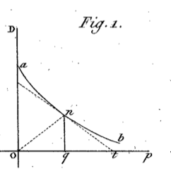
 

> *Furthermore,* **what is meant by the quantity demanded**?...***The cheaper an article is, the greater ordinarily is the demand for it***. ...We add the word generally as a corrective ; there are, in fact, some objects of whim and luxury which are only desirable on account of their rarity and of the high price which is the consequence thereof.
>
> **Let us admit therefore that the sales or the annual demand D is, for each article, a particular function F(p) of the price p of such article. To know the form of this function would be to know what we call the law of demand or of sales.** It depends evidently on the kind of utility of the article, on the nature of the services it can render or the enjoyments it can procure, on the habits and customs of the people, on the average wealth, and on the scale on which wealth is distributed. ... **Observation must therefore be depended on for furnishing the means of drawing up between proper limits a table of the corresponding values of D and p ; after which, by the well-known methods of interpolation or by graphic processes, an empiric formula or a curve can be made to represent the function in question**...
>
> Mathematical principles of the Theory of Wealth - Chapter IV

In Chapter IV, Cournot derives the first-order and second-order conditions for a firm that maximizes profits, noticing that if demand is continuous, profits are also continuous. He starts with an example without costs of production and present the optimality conditions that determine the price.

> Since the function $pF(p)$ at first increases and then decreases as $p$ increases, there is therefore a value of  $p$ which makes this function a **maximum**,and which is given by the equation $$F(p) + pF'(p) = 0$$

 > We know by the theory of maxima and mimima that equation (above) is satisfied as well by the values of $p$ which render $pF(p)$ a minimum as by those which render this product a maximum. The argument used at the beginning of the preceding article shows, indeed, that the function $pF(p)$ necessarily has a maximum, **but it might have several and pass through minimum values between**. A root of equation (above) corresponds to a maximum or a minimum according as  $$2F'(p)+pF''(p)< or >0$$.

One remarkable contribution of Cournot is to analyse the profit maximization problem under different assumptions on the level of competition of the market: monopoly, oligopoly, duopoly, and perfect competition. The novelty of this analysis is to explore different configurations relative to the perfect competition paradigm of the Classics. His duopoly analysis is still part of modern textbooks.  He starts with the monopolist problem:

> ... in which $\phi(D)$ denotes the cost...Since $D$ is connected with $p$ by the relation $D=F(p)$...Consequently the price to which the producer should bring his  article will be determined by the equation
> $$
> D + \frac{dD}{dp}\left[p-\frac{d\left[\phi\left(D\right)\right]}{dD}\right]=0
> $$

He then moves to his famous duopoly analysis, which we report almost entirely, given its importance. Cournot uses the example of two water producers (which is smart as water sources are not many) and sets the problem of each producer having to maximize its profits independently of the other producer. Therefore in setting the problem, Cournot recognizes the importance of the two producers not colluding. He also use the inverse demand so that the variable that the producers have to choose is the quantity and not the price. So here is the set-up of the problem:

> **Every one has a vague idea of the effects of competition. Theory should have attempted to render this idea more precise; and yet, for lack of regarding the question from the proper point of view  and for want of recourse to symbols of which the use in this connection becomes indispensable**,  economic writers have not in the least improved on popular notions in this respect.  These notions have remained as ill-defined and ill-applied in their works, as in popular language.  To make the abstract idea of monopoly comprehensible, we imagined one spring and one proprietor.  **Let us now imagine two proprietors and two springs of which the qualities are identical**, and which,  on account of their similar positions, **supply the same market in competition**.   In this case the price is necessarily the same for each proprietor.  If $p$ is this price, $D=F(p)$ the total sales, $D_1$ the sales from the spring (1) and $D_2$ the sales from the spring (2), then $D_1+D_2=D$. If, to begin with, we neglect the cost of production, the respective incomes of the proprietors will be $pD_1$ and $pD_2$ ; and each of them independently will seek to make this income as large as possible. **We say each independently , and this restriction is very essential**, as will soon appear ; for if they should come to an agreement so as to obtain for each the greatest possible income,  the results would be entirely different, and would not differ, so far as consumers are concerned, from those obtained in treating of a monopoly. Instead of adopting $D = F(p)$ as before,   in this case it will be convenient to adopt the inverse notation $p=f(D)$  and then the profits of proprietors (1) and (2) will be respectively expressed by 
> $$
> D_1 \times f(D_1 + D_2) \ and \  D_2 \times f(D_1 + D_2)
> $$
> i.e. by functions into each of which enter two variables, $D_1$ and $D_2$.
>
> Mathematical principles of the Theory of Wealth - Chapter VII

And now the solution to it:

> Proprietor (1) can have no direct influence on the determination of $D_2$ : all that he can do,  when $D_2$ has been determined by proprietor (2), is to choose for $D_1$ the value which is best for him. This he will be able to accomplish by properly adjusting his price, except as proprietor (2), who, seeing himself forced to accept this price and this value of $D_1$ may adopt a new value for $D_2$ more favourable to his interests than the preceding one. Analytically this is equivalent to saying that $D_1$ will be determined in terms of $D_2$ by the condition
>
> $$
> \frac{d\left[D_{1}f\left(D_{1}+D_{2}\right)\right]}{dD_{1}}=0
> $$
>
> and that $D_2$ will be determined in terms of $D_1$ by the analogous condition
>
> $$
> \frac{d\left[D_{2}f\left(D_{1}+D_{2}\right)\right]}{dD_{2}}=0
> $$
>
> whence it follows that the final values of $D_1$ and $D_2$, and consequently of $D$ and of $p$, will be determined by the system of equations
>
> $$
> (1) f\left(D_{1}+D_{2}\right)+D_{1}f'\left(D_{1}+D_{2}\right)=0
> $$
>
> $$
> (2) f\left(D_{1}+D_{2}\right)+D_{2}f'\left(D_{1}+D_{2}\right)=0
> $$
>
> Mathematical principles of the Theory of Wealth - Chapter VII

The passage introduces one of the first formal mathematical treatments of duopoly competition in economic theory. The author starts by explaining how to move from monopoly to duopoly, considering two identical springs (firms) serving the same market. The crucial insight is that each proprietor acts independently to maximize their own profit, which fundamentally differs from monopolistic collusion. The mathematical formulation expresses each proprietor's profit as a function of both their own sales (D₁ or D₂) and total market sales (D₁ + D₂), with price being a function of total quantity p = f(D). The solution demonstrates that equilibrium is reached when each proprietor maximizes their profit taking the other's output as given, leading to a system of simultaneous equations. This formulation essentially describes what would later be known as Cournot competition, where each firm's optimal strategy depends on their competitor's choice, and the final equilibrium requires both conditions to be satisfied simultaneously. The mathematical approach captures the interdependence of decisions in competitive markets, a feature that would have been difficult to express precisely without formal mathematical tools.

The solution is the correct one when the strategic variable is quantity. In modern textbooks, the two conditions are called the reaction functions of the two producers, namely the optimal behavior given the behavior of the other producer, and the solution is an example of a Nash equilibrium in game theory.  Cournot presents a graphical solution and argues that the equilibrium is stable[^fnco3] .

 
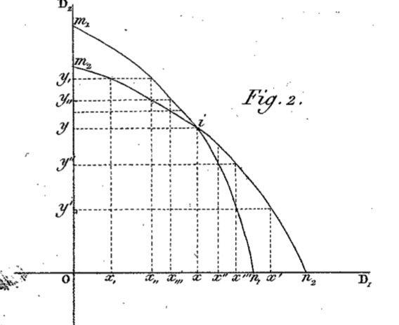

Finally he turns to the oligopoly[^fnco4] and the perfect competition case going back to price as the choice variable which we report here:

> The effects of competition have reached their limit, when each of the partial productions $D_k$ is **inappreciable** not only with reference to the total production $D = F(p)$ but also with reference to the derivative  $F'(p)$ so that the partial production $D_k$ could be subtracted from $D$ without any appreciable variation resulting in the price of the commodity....  According to this hypothesis, in the equation
> $$
> D_k + \frac{dD}{dp}\left[p-\frac{d\left[\phi_k\left(D_k\right)\right]}{dD}\right]=0
> $$
> the term $D_k$ can be neglected without sensible error, which reduces the equation to
>
> $$
> p-\phi_k(D_k) =0
> $$
> In consequence, the system of equations of the preceding chapter will be replaced by
>
> $$
> p-\phi_1(D_1) =0,p-\phi_2(D_2) =0,...,p-\phi_n(D_n) =0
> $$
>
> These $n$ equations together with
>
> $$
> D_1+D_2+...+D_n=F(p)
> $$
>
> will determine all the unknown quantities $p$ and $D_1$,$D_2$,...,$D_n$.  If we conceive of all the equations of (i) as solved with reference to $D_1$,$D_2$,...,$D_n$  the first member of equation (2) will become a function of $p$, which we can represent by $\Omega(p)$, so that this equation can be written in  the very simple form
>
> $$
> \Omega(p)-F(p)=0.
> $$
>
> In the hypothesis under consideration, all the functions $\phi_k'(D_k)$ must be be considered to increase with $D_k$. 

This passage describes the mathematical transition from oligopoly to perfect competition, introducing a key concept in economic theory. The author shows that when each firm's production ($D_k$) becomes "inappreciable" (negligibly small) relative to both total market production ($D$) and its derivative, we arrive at perfect competition. In this case, no individual firm can influence the market price by changing their output. The mathematical formalization demonstrates how the complex oligopoly equations simplify to a system where price equals marginal cost ($p = φ_k(D_k)$) for each firm, a fundamental principle of perfect competition. The total market equilibrium is then determined by these individual firm conditions plus the market clearing condition that total supply equals demand. This formalization is particularly significant as it mathematically demonstrates how perfect competition emerges as a limiting case when firms become infinitesimally small relative to the market, a concept that would become central to modern microeconomic theory.

The passage essentially provides one of the first rigorous mathematical demonstrations of the relationship between market structure (number and size of firms) and price determination, showing how perfect competition emerges as a special case where individual firms become price-takers rather than price-makers. He also set up the system of equations, which, although partial equilibrium as they only represent the production side of the economy,  will inspire Leon Walras in his resolution of the general equilibrium. 

### Marginalism I

Although Cournot can be seen as a marginalist, Historians have identified the official starting date in 1871 with the publication of Theory of Political Economy by William Stanley Jevons (1835-1882). As mentioned above, the main characteristics of this new approach to economics are the focus on the individual decisions of producers and consumers and the consequences of these decisions on allocating resources in the economy. The central behavioral hypothesis is the same as in the Classics economists: every producer or consumer chooses what is best for himself, but the leap forward is the reduction of this behavior to the maximization of profits for producers, as Cournot had anticipated, and of a utility function for the consumers. 

#### William Stanley Jevons 

The use of the utility is a key contribution of Jevons, who, in his words, treats the economy as a "calculus of pleasure and pain" and leads him to a theory of value that depends only on utility. An individual maximizing his utility his led the right amount of consumption whose value depends entirely on the "final degree of utility" and not on labor content as previously argued by the Classics.[^fnj0].  A second innovation is that Jevons uses the same approach to determine the labor supply. In this case, the individual minimizes the pain that working provides, considering that his income allows him to consume. Jevons therefore introduces what we would know today as the theory of the consumer. He also presents the first 2 by 2 exchange equilibrium model. Here is the parts of his principles that we will cover.

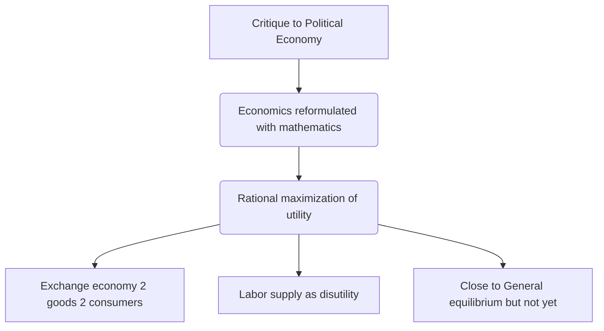
```mermaid
graph TD
    A[Critique to Political Economy]
    B(Economics reformulated with mathematics)
    C(Rational maximization of utility)
    D[Exchange economy 2 goods 2 consumers]
    E[Labor supply as disutility]
    F[Close to General equilibrium but not yet]
    A --> B
    B --> C
    C --> D 
    C --> E 
    C --> F
```

Jevons, in 1871, is convinced of proposing a revolution relative to his predecessors[^fnj1] by suggesting that political economy must be analyzed through mathematical methods. He is not a sufficiently skilled mathematician to reach definite answers on that matter and his presentation of the subject is very pedagogical reflecting his efforts to go trough a formal analysis. 

> ..In this work I have attempted **to treat Economy as Calculus of Pleasure and Pain** *and have sketched out, almost irrespective of previous opinions, the form which the science, as it seems to me, must ultimately take. I have long thought that as it deals throughout with quantities, it must be a mathematical science in matter if not in language. I endeavoured to arrive at accurate quantitative notions concerning Utility, Value, Labour, Capital, etc., and I have often been surprised to find how clearly some of* **the most difficult notion**, especially that most puzzling of notions **Value, admit of mathematical analysis and expression**. **The Theory of Economy thus treated presents a close analogy to the science of Statical Mechanics, and the Laws of Exchange are found to resemble the Laws of Equilibrium of a lever as determined by the principle of virtual velocities.**
>
> Theory of Political Economy - Preface first edition 1871

But as we have seen, this revolution had already occurred, and in the second edition, where he suggests changing the name from Political Economy to Economics, he recognizes the work of Cournot, Gossen, and others[^fnj2].

Chapter 2 of Jevons' Theory of Political Economy focuses on "Theory of Pleasure and Pain." Jevons begins by establishing that economics must be grounded in a scientific understanding of human feelings, particularly pleasure and pain. He argues that these sensations are the ultimate object of economics, as they are the motivating forces behind all human action. Drawing heavily on Jeremy Bentham's utilitarian philosophy, he proposes that pleasure and pain can be treated as measurable quantities, though he acknowledges they are subjective experiences.

The key theoretical innovation is his attempt to mathematize these feelings, suggesting that pleasure and pain have several measurable dimensions: intensity, duration, certainty/uncertainty, and proximity/remoteness in time. Jevons argues that human beings naturally seek to maximize pleasure and minimize pain, making these calculations (even if unconsciously) in their economic decisions. This forms the foundation for his later analysis of utility and economic behavior, effectively laying the groundwork for modern utility theory and rational choice economics. He importantly notes that while we cannot directly measure these feelings, we can observe their effects through human choices and market behavior.

Jevons presents in chapter III his theory of utility. He clearly states that utility is an abstract quality that a commodity provides to the individual and that the economic problem the individual faces to optimally choose how much to consume or supply commodities. Jevons next distinguished between total utility and ‘final degree of utility’, defined as ‘the degree of utility of the last addition, or the next possible addition of a very small, or infinitely small, quantity to the existing stock’. The presentation of Jevons is extremely pedagogical, he explains every step of the reasoning as if he was writing for readers untrained in calculus.

> **Pleasure and pain are undoubtedly the ultimate objects of the Calculus of Economics. To satisfy our wants to the utmost with the least effort, to procure the greatest amount of what is desirable at the expense of the least that is undesirable in other words, to maximise pleasure, is the problem of Economics.**
> **By a commodity we shall understand any object, substance, action, or service, which can afford pleasure or ward off pain...and employ the term utility to denote the abstract quality whereby an object serves our purposes, and becomes entitled to rank as a commodity.**

> **Utility must be considered as measured by, or even as actually identical with, the addition made to a person's happiness.** It is a convenient name for the aggregate of the favorable balance of feeling produced, the sum of the
> pleasure created and the pain prevented. **We must now carefully discriminate between the total utility arising from any commodity and the utility attaching to any particular portion of it.** Thus the total utility of the food we eat consists in maintaining life, and may be considered as infinitely great; but if we were to subtract a tenth part from what we eat daily, our loss would be but slight. We should certainly not lose a tenth part of the whole utility of food to us. It might be doubtful whether we should suffer any harm at all.

> Let us imagine the whole quantity of food which a person consumes on an average during twenty-four hours to be divided into ten equal parts. If his food be reduced by the last part, he will suffer but little; if a second tenth part be deficient, he will feel the want distinctly; the subtraction of the third tenth part will be decidedly injurious; with every subsequent subtraction of a tenth part his sufferings will be more and more serious, until at length he will be upon the verge of starvation. Now, if we call each of the tenth parts an increment, the meaning of these facts is, that each increment of food is less necessary, or possesses less utility, than the previous one. To explain this variation of utility we may make use of space representations, which I have found convenient in illustrating the laws of economics in my college lectures during fifteen years past.
>
> Theory of Political Economy - The theory of Utility - Chapter III

Jevons begins by establishing economics as a calculus of pleasure and pain, where the ultimate goal is to maximize pleasure (utility) while minimizing disutility. He carefully defines utility as the abstract quality that makes something a commodity by serving human purposes, directly connecting it to happiness or well-being. His crucial innovation is the distinction between total utility and the utility of additional portions (marginal utility), illustrated through the famous food example: while the total utility of food might be infinite (as it sustains life), each additional portion (increment) provides decreasing additional satisfaction. This example introduces the principle of diminishing marginal utility - one of the cornerstones of modern economic theory. The passage is particularly significant as it represents one of the first attempts to systematically quantify and mathematically analyse human satisfaction, laying the groundwork for modern consumer theory and welfare economics. Here is the original graph of the marginal utility concept that he first presents in terms of consuming a discrete amount of food.

> Let the line $ox$ be used as a measure of the quantity of food, and let it be divided into ten equal parts to correspond to the ten portions of food mentioned above. Upon these equal lines are constructed rectangles and the area of each rectangle may be assumed to represent the utility of the increment of food corresponding to its base. Thus the utility of the last increment is small, being proportional to the small rectangle on X. As we approach towards o, each increment bears a larger rectangle, that standing upon III being the largest complete rectangle. **The utility of the next increment, II, is undefined, as also that of I, since these portions of food would be indispensable to life, and their utility, therefore, infinitely great**

He then moves to the assumption of considering a continuous function for the degree of utility (today marginal utility), and here, he justifies it by arguing that aggregation of small units would make it continuous. Today we know that we cannot use what holds for an individual to hold at the aggregate level except in special cases and in the case of the representative agent. In reality he wants to transmit the idea that even if continuity appears to be logically unrealistic, it is a useful abstraction as it permits a formal analysis, an idea that Cournot had also expressed. Jevons original exposition is worth reporting for its clarity and simplicity.

> But the division of the food into ten equal parts is an arbitrary supposition. If we had taken twenty or a hundred or more equal parts, the same general principle would hold true, namely, that each small portion would be less useful and necessary than the last. The law may be considered to hold true theoretically, however small the increments are made; and in this way we shall at last reach a figure which is undistinguishable from a continuous curve. **The notion of infinitely small quantities of food may seem absurd as regards the consumption of one individual; but when we consider the consumption of a nation as a whole, the consumption may well be conceived to increase or diminish by quantities which are, practically speaking, infinitely small compared with the whole consumption.** The laws which we are about to trace out are to be conceived as theoretically true of the individual; they can only be practically verified as regards the aggregate transactions, productions, and consumptions of a large body of people. But the laws of the aggregate depend of course upon the laws applying to individual cases....

He then introduces the utility function $u(x)$ and the degree of utility $y(x)$.

> Let $x$ signify, as is usual in mathematical books, the quantity which varies independently, in this case the quantity of commodity. Let $u$ denote the **whole utility** proceeding from the consumption of $x$. Then $u$ will be, as mathematicians say, a function of $x$; that is, it will vary in some continuous and regular, but probably unknown, manner, whenx  is made to vary...Our great object at present, however, is to express the **degree of utility**.

Then using graphical Analysis he presents the reader the notion of limit to allow him to understand how to go from a discrete function to a continuous function and define formally the degree of utility as the differential of the function $u$ with respect to $x$ .

> We find these considerations fully illustrated by Fig. IV., in which oa represents $x$, and $ab$ is the degree of utility at the point $a$. Now, if we increase $x$ by the small quantity $aa'$, or $\Delta  x$, the utility is increased  by the small rectangle $abb'a'$, or $\Delta    u$; and, since a rectangle is the product of its sides, we find that the length of the line ab, the degree of utility, is represented by the fraction $\frac{\Delta u}{\Delta x}$.

> As already explained, however, the utility of a commodity may be considered to vary with perfect continuity, so that we commit a small error in assuming it to be uniform over the whole increment $\Delta x$. To avoid this we must imagine $\Delta x$ to be reduced to an infinitely small size, Du decreasing with it. The smaller the quantities are the more nearly we shall have a correct expression for $ab$, the degree of utility at the point $a.$ **Thus the limit of this fraction $\frac{\Delta u}{\Delta x}$ or, as it is commonly expressed $\frac{du}{dx}$ , is the degree of utility corresponding to the quantity of commodity $x$**. The degree of utility is, in mathematical language, the differential coefficient of $u$ considered as a function of $x$, and will itself be another function of $x$.

The passage represents a crucial moment in economic theory where calculus is formally introduced to define marginal utility. Jevons explains how the transition from discrete changes ($Δu/Δx$) to continuous changes ($du/dx$) provides a more precise mathematical representation of utility's rate of change. Using a geometric illustration, he shows that the degree of utility (marginal utility) at any point can be understood as the limit of the ratio between a small change in total utility and a small change in quantity as these changes become infinitesimally small. This mathematical formalization was revolutionary as it provided a precise way to express diminishing marginal utility, transforming an intuitive concept into a mathematical one that could be used for rigorous economic analysis. The introduction of differential calculus to express marginal utility would become fundamental to modern microeconomic theory, particularly in consumer theory and optimization problems.

The next step in his reasoning is to present the final degree of utility which is basically the value of the marginal utility at $x$, the quantity of the good consumed and define it as the central function of economics.    

> **We shall seldom need to consider the degree of utility except as regards the last increment which has been consumed**, or, which comes to the same thing, the next increment which is about to be consumed. I shall therefore commonly use the expression **final degree of utility, as meaning the degree of utility of the last addition**, or the next possible addition of a very small, or infinitely small, quantity to the existing stock. In ordinary circumstances, too, the final degree of utility will not be great compared with what it might be.

> **The final degree of utility is that function upon which the theory of economics will be found to turn**. Economists, generally speaking, have failed to discriminate between this function and the total utility, and from this confusion has arisen much perplexity. Many commodities which are most useful to us are esteemed and desired but little. We cannot live without water, and yet in ordinary circumstances we set no value on it. Why is this? Simply because we usually have so much of it that its final degree of utility is reduced nearly to zero. We enjoy every day the almost infinite utility of water, but then we do not need to consume more than we have. Let the supply run short by drought, and we begin to feel the higher degrees of utility, of which we think but little at other times.

Jevons makes two fundamental points that would reshape economic thinking. First, he argues that economic analysis should focus primarily on the utility of the last (or next) small increment consumed, rather than total utility. Second, he resolves the famous water-diamond paradox that had puzzled earlier economists including Adam Smith - explaining why vital goods like water often have little market value while less essential items like diamonds command high prices. The key insight is that economic value depends not on total utility but on the final degree of utility, which is determined by relative scarcity. Water's low price reflects its abundance (making its marginal utility near zero) despite its high total utility, while diamonds' high price reflects their scarcity (maintaining high marginal utility). This conceptual breakthrough would become foundational to modern price theory and consumer behavior analysis.

Armed with the final degree of utility Jevons turns to the theory of exchange, developed in the fourth chapter of the Theory, which is probably his best known piece of work. Jevons had no doubt of its significance, declaring that without a ‘perfect comprehension’ of the theory it was ‘impossible to have a correct idea of the science of Economics’. The analysis rested on several assumptions. First, that of a ‘perfect market’ defined as ‘two or more persons dealing in two or more commodities’ with traders having ‘perfect knowledge of the conditions of supply and demand, and the consequent ratios of exchange. The trading body is treated as a single individual, aiming to maximise its utility and subject to an ultimately diminishing final degree of utility as it consumes more of any one commodity. Each trading body is initially the sole possessor of a particular stock of commodity: one has beef and the other corn. At the onset he presents the result of his analysis:                  

> **The keystone of the whole Theory of Exchange, and of the principal problems of Economics, lies in this proposition. The ratio of exchange of any two commodities will be the reciprocal of the ratio of the final degrees of utility of the quantities of commodity available for consumption after the exchange is completed.** When the reader has reflected a little upon the meaning of this proposition, he will see, I think, that it is necessarily true, if the principles of human nature have been correctly represented in previous pages.
>
> Theory of Political Economy - Theory of Exchange - chapter IV 

And then presents his two commodities by two consumer exchange model. [^jevons2]

Let us report how Jevons derived the equilibrium that occurs after trade using the same notation of the original text below. Let $a$: corn initially held by $A$, $x$: corn traded, $b$: beef initially held by $B$, $y$: beef traded, $\varphi_{1}(a-x)$ denote the final degree of utility of corn to $A$, $\psi_{1}(y)$ denote $A$’s final degree of utility for beef,  $\psi_{2}(b-y)$ denote the final degree of utility of beef to $B$, and $\varphi_{2}(x)$ denote $B$’s final degree of utility for corn. The equilibrium Jevons derives is

​       					$$\frac{\phi_{1}\left(a-x\right)}{\psi_{1}(y)}=\frac{y}{x}=\frac{\phi_{2}\left(x\right)}{\psi_{2}\left(b-y\right)}$$

where the ratio $y$ to $x$ represents how the two commodities are traded in the market (the value of one in terms of the other). So how do we arrive to this solution? He starts by postulating that the relative value of beef in term of corn in the market is $y/x$.  If the exchange value of beef and corn is $y/x$ then the when an exchange of $\Delta{y}$ units of beef occurs it must be for $\frac{y}{x}\Delta x$ units of corn. He presents this argument in terms of discrete changes and will map into continuous changes below.

> To represent this process of reasoning in symbols, let $\Delta x$ denote a small increment of corn, and $\Delta y$ a small increment of beef exchanged for it. Now our Law of Indifference comes into play. As both the corn and the beef are homogeneous commodities, **no parts can be exchanged at a different ratio from other parts in the same market: hence, if $x$ be the whole quantity of corn given for $y$ the whole quantity of beef received**, $\Delta	y$ must have the same ratio to $\Delta	x$ as $y$ to $x$; we have then, 
> $$
> \frac{\Delta y}{\Delta x}=\frac{y}{x}  \\ or \\  \Delta y=\frac{y}{x}\Delta x.
> $$

> In a state of equilibrium, the utilities of these increments must be equal in the case of each party, in order that neither more nor less exchange would be desirable. Now the increment of beef, $\Delta y$, is $y/x$ times as great as the increment of corn, $\Delta x$, so that, in order that their utilities shall be equal, the degree of utility of beef must be $x/y$ times as great as the degree of utility of corn.

> Thus we arrive at the principle that the degrees of utility of commodities  exchanged will be in the inverse proportion of the magnitudes of the increments exchanged. Let us now suppose that the first body, $A$, originally possessed the quantity $a$ of corn, and that the second body, $B$, possessed the quantity $b$ of beef. As the exchange consists in giving $x$ of corn for $y$ of beef, the state of things after exchange will be as follows: $A$ holds $a-x$ of corn, and $y$ of beef, $B$ holds $x$ of corn, and $b-y$ of beef. Let $\varphi_{1}(a-x)$ denote the final degree of utility of corn to A, and $\varphi_{2}(x)$ the corresponding function for $x$. Also let $\psi_{1}(y)$ denote A’s final degree of utility for beef, and $\psi_{2}(b-y)$ B’s similar function. Then, as explained previously will not be satisfied unless the following equation holds true:
> $$
> \phi_{1}\left(a-x\right)dx	=\psi_{1}(y)dy \\\\
> or\\ 	\frac{\phi_{1}\left(a-x\right)}{\psi_{1}(y)}=\frac{dy}{dx}
> $$

> Hence, substituting for the second member by the equation given
> previously, we have
> $$
> \frac{\phi_{1}(a-x)}{\psi_{1}(y)}=\frac{y}{x}
> $$
> What holds true of A will also hold true of B, mutatis mutandis. He must also derive exactly equal utility from the final increments, otherwise it will be for his interest to exchange either more or less, and he will disturb the conditions of exchange. Accordingly [substituting as before] the following final equation must hold true... :
> $$
> \frac{\phi_{2}\left(x\right)}{\psi_{2}\left(b-y\right)}=\frac{y}{x}
> $$
> We arrive, then at the conclusion that whenever two commodities are exchanged for each other, and more or less can be given or received in infinitely small quantities, the quantities exchanged satisfy two equations, which may be stated thus in a concise form
> $$
> \frac{\phi_{1}\left(a-x\right)}{\psi_{1}(y)}=\frac{y}{x}=\frac{\phi_{2}\left(x\right)}{\psi_{2}\left(b-y\right)}
> $$
> Theory of Political Economy - Theory of Exchange - chapter IV 

Notice that he does not provide here the solution in terms of relative prices but in terms of exchange value. Later in the book, but without equating the ratio of marginal utility to the relative price he derives that the exchange value is equal to the ratio of prices:

> **Value is of course very frequently estimated by price**, that is, by the quantity of legal money for which the commodity may be exchanged. Price is indeed ambiguous in the same way as value; it means either the price of the whole quantity, or the price per unit of the quantity. Let $p_{1}$ be the price per unit of $X$, and $p_{2}$ the similar price of $Y$. Then it is apparent that $y\times p_{2}$ will be the whole price of $y$, and $x\times p_{1}$ will be the whole price of $x$. These two must be equal to each other, so that we get $\frac{y}{x}=\frac{p_{1}}{p_{2}}$.
>
> Theory of Political Economy - The theory of Labour - chapter V

The fifth chapter of the Theory is best known for the treatment of labour-supply, considered by some to have been Jevons’s most important contribution to the main stream of neoclassical economics which is the synthesis of economics that started with the marginalist contributions. He introduces the notion of intensity margin for the supply of labor. This of course to allow the quantity of labor to vary continuously and use the same mathematical tools to derive his theory. An important novelty is to identify what enters the utility of the individual is the pain that labor provides. [^jevons3]

I will spare you the equations and just report his graphical analysis. Notice that the painfulness of labour, the lower parabola, is of a particular shape. The y axis are still the degree of utility. You can think of a farmer that produces his own $x$ by supplying labour. For Jevons after a certain amount of effort the utility of providing labor becomes negative because of pain. The optimal supply of labour will therefore be the amount that equates the degree of disutility provided by pain to the degree of utility provided by consumption[^jevons_labour].

He then turns to production where he equates rates of production, say marginal productivity in modern language, to the relative value of the two commodities in the market.

> To simplify our expressions, let us substitute for the rate of production $\frac{dx}{dl}$ the symbol $\bar{\omega}$. Then $\bar{\omega}_{1}$, $\bar{\omega}_{2}$ express the relative quantities of two different commodities produced by an increment of labour...so that we may at once deduce the all-important equation $\frac{\bar{\omega}_{2}}{\bar{\omega}_{1}}=\frac{y_{1}}{x_{1}}$.
>
> Theory of Political Economy - The theory of Labour - chapter V 

Which using the previous exchange equilibrium is equal to the ratio of the final utility of the two goods. He then equates the marginal productivity to the ratio of the cost of production coming close to give a full general equilibrium solution but only close because here instead of realizing that prices and quantities are simultaneously determined in equilibrium he appears confused and almost states that the relative prices are equal to the ratio of cost of production, a very classic observation. 

Finally Jevons makes an important contribution in chapter VII by conceptualizing capital in terms of time. He defines capital as "the aggregate of those commodities which are required for sustaining labourers of any kind or class engaged in work." The key insight is that capital's primary function is to enable workers to undertake lengthy production processes - "to put an interval between the beginning and the end of an enterprise."

Jevons introduces two crucial distinct concepts:

1. The "amount of capital invested" - the physical quantity of inputs in the production process
2. The "amount of investment of capital" - the physical quantity multiplied by the time

In this diagram, production begins at time 0 and ends at time T. The rectangles represents cumulative capital addition until the final output is realized. The total amount of capital invested (I*) can be expressed as: I* = ∑ᵀₜ₌₀ I_t. The "amount of investment of capital" is represented by the entire area. With θ = T/2 as the average time of investment, this can be expressed as θI* = TI*/2. He held that it is possible to increase production by increasing the amount of the investment, or by extending its average period. This is the first appearance of the concept of the marginal productivity of capital.

#### Leon Walras

Leon Walras (1834-1910) was one of the three leaders of the Marginalist Revolution, even though his greatest work, *Elements of Pure Economics*, was published in 1874, three years after those of William Stanley Jevons. His book is divided in eight parts. In the first part Walras provides his definition of the scope of economics,  his acceptance of the subjective value theory and the importance of the mathematical method. In time with new editions he comes to recognize that Jevons[^walras_1] was working independently on very similar questions. Nonetheless, alone among the marginalists, Léon Walras set forth the new theory in a formal general equilibrium setting.  Thus, he endowed it with the multi-market considerations Jevons had largely avoided. Léon Walras is widely and rightfully regarded as the father of General Equilibrium Theory. His model showed that supply and demand in any single market are influenced by prices in other markets, and true equilibrium occurs when all individuals can simultaneously maximize their objectives without excess demand.

In Walras's economic model, the economy consists of agents acting as either consumers or entrepreneurs. Consumers provide productive services and make decisions about consumption and savings, while entrepreneurs make production and investment decisions. Importantly, this model eliminates the concept of social classes, as spending patterns are determined by the amount of income rather than its source.

The economic process begins with an initial endowment of goods and resources. Consumers seek to maximize their satisfaction through optimal distribution of income between consumption and savings, while entrepreneurs aim to maximize profits. These pursuits lead to exchange relationships where consumers supply factors of production to firms in exchange for income, which they then use for purchases or savings. Firms use these factors along with intermediate goods to produce output, generating revenues that are either distributed to owners or reinvested. 

Walras's theory aimed to demonstrate how voluntary exchanges between rational, self-interested, and well-informed individuals could lead to efficient economic outcomes through market interactions alone. His model required perfect competition, excluding any form of organized social groups like unions or cartels, and relied on a system where prices coordinate individual actions to achieve optimal outcomes.

A crucial aspect of his model was the concept of price formation, which relied on two theoretical constructs: the 'auctioneer' and the 'Sisyphus entrepreneur.' The auctioneer facilitates a process called tâtonnement, where prices are adjusted through trial and error until supply equals demand in all markets. Importantly, no actual trades occur until equilibrium prices are reached. The Sisyphus entrepreneur, meanwhile, operates with zero profit in equilibrium, serving merely as a coordinator of productive activity rather than a true profit maximizer.

Walras formalized his theory through a system of simultaneous equations describing interactions between consumers and sellers across all markets. However, his mathematical framework had some limitations: uncertainty about whether solutions to his equations existed or had economic meaning. While Walras recognized his model was idealized and different from real markets, he hoped it could serve as a blueprint for economic reform. It wasn't until nearly a century later that neoclassical economists would address some of these mathematical challenges.

Walras's mathematical treatment began with a fundamental analysis of two-commodity exchange, where he introduced the crucial concept of relative prices.  This is where the contact with Jevons is most evident although he immediately introduces the notion of relative prices that will be important to understand what is determined in equilibrium.

> ..If, in fact, prices result mathematically from demand curves, the causes and primary conditions that generate and affect demand curves will also generate and affect prices.
>
> ...I shall, therefore, assume the existence of a standard measure of intensity of wants or intensive utility, which is applicable not only to similar units of the same kind of wealth but also to different units of various kinds of wealth.
>
> ...**Let us define prices in general as ratios between values in exchange or as relative values in exchange. In general, also, let us designate the price of (B) in terms of (𝐴) *by* $p_b$ and the price of (𝐴) in terms of (𝐵) *by* $p_a$...**

The presentation of the rareté, his word for "marginal utility", is more precise in terms of mathematical exposition, although slighlty less intuitive for the non mathematical proficient reader. Here I report his graphical explanation of the rareté. Note also that the axis are inverted respect to Jevons [^walras_2].

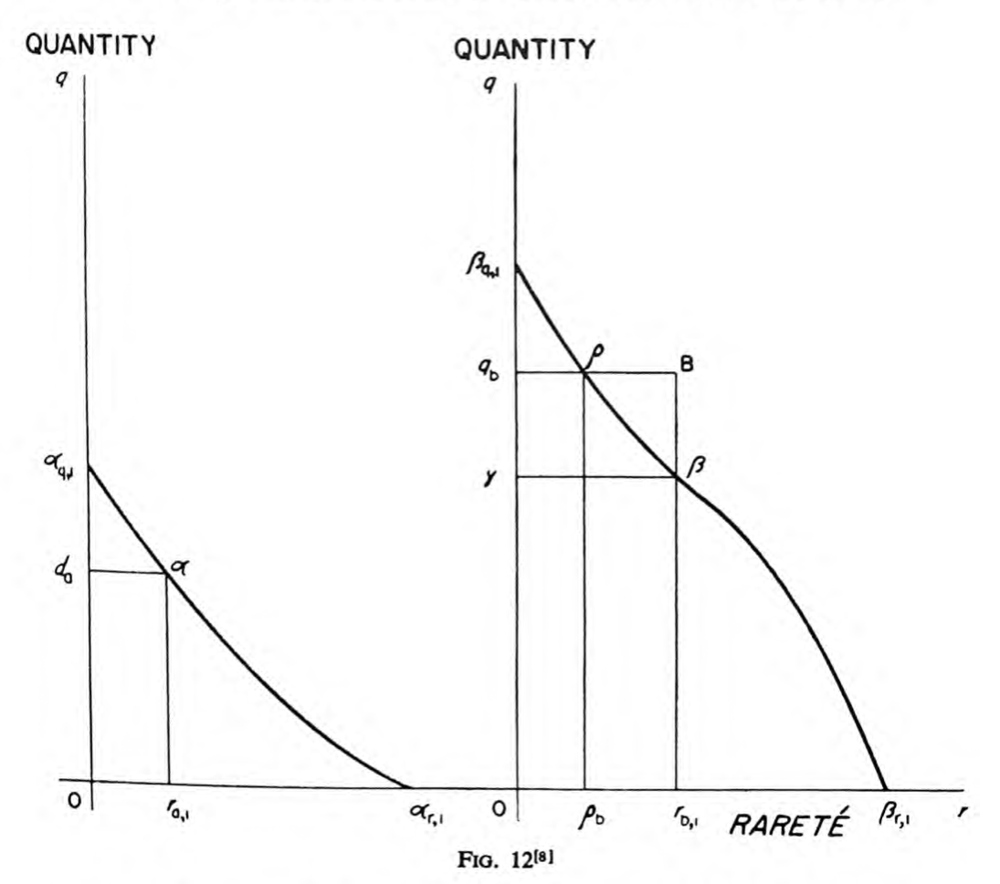

The mathematical formulation was particularly precise, showing how utility relates to quantity consumed:

> Analytically, if we are given effective utilities as functions of the quantities consumed according to the equations $u=\Phi_{a,1}\left(q\right)$ and $u=\Phi_{b,1}\left(q\right)$ the raretes are designated by the derivatives $\Phi_{a,1}'\left(q\right)$ and $\Phi_{b,1}'\left(q\right)$. If, on the other hand, we are given the raretes as functions of the quantities consumed, according to the equations $r=\phi_{a,1}\left(q\right)$ and $r=\phi_{b,1}\left(q\right)$ then the effective utilities are designated by the definite integrals from $0$ to $q$: $\int_{0}^{q}\phi_{a,1}\left(q\right)dq$ and $\int_{0}^{q}\phi_{b,1}\left(q\right)dq$. We then have for $u$ and $r$ the mutually related expressions
> $$
> u=\Phi\left(q\right)=\int_{0}^{q}\phi\left(q\right)dq,
> $$
> and
> $$
> r=\Phi'\left(q\right)=\phi\left(q\right).
> $$
> Elements of Pure Economics - Utility curves or want curves - Lesson 8

This mathematical precision was a significant advance in economic theory.  Building on this foundation, Walras demonstrated how equilibrium emerges through exchange, introducing the concept of utility maximization. As he stated, if an individual's "object in trading is to gratify the greatest possible sum total of wants," then the ratio of marginal utilities must equal the price ratio. This led to his formal equation:

$$
\phi_{a,1}(d_{a}) = p_{a}\phi_{b,1}(q_{b}-d_{a}p_{a})
$$
Here $q_{b}$ is the endowment of good b and $o_{b}$ is the quantity exchanged and we use $o_{b} = d_{a}p_{a}$.

> If we suppose that **his object in trading is to gratify the greatest possible sum total of wants**, then, surely, $d_{a}$ is determined for a given $p_{a}$ by the condition that the sum of the two areas, $Oy\beta\beta_{r,1}$ and $Od_{a}\alpha\alpha_{r,1}$ be maximized. Now the condition of such a maximum is that the ratio of the intensities $r_{a,1}$ and $r_{b,1}$ of the last wants satisfied by the quantities $d_{a}$ and $y$, i.e. the ratio of their respective raretés upon completion of this exchange, be equal to the price $p_{a}$. If, in the equation 
> $$
> r_{a,1}=p_{a}r_{b,1},
> $$
> we replace $r_{a,1}$ and $r_{b,1}$ by their equivalents, then
> $$
> \begin{aligned}
> \phi_{a,1}\left(d_{a}\right) & =p_{a}\phi_{b,1}\left(y\right)=p_{a}\phi_{b,1}\left(q_{b}-o_{b}\right)\\
> & =p_{a}\phi_{b,1}\left(q_{b}-d_{a}p_{a}\right).\end{aligned}
> $$
> This last equation gives $d_{a}$ as a function of $p_{a}$. If we suppose the equation to be solved for the first of the two variables, this relation reduces to 
> $$
> d_{a}=f_{a,1}\left(p_{a}\right).
> $$

He goes beyond Jevons by recognizing that this solution corresponds to the maximization of the utity function subject to the budget constraint which will become the standard way to derive the optimality conditions. 

> Others will see immediately that by differentiating either of the expressions with respect to $d_{a}$
> $$
> \Phi_{a,1}\left(d_{a}\right)+\Phi_{b,1}\left(q_{b}-d_{a}p_{a}\right)
> $$
> or
> $$
> \int_{0}^{d_{a}}\phi_{a,1}\left(q\right)dq+\int_{0}^{q_{b}-d_{a}p_{a}}\phi_{b,1}\left(q\right)dq
> $$
> we obtain
> $$
> \phi_{a,1}\left(d_{a}\right)-p_{a}\phi_{b,1}\left(q_{b}-d_{a}p_{a}\right)=0
> $$
> or
> $$
> \phi_{a,1}\left(d_{a}\right)=p_{a}\phi_{b,1}\left(q_{b}-d_{a}p_{a}\right).
> $$

Like Cournot before him, he clarifies the second order conditions that ensure that we are obtaining a maximum[^Walrassoc]. Finally the general equilibrium in the exchange economy with many consumers is obtained. An important point is that Walras recognizes formally that the equilibrium only determines the relative prices so that one equation is redundant (Walras Law).

>  To sum up, if, for simplicity, we designate by $x_{1}$ and $y_{1}$ the positive or negative quantities of commodities (A) and (B) which party (1), having regard to the price, will add to his initial holdings, $q_{a,1}$ and $q_{b,1}$, of these commodities, then his exchange schedule will result from the following two equations, one of exchange and the other of maximum satisfaction:...
>
>  These equations, when solved for $x_{1}$ and $y_{1}$, and appropriately adapted to satisfy the above-mentioned restrictions, take the form
>  $$
>  x_{1}=f_{a,1}\left(p_{a}\right)\ \ \ and\ \ \ y_{1}=f_{b,1}\left(p_{b}\right).
>  $$
>  Similarly, we could deduce the following expressions for the trading schedules of individuals (2),(3).  ...
>
>  The equality between the \[aggregate\] effective demand and offer of each of the two commodities (A) and (B) could be expressed by either of the following equations 
>  $$
>  X=f_{a,1}\left(p_{a}\right)+f_{a,2}\left(p_{a}\right)+f_{a,3}\left(p_{a}\right)+...=F_{a}\left(p_{a}\right)=0,
>  $$
>  or
>  $$
>  Y=f_{b,1}\left(p_{b}\right)+f_{b,2}\left(p_{b}\right)+f_{b,3}\left(p_{b}\right)+...=F_{b}\left(p_{b}\right)=0.
>  $$
>  For example, we could derive $p_{a}$ from the first of these equations, and then $p_{b}$ from the equation
>  $$
>  p_{a}p_{b}=1,
>  $$
>  and thus obtain a value of $p_{b}$ which would necessarily satisfy the second of the above equations..
>
>  Elements of Pure Economics - General solution of two-commodity problem - Lesson 9 .

After having showed how general equilibrium in an exchange economy emerges through a system of equations that simultaneously determine relative all prices and quantities he introduces production.  Here importantly he clarifies why when looking only at production prices appear to be determined by production costs.

> Thus far, however, we have left out of consideration the fact that commodities are products which result from the combination of productive factors such as land, men and capital goods....Our solution of the problem of exchange led to a scientific formulation of the law of offer and demand. **Our solution of the problem of production brings us to a scientific formulation of the law of the cost of production or of cost price**. Though, in the end, I shall do no more than rediscover two well-known fundamental laws of economics, I shall do so with this difference, that instead of presenting them as conflicting and mutually contradictory in the determination of prices, I shall assign to each its proper role...
>
> *In other words,* **we still have to inquire whether the prices of productive services determine the prices of products, as it is often claimed, or whether the prices of products, having already been determined, as we have seen, by the operation of the law of offer and demand, determine, in their turn, the prices of the productive services by the operation of the law of the cost of production or of cost price**.
>
> Elements of Pure Economics - Capital and income; the three services - Lesson 17

The complete system consists of several sets of equations:

1. n equations linking the aggregate offer (production) of each good with the technology use of each input
2. m equations equating the value of each product to its cost of production
3. Individual budget constraints and optimization conditions

As Walras explained: "We have thus, in all, $2m+2n$ equations. But these $2m+2n$ reduce to $2m+2n-1$ equations..." These equations determine:

- n total quantities of services offered
- n prices of these services
- m total quantities of products demanded
- (m-1) prices of products in terms of the m-th good

> We have thus, in all, $2m+2n$ equations. But these $2m+2n$ reduce to $2m+2n-1$ equations...
>
> At all events, in a state of general equilibrium, there will remain $2m+2n-1$ equations to determine $2m+2n-1$ unknowns which are: (1) the 𝑛 total quantities of services offered, (2) the 𝑛 prices of these services, (3) the 𝑚 total quantities of the products demanded and (4) the  𝑚−1 prices of these products in terms of the 𝑚-th. It still remains to be shown that, for equilibrium in production as for equilibrium in exchange, this problem to which we have given a theoretical solution is the same problem which is solved in practice in the market by the mechanism of free competition.
>
> Elements of Pure Economics - Productions Equations - Lesson 20

This completed his theoretical framework, though as he noted, this was a "theoretical solution" that still needed to be shown to correspond to "the same problem which is solved in practice in the market by the mechanism of free competition." To explain how the economy reaches this equilibrium, Walras introduced the concept of tâtonnement (groping). However, Walras recognized two important complications:

1. In production, unlike exchange, "productive services are transformed into products. After certain prices for services have been cried and certain quantities of products have been manufactured, if these prices and quantities are not the equilibrium prices and quantities, it will be necessary not only to cry new prices but also to manufacture revised quantities of products."
2. Production requires time, which Walras addressed by "purely and simply by ignoring the time element at this point."

> In exchange, [the total existing quantities of] commodities do not under go any change. When a price is cried,and the effective demand and offer corresponding to this price are not equal, another price is cried for which there is another corresponding effective demand and offer. In production, productive services are transformed into products. After certain prices for services have been cried and certain quantities of products have been manufactured, if these prices and quantities are not the equilibrium prices and quantities, it will be necessary not only to cry new prices but also to manufacture revised quantities of products. In order to work out as rigorous a description of the process of groping (tatonnement) [towards equilibrium] in production.
>
> Here is still another complication. Once the equilibrium has been established in principle exchange can take place immediately. Production, however, requires a certain lapse of time. We shall resolve the second difficulty purely and simply by ignoring the time element at this point.

While the general equilibrium model that Walras presented is based on perfect competition, Walras understandood that this is just an abstraction, a useful benchmark case, but reality is more complex. Nevertheless the abstraction of perfect competition appears to be a state of nature towards which the private economy should tend to. 

> ....We can now see how certain objections to our method fall to the ground of their own weight... "Precisely" we are told,**absolutely free competition is only an hypothesis. In reality, the working of free competition is obstructed by an infinite number of disturbing factors.** It is, therefore, pointless, apart from the gratification of idle curiosity to study free competition by itself, uninfluenced by perturbations which defy mathematical computation." **The futility of this objection is obvious. Even supposing that the future development of our science will never allow these disturbing factors to be incorporated into our equations of exchange certainly a useless prognostic, if not a rash one nevertheless,** the equations we have developed do show freedom of production to be the superior general rule. Freedom procures, within certain limits, the maximum of utility; and, since the factors which interfere with freedom are obstacles to the attainment of this maximum, they should, without exception, be eliminated as completely as possible. **Of course, economists have been saying all along that they advocate laisser-faire, laisser-passer.** Unfortunately, it must be said that up to the present economists have been less concerned with establishing proofs for their arguments in favour of laisser-faire, laisser-passer than they have been with using them as weapons against the socialists, new and old, who for their part are equally negligent in establishing proofs for their arguments in favour of State intervention.

He also realizes that for what regards public goods perfect competition might not be appropriate.

> For example, in the theory we are developing in this book, the first foundation on which our proof of the principle of free competition rests is the **individual consumer's appreciation of the utility of final products and services**. Our proof implies a **fundamental distinction between individual wants, i.e. private utility which the individual is capable of estimating, and social wants or public utility which is estimated in an entirely different way**. Therefore, the principle of free competition, which is applicable to the production of things for private demand, is not applicable to the production of things where public interest is involved. Are there not economists, however, who have fallen into the error of advocating that public services be brought within the fold of free competition by turning these services over to private industry?
>
> Elements of Pure Economics - Variation of prices of products and services - Lesson 22 

Walras stands as a transformative figure in economic theory, having achieved what no economist before him had accomplished: the creation of a comprehensive theoretical model that could mathematically demonstrate general equilibrium. While predecessors like Quesnay and Cournot had recognized economic interdependence, they believed general equilibrium was beyond mathematical reach. Walras proved otherwise, even if only in principle.

The reception of his work reveals an interesting historical paradox. Despite its revolutionary nature, Walras's theory faced initial resistance and indifference, particularly in his native France, where it took nearly twenty-five years to gain recognition. Outside France, relationships with contemporary theorists like Jevons, Edgeworth, and Marshall were tepid at best, with Marshall offering only three brief mentions in his Principles. Walras approached economics through a distinctive philosophical framework that separated the discipline into three domains: pure economics (guided by truth, studying relationships among things), applied economics (focused on utility, examining relationships between persons and things), and social economics (centered on justice, analyzing relationships among persons). This tripartite division reflected his commitment to separating scientific analysis from moral judgments, following Bentham's utilitarian perspective.

Despite his reputation as a pure theorist, Walras remained deeply engaged with practical economic issues. His policy recommendations reflected a nuanced position between liberal markets and state intervention, advocating for the nationalization of natural monopolies, price stabilization through monetary policy, state oversight of capital markets, and state land ownership with private usage rights. This combination of theoretical rigor and practical engagement led him to describe himself, somewhat paradoxically, as a "scientific socialist," drawing on both Kantian moral philosophy and rationalist traditions to bridge the gap between free market mechanisms and social reform.

What makes Walras's legacy particularly intriguing is how he maintained a rigorous separation between technical economic analysis and ethical considerations while simultaneously developing frameworks for both. He rejected the classical notion of natural economic laws while still believing in natural law approaches to questions of justice, creating a sophisticated methodology that continues to influence economic thinking today.

### Marginalism II

The previous authors worked out the economic outcome(s) implied by that the pursue of self interested workers, entrepreneurs and landlords (which were morphing into consumers and producers) , but not the question of the desirability form society point of view of such an outcome. Of course they touched, especially Walras, the issue. The next two authors will be the key figures in answering the old Smith view that the invisible hand was not only a system to allocate resources, but also that it worked in the public interest.  

#### Francis Ysidro Edgeworth  

Edgeworth (1845-1926)  was a major figure in the development of neoclassical economics, and one of its most original theorists, making a wide range of lasting contributions. He published his most famous and original book, *Mathematical Psychics* in 1881 a difficult read where, as J.M Keynes put it,  "Quotations from the Greek tread on the heels of the differential calculus".  In it, he criticized Jevon's theory of barter exchange between two traders, showing that the solution was indeterminate and that it really reflected a contract curve showing all the possible outcomes of the exchange. Edgeworth showed that as the number of traders in an economy increase, the degree of indeterminacy is reduced. He argued that in the limit case of an infinite number of traders ("perfect competition"),  the contract curve becomes fully determinate and identical to the "equilibrium". Edgeworth had argued that the only way of resolving this indeterminacy of contract would be to appeal to the utilitarian principle of maximizing the sum of the utilities of traders over the range of final settlements. This sum of utilities would be the welfare of society. This in part reflected the fact that Edgeworth came to economics from moral philosophy. The central question of distributive justice, rather than simply the application of mathematics, dominated his attitude towards economics.  Edgeworth also introduced into economics the generalized utility function, $U(x,y,z,...)$, as opposed to an additive utility function in the different arguments, permitting the notion of complements and substitutes to be developed. He also derived the first "indifference curve".  But let us turn his view on utility which has been defined as "strict" utilitarism.

> For **moral calculus a further dimension is required ; to compare the happiness of one person with the happiness of another**, and generally the happiness of groups of different members and different average happiness. Such comparison can no longer be shirked, if there is, to be any systematic morality at all. It is postulated by distributive justice.
>
> Mathematical Psychics - Hedinometry

Edgeworth was like his predecessors convinced that mathematics provided powerful assistance to ‘unaided’ reason, and could check the conclusions reached by other methods. So the mapping between utility and particles here described.

> Atoms of pleasure are not easy to distinguish and discern ; more continuous than sand, more discrete than liquid; as it were nuclei of the just-perceivable, embedded in circumambient semi-consciousness. We cannot count the golden sands of life ; we cannot number the innumerable smile of seas of love ; but  **we seem to be capable of observing that there a greater, there a less, multitude of pleasure-units**, mass of happiness ; and that is enough.
>
> Mathematical Psychics - Hedinometry

This mapping inspired the methods to be used to study utility and a great stress was placed on comparison with Lagrange’s ‘principle of least action’ in examining the overall effects produced by the interactions among many particles. Referring to Laplace’s massive work, Mécanique Céleste, he suggested that:

> The application of mathematics to the world of soul is countenanced by the hypothesis (agreeable to the general hypothesis that every psychical phenomenon is the concomitant, and in some sense the other side of a physical phenomenon), the particular hypothesis adopted in these pages, that Pleasure is the concomitant of Energy.
>
> "Mecanique Sociale" may one day take her place along with "Mecanique Celeste," throned each upon the double-sided height of one maximum principle, the supreme pinnacle of moral as of physical science.
>
> Mathematical Psychics - Maximum Energy

And this views would lead to his first axiom and (belief), that probably inspired Samuelson's famous comment that Edgeworth believed that utility "was as real as his morning jam".

> **Axiom: Pleasure is measurable, and all pleasures are commensurable; so much of one sort of pleasure felt by one sentient being equateahle to so much of other sorts of pleasure felt by other sentients.**
>
> Mathematical Psychics - Definitions

In modern economic analysis the analytical tools invented by Edgeworth in 1881, such as the indifference map and the contract curve, are now used in a vast range of contexts. They were introduced by Edgeworth to examine the nature of barter among individuals. He wanted to see if a determinate rate of exchange would be likely to result in barter situations where it is assumed only that individuals wish to maximize their own utility, considered solely as a function of their own consumption. With full knowledge of individuals’ utility functions, and their initial endowments of goods, would it be possible to work out a ‘determinate’ rate of exchange at which trade would take place?

> The PROBLEM to which attention is specially directed in this introductory summary is: How far contract is indeterminate – an inquiry of more than theoretical importance, if it show not only that indeterminateness tends to [be present] widely, but also in what direction an escape from its evils is to be sought.

Edgeworth began his analysis of this problem by taking the simplest case of two individuals exchanging fixed quantities of two goods. The basic framework is that described by Jevons, where the first individual holds all of the initial stocks of the first good, and the second individual holds all the stocks of the second good.

> Let $x$ and $y$ be the portions interchanged, as in Professor Jevons example. Then the utility of one party, say $X$, may be written $\Phi_{1}\left(a-x\right)+\Psi_{1}\left(y\right)$; and the utility of the other party, say $\Phi_{2}\left(x\right)+\Psi_{2}\left(b-y\right)$; where $\Psi$ and $\Phi$ are the integrals of Professor Jevons' symbols, $\phi$ and $\psi$. It is agreed that $x$ and $y$ shall be varied only by consent (not e.g. by violence).
>
> More generally. Let $P$, the utility of $X$, one party, $=F(x,y)$ and $\Pi$, the utility of $Y$ the other party, =$\Phi(x,y)$...
>
> It may be shown from a variety of points of view that the locus of the required point is $$\frac{dP}{dx}\frac{d\Pi}{dy}-\frac{dP}{dy}\frac{d\Pi}{dx}=0$$ which locus it is here proposed to call the **contract-curve**.
>
> ...For the **indifference-curve** is in general convex to the abscissa. For its differential equation is
>
> $$
> \frac{dy}{dx}=\frac{\left(\frac{dF\left(x,y\right)}{dx}\right)}{\left(\frac{dF\left(x,y\right)}{dy}\right)}
> $$
> Mathematical Psychics - Pure contract

The concepts of indifference curves and the contract curve therefore help to specify a range of ‘efficient exchanges’ of goods between individuals. The essential feature of the analysis from Edgeworth’s point of view is precisely that there is a range rather than a unique point: ‘the settlements are represented by an indefinite number of points’. The central question which Edgeworth was trying to resolve in the second part of Mathematical Psychics was that of the conditions necessary to remove the indeterminacy which exists in the case of barter between two traders. The question naturally arises as to the extent to which this indeterminacy is the result of the absence of competition in the simple two-person market. Edgeworth thus quickly moved on to the introduction of further traders. The question at issue is whether the range of indeterminacy along the contract curve is reduced by the addition of these traders. Edgeworth shows that the introduction of the additional pair of traders means that the contract curve shrinks, and the range of indeterminacy involved in barter is correspondingly reduced. When the number of traders approaches infinity the result is that the final settlement looks just like a price-taking equilibrium. This reminds of the Cournot's result of perfect competition, but Edgeworth proves it in general equilibrium with a different approach. 

Edgeworth also introduce the exact utilitarism welfare approach to find the best possible equilibrium with the following problem:

> PROBLEM.-To find ($\alpha$) the distribution of means and ($\beta$) of labour, the ($\gamma)$ quality and ($\delta$) number of population, so that there may be the greatest possible happiness.

Without presenting $\gamma$ and $\delta$  his formulation to solve for $\alpha$  and $\beta$  is to find the maximum of:

>  ...Let $V=\int_{x_0}^{x_1}{n[F(xy)-p-c\{y-f(xp)\}]dx}$
>
>  where where $x$ is degree of either capacity, or more elegantly, if possible, a third variable in terms of which both capacities may be expressed ; $x_1$ and $x_0$ are the given limits of integration (the number and quality of the distributees being not in the present inquiry variable); $n$ is the number of each section; $F(x y)$ is a unit's pleasure of consumption being a function of $x$ his quality (capacity for pleasure) and the independent variable $y$ his means; $p$ is the unit's pain of work, another independent variable function ; $c$ is the constant incidental to problems of relative maximum; $f(xp)$ is the work done by the unit, being a function of his quality ( capacity for work) and fatigue (effort).

This is today welfare maximization adopting a utilitarian point o view.  	

#### Vilfredo Pareto

Pareto (1848-1923) is mainly associated with general equilibrium, welfare economics and ordinal utility. Vilfredo Pareto transformed economic theory through two fundamental contributions that continue to influence modern economics. First, he established the foundation of ordinalism by introducing a crucial distinction between individual desire (which he termed "ophelimity," from the Greek 'ophelos' meaning pleasant) and social utility. This distinction allowed him to separate personal preferences from broader social benefits, marking a decisive shift away from the cardinal utility measurements that had dominated earlier marginalist thinking.

Pareto's most significant insight was demonstrating that consumer theory could be constructed using only indifference curves, without any need to measure utility as a cardinal quantity. By showing that arbitrary (but increasing) indexes could be assigned to indifference curves, he freed economic theory from what he considered "metaphysical" elements. This breakthrough, though not fully embraced until the 1930s through the work of Robbins, Hicks, and Allen, laid the groundwork for modern microeconomic theory.

His second major contribution was the development of welfare economics through what became known as the Pareto criterion. This criterion provided a way to evaluate social welfare without requiring interpersonal utility comparisons, defining an optimal situation as one where no individual could be made better off without making someone else worse off. He proved that competitive equilibrium allocations meet this criterion, while acknowledging that multiple Pareto optima could exist. This insight built upon Walras's work but provided a more rigorous foundation for analysing economic efficiency. His framework demonstrated the efficiency of competitive markets while acknowledging their limitations, creating a more nuanced understanding of market structures that continues to influence economic analysis today.

Pareto’s lasting contribution has come to be regarded as that which helped the evolution of economic theory on the path from the contributions of his predecessor Walras to the full axiomatic formulation of the Arrow–Debreu model. It was his background as engineer and mathematician that led him to adopt a formal approach to the subject but we have to note that his frustration with his inability to explain empirical facts that later led him to extend his analysis to sociology. In his Manual of Political Economy, he re-introduces the indifference curves of Edgeworth and present them graphically. However is reasoning is specular to Edgeworth, in the sense that he takes the indifference curves as primitives instead of the utility function (that he calls ophemility).  It is in the *Manual* that we find the first representation of what has since become known (and mislabelled) as the "Edgeworth box. 

>  **The indifference lines of tastes**. Let us consider a man who is guided by his tastes alone, and who possesses one kilogram of bread and one kilogram of wine. Depending on his tastes, he is disposed to have a little less bread and a little more wine, or conversely. He agrees, for example, to have only 0.9 kilograms of bread, provided he can have 1.2 kilograms of wine. In other words, this means that for him both these combinations, namely, one kilogram of bread and one kilogram of wine, 0.9 kilograms of bread and 1.2 kilograms of wine are equivalent. He does not prefer the second to the first, or the first to the second; he would not know which to choose; **he is indifferent as to whether he enjoys the one or the other of these combinations.**

 

> ...The use of graphs will make it very much easier to follow the argument. Let us draw two perpendicular axes, OA and OB; let us measure the quantities of bread along enjoys the one or the other of these combinations. Starting from the combination of one kilogram of bread and one kilogram of wine, we OA and the quantities of wine along OB. For example, Oa represents one unit of bread, and Ob one unit of wine; the point m, defined by these coordinates, indicates the combination of one kilogram of bread and one kilogram of wine.
>
> ...We can in this way represent all the preceding series, and by joining together the points of this series, we obtain the line $nms$, which may be called the indifference line, or **indifference curve**. This expression is due to Professor F.Y. Edgeworth. He assumed the existence of utility (ophelimity) and deduced the indifference curves from it; I, on the contrary, consider the indifference curves as a factual datum and infer from them all that is necessary for the theory of equilibrium, without resorting to ophelimity.
>
> Manual of Political Economy - The general concept of Economic Equilibrium - chapter III

This approach will be important because it will establish that an ordinal notion of utility is sufficient for the construction of equilibrium theory, solving the problem of measuring utility which he thought was not possible. Pareto embraced the idea that cardinal utility could be dispensed with. Preferences were the primitive datum, and utility a mere representation of preference-ordering.  With this, Pareto inaugurated modern microeconomics.

> **Ophelimity, or its index, for one individual, and ophelimity, or its index, for another individual, are heterogeneous quantities. They may neither be added together**, nor compared: No bridge, as the English say. A sum of ophelimities enjoyed by different individuals does not exist; such an expression has no meaning.
>
> Manual of Political Economy - Tastes - chapter IV

Of all Pareto’s contributions to economics, it is this notion of ‘optimality’ or efficiency that has made the greatest impact.

> *We shall start by defining a term which it is convenient to use in order to avoid long-drawn-out sentences.* **We shall say that the members of a community enjoy, in a certain situation, maximum ophelimity when it is impossible to move slightly away from this position.[in such a way that the ophelimity enjoyed by each member of the community increases or decreases]. That is to say, every small displacement from this position must necessarily have the effect of increasing the ophelimity enjoyed by some individuals and decreasing that enjoyed by others, i.e., of being agreeable to some and disagreeable to others.**
>
> Manual of Political Economy - Economic Equilibrium - chapter VI
>
> This theorem can be rigorously proved only with the aid of mathematics I shall restrict myself here to providing just a sketch [of the proof]. Let us start by considering an exchange between two individuals. For the first, the axes are $ox$ and $oy$ and for the second,  $\omega\alpha$ and $\omega\beta$‚ and they are positioned in such a way that the paths followed by the two individuals form a single line in [the] Figure.
>
> 

> The indifference lines are $t,t',t''$, . . . , for the first individual and $s,s',s''$, . . ., for the second. For the first individual, the hill of pleasure rises from  $o$ toward $\omega$, and for the second it rises instead from $\omega$  toward $o$. For phenomena of type (I), we know that the equilibrium point is to be found at a point of tangency of the two individuals’ indifference curves. Let $c$ be one of these points. If we move away from it along the path $cc'$, we ascend the hill of pleasure of the first individual and descend that of the second; and conversely if we follow the path $cc''$. It is thus not possible to move away from $c$ so as to benefit, or harm, both individuals at the same time; but necessarily, if one of them benefits the other is harmed.

The real insight that Pareto had was that this notion of efficiency or optimality was independent of all institutional arrangements and of all distributional considerations. Pareto then went on in the Manuel to establish the ‘first theorem of welfare economics’, that a competitive equilibrium is a Pareto optimum and a tentative version of the ‘second theorem’, that any Pareto optimum can be obtained as a competitive equilibrium from an appropriate distribution of initial resources. The latter result is only suggested and is never clearly stated. 

### Marginalism III

#### Alfred Marshall

Maybe the classification of Marshall in a different marginalist chapter is incorrect and Marshall (1842-1924) should be part of the first, or maybe not even classified as a marginalist. Alfred Marshall developed partial-equilibrium analysis as his distinctive contribution to economics, marking a significant departure from Walras's general equilibrium approach. Unlike Walras and the Continental tradition, Marshall prioritized practical explanatory power and realism over mathematical elegance, focusing on single market analysis through his innovative concepts of 'industry' and 'representative firm.' While he acknowledged the interconnections between markets, Marshall deliberately chose to make economics accessible to businessmen and educated readers, relegating mathematical analysis to appendices in his work.

His theoretical framework introduced crucial distinctions between market and normal behavior, with normal decisions reflecting long-term expectations about prices and market conditions. Marshall's conception of competition differed fundamentally from Walras's price-taking agents; instead, he envisioned perfect competition as involving many active agents with conflicting objectives operating without coalitions. This view allowed for firm heterogeneity, treating small differences between firms as analogous to genetic variations in Darwinian theory. His integration of classical production theory with neoclassical demand theory, exemplified in the famous "Marshallian cross," successfully connected utility theory to demand theory in ways that his contemporaries hadn't achieved.

Marshall's broader intellectual framework uniquely combined Darwinian evolution, Christian moral philosophy, and Benthamite utilitarianism. Marshall saw economic questions as inseparable from social and moral considerations. This philosophical stance led him to support moderate reforms within capitalism, arguing that economic progress should benefit all of society. He advocated for redistributive policies based on the principle that money had greater utility for the poor than the rich, while supporting state intervention to correct market distortions through mechanisms like cooperative movements and profit-sharing.

Marshall presented his views on economics differently from the authors we have read so far. To start, his book is in plain English without equations or graphs in the main text. Not that Marshall did not use analytical tools, but in his book the graph were relegated into footnotes and the mathematics into appendices. Marshall was less formal in his mathematics than the other marginalist economists but broader in the topics he covered in his Principles of Economics (1890) (notice the title), and is worth remembering for the number of contributions he provided in it. Marshall did not see the new approach to Political Economy brought by marginalism as a true rupture with the Classics.

> *Some of the best work of the* **present generation** *has indeed appeared at first sight to be* **antagonistic to that of earlier writers**; **but** *when it has had time to settle down into its proper place, and its rough edges have been worn away,* **it has been found to involve no real breach of continuity** in the development of the science.

Although he acknowledged that the new approach brings insights[^fnm1] and the use of mathematics is useful to organize the thoughts of the economist, although not the reader[^fnm2]. Marshall also arguments for a correct balance between induction and deduction and that exact laws might not be appropriate to describe human behaviour. He also consider that while pure economics is important it must also be directed at responding practical questions. 

> *It is the business of economics, as of almost every other science, to* **collect facts, to arrange and interpret them, and to draw inferences from them.** *...* **Induction and deduction are both needed** *for scientific thought as the left and right foot are both needed for walking.*
>
> *The laws of economics are to be compared with the laws of the tides, rather than with the simple and exact law of gravitation. For the actions of men are so various and uncertain, that the best statement of tendencies, which we can make in a science of human conduct, must needs be inexact and faulty.*
>
> **Economic laws**, or statements of economic tendencies, are those **social laws** which relate to branches of conduct in which the strength economic of the motives chiefly concerned can be measured by a money price.
>
> Principle of Economics - Economic Generalizations or laws - Book I - Chapter III

> **Economics has then as its purpose firstly to acquire knowledge for its own sake, and secondly to throw light on practical issues**. But though we are bound, before entering on any study, to consider carefully what are its uses, we should not plan out our work with direct reference to them.

##### Contributions

###### Elasticity

Marshall emphasize the overarching importance given to utility by the recent marginalist revolution, and how it was neglected in classical economics. But he does it introducing the notion of"desirability or utility", and inserts diminishing marginal utility using a monetary stick, the "willingness to pay".  This is an example of his vision of mapping mathematics to plain English. There is an advantage as it becomes accessible to many, but there is also a cost as in this case it assumes that there is no income effect but only a substitution effect. In his discussion of demand, which he draws with the price on y axis, he introduces and defines the notion of elasticity, an important concept for economics.

> We have seen that the only universal law as to a person's desire for a commodity is that it diminishes, other things being equal, with every increase in his supply of that commodity. But this diminution may be slow or rapid. If it is slow the price that he will give for the commodity will not fall much in consequence of a considerable increase in his supply of it; and a small fall in price will cause a comparatively large increase in his purchases. But if it is rapid, a small fall in price will cause only a very small increase in his purchases. In the former case his willingness to purchase the thing stretches itself out a great deal under the action of a small inducement: the elasticity of his wants, we may say, is great. In the latter case the extra inducement given by the fall in price causes hardly any extension of his desire to purchase : the elasticity of his demand is small.
>
> Principle of Economics - The elasticity of wants - Book III \- Chapter IV

 
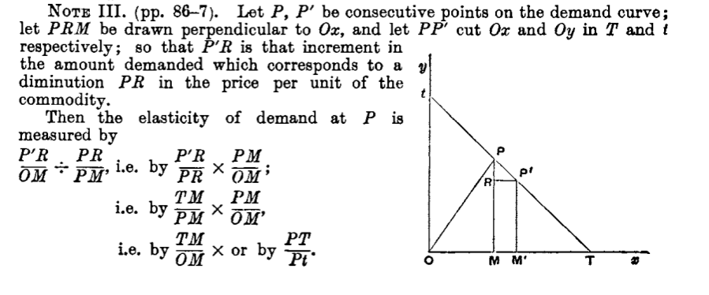

###### Consumer Surplus

Marshall also approaches Welfare issues from a partial equilibrium. Using his demand function with no income effects we can determine the utility gain from a price decrease simply looking at the area below the demand. This is the famous concept of consumer surplus, the difference between the maximum amount that a consumer would be willing to pay and what he actually pays.

> *We may now turn to consider how far the price which is actually paid for a thing represents the benefit that arises from its possession...The excess of the price which he would be willing to pay rather than go without the thing, over that which he actually does pay, is the economic measure of this surplus satisfaction. It may be called* **consumer's surplus**.

 

> ...Therefore we may say that the area DOHA *represents the aggregate of the satisfaction derived from the consumption of tea...the area* COHA *; and therefore this area represents the total price paid for tea...the area* DCA*; and therefore this area represents the total consumers' surplus that is derived from tea when the price is* AH.

###### Human capital

> *Having discussed the causes which govern the growth of a numerous and vigorous population, we have next to consider the* **training that is required to develop its industrial efficiency**.
>
> *Little need be said of general education; though the influence School even of that on industrial efficiency is greater than it appears. It is true that the children of the working classes must very often leave school, when they have but learnt the elements of reading, writing, arithmetic and drawing; and it is sometimes argued that part of the little time spent on these subjects would be better given to practical work. But* **the advance made at school is important not so much on its own account, as for the power of future advance which a school education gives**. For a truly liberal general education adapts the mind to use its best faculties in business and to use business itself as a means of increasing culture ; though it does not concern itself with the details of particular trades : that is left for technical education.
>
> Principle of Economics - Industrial Training - Book IV- Chapter VI

###### Externalities

Marshall is also credited to have created the concept of external effects or externalities. The externalities he had in mind are a precise mechanism linked to the possibility of having decreasing supply in the long run even with perfect competition. However they are externalities[^marshall_ext] and the generalization to the concept to other area might well spring from Marshall work. 

[^fn1]:  During my Ph.D., one of my teachers, now a world-renowned economist, told me during a conversation that he believed the history of economic thought should not be part of the curriculum of a Ph.D. program. I wonder if he still thinks the same.
[^fnwon1]:  *T*he annual labour of every nation is the fund which originally supplies it** *with all the necessaries and conveniences of life which it annually consumes, and which consist always either in the immediate produce of that labour, or in what is purchased with that produce from other nations. According therefore as this produce, or what is purchased with it, bears a greater or smaller proportion to the number of those who are to consume it, the nation will be better or worse supplied with all the necessaries and conveniences for which it has occasion. But this proportion must in every nation be regulated by two different circumstances; first, by the* **skill, dexterity, and judgment with which its labour is generally applied***; and, secondly, by the* **proportion between the number of those who are employed in useful labour, and that of those who are not so employed***. [...]* *Among civilised and thriving nations, on the contrary, though a great number of people do not labour at all, many of whom consume the produce of ten times, frequently of a hundred times more labour than the greater part of those who work; yet the produce of the whole labour of the society is so great that all are often abundantly supplied, and a workman, even of the lowest and poorest order, if he is frugal and industrious, may enjoy a greater share of the necessaries and conveniences of life than it is possible for any savage to acquire. The causes of this improvement, in* **the productive powers of labour, and the order, according to which its produce is naturally distributed among the different ranks and conditions of men in the society, make the subject of the first book of this Inquiry***. [...] The number of useful and productive labourers, it will hereafter appear, is everywhere in proportion to the quantity of* **capital stock** *which is employed in setting them to work, and to the particular way in which it is so employed. The second book, therefore, treats of the nature of capital stock, of the manner in which it is* **gradually accumulated***, and of the different quantities of labour which it puts into motion, according to the different ways in which it is employed.* Introduction and plan of the work.

[^nfwon2]: 
[^fnwon3]: *As it is the power of exchanging that gives occasion to the division of labour, so the extent of this division must always be limited by the extent of that power, or, in other words, by the* **extent of the market***...in the lone houses and very small villages which are scattered about in so desert a country as the Highlands of Scotland, every farmer must be butcher, baker and brewer for his own family.*

[^fn3]: "The word value, it is to be observed, has two different meanings, and sometimes expresses the utility of some particular object, and sometimes the power of purchasing other goods which the possession of that object conveys. The one may be called **“value in use”**; the other, **“value in exchange.” **The things which have the greatest value in use have frequently little or no value in exchange; and, on the contrary, those which have the greatest value in exchange have frequently little or no value in use. Nothing is more useful than water: but it will purchase scarce anything; scarce anything can be had in exchange for it. A diamond, on the contrary, has scarce any value in use; but a very great quantity of other goods may frequently be had in exchange for it."  Wealth of Nations - On the origin and use of Money - chapter IV
[^fn4]: "**The real price of everything**, what everything really costs to the man who wants to acquire it, **is the toil and trouble of acquiring it**. What everything is really worth to the man who has acquired it, and who wants to dispose of it or exchange it for something else, is the toil of our own body. That money or those goods save us this toil. They contain the value of a certain quantity of labour which we exchange for what is supposed at the time to contain the value of an equal quantity. Labour was the first price, the original purchase-money that was paid for all things. It was not by gold or  by silver, but by labour, that all the wealth of the world was originally purchased; and **its value, to those who possess it, and who want to exchange it for some new productions, is precisely equal to the quantity of labour which it can enable them to purchase or command**." Wealth of Nations - On the origin and use of Money - chapter V"
[^fn5]: ...In this state of things (after the early state of society), the whole produce of labour does not always belong to the labourer. He must in most cases share it with the owner of the **stock** which employs him. Neither is the quantity of labour commonly employed in acquiring or producing any commodity, the only circumstance which can regulate the quantity which it ought commonly to purchase, command, or exchange for. **An additional quantity, it is evident, must be due for the profits of the stock which advanced the wage and furnished the materials of that labour.**  ... As soon as the land of any country has all become private property, the landlords, like all other men, love to **reap where they never sowed**, and demand a **rent even for its natural produce**. Of the Component Parts of the Price of Commodities - chapter VI

[^fn6]: **People of the same trade seldom meet** together, even for merriment and diversion, but the conversation ends in a conspiracy against the public or in some **contrivance to raise prices**. It is impossible indeed to prevent such meetings, by any law which either could be executed  or would be consistent with liberty and justice. But though the law cannot hinder people of the same trade from sometimes assembling together  it ought to do nothing to facilitate such assemblies, much less to render them necessary. Book 1 - Chapter X
[^fn7]: It is chiefly by discounting **bills of exchange**, that is, by advancing money upon them before they are due, that the greater part of banks and bankers issue their promissory notes. They deduct always, upon whatever sum they advance, the **legal interest** till the bill shall become due.[...] It is not by augmenting the capital of the country, but by **rendering a greater part of that capital active and productive** than would otherwise be so, that the most judicious operations of **banking** can increase the industry of the country. Book II

[^fn8]: "Famine seems to be the last, the most dreadful resource of nature. The power of population is so superior to the power in the earth to produce subsistence for man, that premature death must in some shape or other visit the human race. The vices of mankind are active and able ministers of depopulation. They are the precursors in the great army of destruction; and often finish the dreadful work themselves. But should they fail in this war of extermination, sickly seasons, epidemics, pestilence, and plague, advance in terrific array, and sweep off their thousands and ten thousands. Should success be still incomplete, gigantic inevitable famine stalks in the rear, and with one mighty blow levels the population with the food of the world. Must it not then be acknowledged by an attentive examiner of the histories of mankind, that in every age and in every state in which man has existed, or does now exist. **That the increase of population is necessarily limited by the means of subsistence**. That population does invariably increase when the means of subsistence increase. And that the superior power of population it repressed, and the actual population kept equal to the means of subsistence, by misery and vice?"

  The second contrinution regards the role of aggregate demand. In 1803, a French economist, **Jean-Baptiste Say**, famously postulated that supply "creates" demand[^fn9]. On the contrary, Malthus believed economic crises were characterized by a general excess supply caused by insufficient consumption[^fn10]. The discussions on Say's law and its rebuttal echo until today. Later, Keynes acknowledged Malthus as a precursor of his ideas on gluts and slumps.  

[^fn11]:   "**The produce** of the **earth—all** that is derived from its surface by the united application of **labour**, **machinery**, and **capital**, is divided among **three classes** of the community; namely,**the proprietor of the land, the owner of the stock or capital** necessary for its cultivation,and **the labourers** by whose industry it is cultivated. But in different stages of society,the proportions of the whole produce of the earth which will be allotted to each of these classes,under the names of **rent**, **profit**, and **wages**, will be essentially different;depending mainly on the actual fertility of the soil, on the accumulation of capital and population,and on the skill, ingenuity, and instruments employed in agriculture. **To determine the laws which regulate this distribution, is the principal problem in Political Economy**: much as the science has been improved by the writings of Turgot, Stuart, Smith, Say, Sismondi,and others, they afford very little satisfactory information respecting the natural course of rent, profit, and wages."

[^fn12]: "When commodities varied in relative value, it would be desirable to have the means of ascertaining which of them fell and which rose in real value, and this could be effected only by comparing them one after another with some invariable standard measure of value, which should itself be subject to none of the fluctuations to which other commodities are exposed. Of such a measure it is impossible to be possessed..."

[^fnric1]: *Labour, like all other things which are purchased and sold, and which may be increased or diminished in quantity, has its* **natural** *and its* **market price***. The natural price of labour is that price which is necessary to enable the labourers, one with another, to subsist and to perpetuate their race, without either increase or diminution.*

[^fn13]: "In one and the same country, profits are, generally speaking, always on the same level; or differ only as the employment of capital may be more or less secure and agreeable. It is not so between different countries. If the profits of capital employed in Yorkshire, should exceed those of capital employed in London, capital would speedily move from London to Yorkshire, and an equality of profits would be effected; but if in consequence of the diminished rate of production in the lands of England, from the increase of capital and population, wages should rise, and profits fall, **it would not follow that capital and population would necessarily move from England to Holland, or Spain, or Russia, where profits might be higher**."

[^fn14]: "**The laws and conditions of the production of wealth partake of the character of physical truths. There is nothing optional or arbitrary in them**[...]It is not so with the Distribution of Wealth. That is a matter of human institution solely. The things once there, mankind, individually or collectively,can do with them as they like[...] **The distribution of wealth, therefore, depends on the laws and customs of society**. The rules by which it is determined, are what the opinions and feelings of the ruling portion of the community make them, and are very different in different ages and countries; and might be still more different, if mankind so chose."

 > The opinions and feelings of mankind, doubtless, are not a matter of chance.
 > They are consequences of the fundamental laws of human nature, combined with the existing state of knowledge and experience, and the existing condition of social institutions and intellectual and moral culture. But the laws of the generation of human opinions are not within our present subject. They are part of the general theory of human progress, a far larger and more difficult subject of inquiry than political economy. We have here to consider, not the causes, but the consequences, of the rules according to which wealth may be distributed. Those, at least, are as little arbitrary, and have as much
 > the character of physical laws, as the laws of production.

[^fn15]: "The proper mathematical analogy [between demand and supply] is that of an **equation**.  If unequal at any moment, competition equalizes them, and the manner in which this is done is by an adjustment of the value. If the demand increases, the value rises; if the demand diminishes, the value falls; again, if the supply falls off, the value rises; and falls, if the supply is increased.  The rise or the fall continues until the demand and supply are again equal to one another:  and the value which a commodity will bring in any market is no other than the value which, in that market, gives a demand just sufficient to carry off the existing or expected supply."

 Principles of Political Economy - Book III - Chapter XIV

 > The produce of a country exchanges for the produce of other countries at such values as are required in order that the whole of her exports may exactly pay for the whole of her imports. This law of International Values is but an extension of the more general law of Value, which we called the Equation of Supply and Demand. We have seen that the value of a commodity always so adjusts itself as to bring the demand to the exact level of the supply.
 > But all trade, either between nations or individuals, is an interchange of commodities,  in which the things that they respectively have to sell constitute also their means of purchase: the supply brought by the one constitutes his demand for what is brought by the other.  So that supply and demand are but another expression for **reciprocal demand**; and to say that value will adjust itself so as to equalize demand with supply, is, in fact, to say that it will adjust itself so as to equalize the demand on one side with the demand on the other.

[^fn16]: "Setting out, then, from the maxim that equal sacrifices ought to be demanded from all, we have next to inquire whether this is in fact done, by **making each contribute the same percentage on his pecuniary means**. Many persons maintain the negative, saying that a tenth part taken from a small income is a heavier burthen than the same fraction deducted from one much larger: and on this is grounded the very popular scheme of what is called a graduated property tax, viz. an income tax in which the percentage rises with the amount of the income[...]The mode of adjusting these inequalities of pressure, which seems to be the most equitable, is that recommended by Bentham, of leaving a **certain minimum of income, sufficient to provide the necessaries of life, untaxed**. Suppose 50l." 
[^fnm1]: On the other hand, we may suppose this better distribution of property attained, by the joint effect of the prudence and frugality of individuals, and of a system of legislation favouring equality of fortunes, so far as is consistent with the just claim of the individual to the fruits, whether great or small, of his or her own industry. We may suppose, for instance [...], a limitation of the sum which any one person may acquire by gift or inheritance, to the amount sufficient to constitute a moderate independence...

[^fn17]: Actually you can show that the model is stable starting from any condition. However sticking to the fixed proportions classical assumptions the redundant factor has a price equal to zero until it decreases to the existing quantity of the other factor. Formally competition implies $$if \ K>L \ => r=0$$,$$if \ L>K \ => w=0$$ and $$ w+r = f'(min{(K,L)})$$.

[^fn18]: *The circulation of commodities is the starting-point of capital. The production of commodities, their circulation, and that more developed form of their circulation called commerce, these form the historical ground-work from which it rises. The modern history of capital dates from the creation in the 16th century of a world-embracing commerce and a world-embracing market. As a matter of history, capital, as opposed to landed property, invariably takes the form at first of money; it appears as moneyed wealth, as the capital of the merchant and of the usurer. But we have no need to refer to the origin of capital in order to discover that the first form of appearance of capital is money. We can see it daily under our very eyes. All new capital, to commence with, comes on the stage, that is, on the market, whether of commodities, labour, or money, even in our days, in the shape of money that by a definite process has to be transformed into capital.* **The first distinction we notice between money that is money only, and money that is capital, is nothing more than a difference in their form of circulation***. The simplest form of the circulation of commodities is* **C—M—C***, the transformation of commodities into money, and the change of the money back again into commodities; or selling in order to buy. But alongside of this form we find another specifically different form:* **M—C—M** *, the transformation of money into commodities, and the change of commodities back again into money; or buying in order to sell. Money that circulates in the latter manner is thereby transformed into, becomes capital, and is already potentially capital.... The simple circulation of commodities— selling in order to buy—is a means of carrying out a purpose unconnected with circulation, namely, the appropriation of use-values, the satisfaction of wants.* **The circulation of money as capital is, on the contrary, an end in itself***, for the expansion of value takes place only within this constantly renewed movement. The circulation of capital has therefore no limits.... As the conscious representative of this movement, the possessor of money becomes a capitalist. His person, or rather his pocket, is the point from which the money starts and to which it returns.* Capital, Volume 1 - Part II - chapter 4
[^fn19]: **The expansion of value, which is the objective basis or main-spring of the circulation M—C—M', becomes his subjective aim***, and it is only in so far as the appropriation of ever more and more wealth in the abstract becomes the sole motive of his operations, that he functions as a capitalist, that is, as capital personified and endowed with consciousness and a will.* **Use-values must therefore never be looked upon as the real aim of the capitalist; neither must the profit on any single transaction***. The restless never-ending process of profit-making alone is what he aims at. This boundless greed after riches, this passionate chase after exchange-value, is common to the capitalist and the miser; but while the miser is merely a capitalist gone mad, the capitalist is a rational miser. The never-ending augmentation of exchange-value, which the miser strives after, by seeking to save his money from circulation, is attained by the more acute capitalist, by constantly throwing it afresh into circulation. Value therefore now becomes value in process, money in process, and, as such, capital. It comes out of circulation, enters into it again, preserves and multiplies itself within its circuit, comes back out of it with expanded bulk, and begins the same round ever afresh. M—M’, money which begets money, such is the description of Capital from the mouths of its first interpreters, the Mercantilists.* **Buying in order to sell, or, more accurately, buying in order to sell dearer, M—C—M’***, appears certainly to be a form peculiar to one kind of capital alone, namely, merchants’ capital. But industrial capital too is money, that is changed into commodities, and by the sale of these commodities, is re-converted into more money. The events that take place outside the sphere of circulation, in the interval between the buying and selling, do not affect the form of this movement.* **Lastly, in the case of interest- bearing capital, the circulation M—C—M’ appears abridged. We have its result without the intermediate stage, in the form M—M’**, “en style lapidaire” so to say, money that is worth more money, value that is greater than itself. M—C—M’ is therefore in reality the general formula of capital as it appears prima facie within the sphere of circulation.

[^fn20]: **By the purchase of labour-power, the capitalist incorporates labour, as a living ferment, with the lifeless constituents of the product***. From his point of view, the labour-process is nothing more than the consumption of the commodity purchased, i.e., of labour-power; but this consumption cannot be effected except by supplying the labour-power with the means of production. The labour-process is a process between things that the capitalist has purchased, things that have become his property. The product of this process belongs, therefore, to him, just as much as does the wine which is the product of a process of fermentation completed in his cellar.*  Capital, Volume 1 - Part II - chapter 7

[^fn21]: **The fact that half a day’s labour is necessary to keep the labourer alive during 24 hours, does not in any way prevent him from working a whole day.** *Therefore, the value of labour-power, and the value which that labour-power creates in the labour-process, are two entirely different magnitudes; and this difference of the two values was what the capitalist had in view, when he was purchasing the labour-power. The useful qualities that labour-power possesses, and by virtue of which it makes yarn or boots, were to him nothing more than a conditio sine qua non; for in order to create value, labour must be expended in a useful manner. What really influenced him was the specific use-value which this commodity possesses of being a source not only of value, but of more value than it has itself.* Capital, Volume 1 - Part II - chapter 7

[^fn22]: **As soon as this process of transformation has sufficiently decomposed the old society from top to bottom**, as soon as the labourers are turned into proletarians, their means of labour into capital, as soon as the capitalist mode of production stands on its own feet, then the further socialisation of labour and further transformation of the land and other means of production into socially exploited and, therefore, common means of production, as well as the further expropriation of private proprietors, takes a new form.* **That which is now to be expropriated is no longer the labourer working for himself, but the capitalist exploiting many labourers.** *This expropriation is accomplished by the action of the immanent laws of capitalistic production itself, by the centralisation of capital.* **One capitalist always kills many***.Hand in hand with this centralisation, or this expropriation of many capitalists by few, develop, on an ever-extending scale, the co-operative form of the labour-process, the conscious technical application of science, the methodical cultivation of the soil, the transformation of the instruments of labour into instruments of labour only usable in common, the economising of all means of production by their use as the means of production of combined, socialised labour, the entanglement of all peoples in the net of the world-market, and with this, the international character of the capitalistic régime. Along with the constantly diminishing number of the magnates of capital, who usurp and monopolise all advantages of this process of transformation, grows the mass of misery, oppression, slavery, degradation, exploitation; but with this too grows the revolt of the working-class, a class always increasing in numbers, and disciplined, united, organised by the very mechanism of the process of capitalist production itself.* **The monopoly of capital becomes a fetter upon the mode of production***, which has sprung up and flourished along with, and under it.**Centralisation of the means of production and socialisation of labour at last reach a point where they become incompatible with their capitalist integument**. Thus integument is burst asunder. The knell of capitalist private property sounds. **The expropriators are expropriated***.

[^cournot0]: I have said that most authors who have devoted themselves to political economy seem also to have had a wrong idea of the nature of the applications of mathematical analysis to the theory of wealth. They imagined that the use of symbols and formulas could only lead to numerical calculations, and as it was clearly perceived that the subject was not suited to such a numerical determination of values by means of theory alone, the conclusion was drawn that the mathematical apparatus, if not liable to lead to erroneous results, was at least idle and pedantic. But those skilled in **mathematical analysis** *know that its object is not simply to calculate numbers, but that it is also employed* **to find the relations between magnitudes which cannot be expressed in numbers and between functions whose law is not capable of algebraic expression**. Thus the **theory of probabilities** furnishes a demonstration of very important propositions, although, without the help of experience, it is impossible to give numerical values for contingent events, except in questions of mere curiosity, such as arise from certain games of chance. Thus, also, **theoretical Mechanics** furnishes to practical Mechanics general theorems of most useful application, although in almost all cases recourse to experience is necessary for the numerical results which practice requires....*There are authors, like Smith and Say, who, in writing on Political Economy, have preserved all the beauties of a purely literary style ; but there are others, like Ricardo, who, when treating the most abstract questions, or when seeking great accuracy, have not been able to avoid algebra, and have only disguised it under arithmetical calculations of tiresome length. Any one who understands algebraic notation, reads at a glance in an equation results reached arithmetically only with great labour and pains.* **I propose to show in this essay that the solution of the general questions which arise from the theory of wealth, depends essentially not on elementary algebra, but on that branch of analysis which comprises arbitrary functions, which are merely restricted to satisfying certain conditions**. As only very simple conditions will be considered, the first principles of the differential and integral calculus suffice for understanding this little treatise. Also, although I fear that it may appear too abstruse to most people who have a liking for these topics, I hardly dare to hope that it will deserve the attention of professional mathematicians, except as they may discover in it the germ of questions more worthy of their powers.
[^fnco1]: **We will assume that the function F(p)**, which expresses the law of demand or of the market, **is a continuous function**,...If the function  $F(p)$ is continuous, it will have the property common to all functions of this nature, and on which so many important applications of mathematical analysis are based : the variations of the demand will be sensibly proportional to the variations in price so long as these last are small fictions of the original price. Moreover, these variations will be of opposite signs, i.e. an increase in price will correspond with a diminution of the demand. [...] **Since the function is continuous, the function pF(p) which expresses the total value of the quantity annually sold, must be continuous also**. 

[^fnco3]: Let us suppose the curve $m_1n_1$  to be the plot of equation (1), and the curve $m_2n_2$ that of equation (2), the variables $D_1$ and $D_2$ being represented by rectangular coordinates. If proprietor (1) should adopt for $D_1$ a value represented by $ox_1$, proprietor (2) would adopt for $D_2$ the value $oy_1$ , which, for the supposed value of $D_1$ would give him the greatest profit. But then, for the same reason, producer (1) ought to adopt for $D_1$ the value $ox_{11}$ , which gives the maximum profit when $D_2$ has the value $oy_1$. This would bring producer (2) to the value $oy_{11}$ for $D_2$ and so forth. The state of equilibrium corresponding to the system of values $ox$ and $oy$ is therefore stable... 
[^fnco4]: \> If there were 3, 4, ...$n$ producers in competition, all their conditions being the same,... we obtain  $$D+\frac{dD}{dp}\left[np-\sum\phi_{n}'\left(D_{n}\right)\right]=0$$. It now remains to be proved that the value of $p$ derived from equation (Monopoly) is always greater than the value of $p$ derived from equation (monopoly). 

[^fnj0]: *Repeated reflection and inquiry have led me to the somewhat novel opinion, that* **value depends entirely upon utility**. Prevailing opinions make labour rather than utility the origin of value; and there are even those who distinctly assert that labour is the cause of value. I show, on the contrary, that we have only to trace out carefully the natural laws of the variation of utility, as depending upon the quantity of commodity in our possession, in order to arrive at a satisfactory theory of exchange, of which the ordinary laws of supply and demand are a necessary consequence. This theory is in harmony with facts; and, whenever there is any apparent reason for the belief that labour is the cause of value, we obtain an explanation of the reason. **Labour is found often to determine value, but only in an indirect manner, by varying the degree of utility of the commodity through an increase or limitation of the supply** ....
[^fnj1]:  The contents of the following pages can hardly meet with ready acceptance among those who regard the Science of Political Economy has having already acquired a nearly perfect form. I believe it is generlly supposed that Adam Smith laid the foundations of this science ; that Malthus, Anderson, and Senior added important doctrines; that Ricardo systematised the whole; and, finally, that Mr. J.S. Mill filled in the details and completely expounded this branch of knowledge...

[^fnj2]: *...Among minor alterations,* **I may mention the substitution for the name Political Economy of the single convenient term Economics.** *This term, besides being more familiar and closely related to the old term is perfectly analogous in form to Mathematics, Ethics, Esthetics, and the names of various other branches of knowledge, and it has moreover the authority of usage from the time of Aristotle...but* **it appears to have been adopted also by Mr. Alfred Marshall** *at Cambridge.*

[^jevons2]: Imagine that there is one trading body possessing only corn, and another possessing only beef. It is certain that, under these circumstances, a portion of the corn may be given in exchange for a portion of the beef with a considerable increase of utility. How are we to determine at what point the exchange will cease to be beneficial? This question must involve both the ratio of exchange and the degrees of utility. Suppose, for a moment, that the ratio of exchange is approximately that of ten pounds of corn for one pound of beef: then if, to the trading body which possesses corn, ten pounds of corn are less useful than one of beef, that body will desire to carry the exchange further. Should the other body possessing beef find one pound less useful than ten pounds of corn, this body will also be desirous to continue the exchange. Exchange will thus go on until each party has obtained all the benefit that is possible, and loss of utility would result if more were exchanged. Both parties, then, rest in satisfaction and equilibrium, and the degrees of utility have come to their level, as it were. **This point of equilibrium will be known by the criterion, that an infinitely small amount of commodity exchanged in addition, at the same rate, will bring neither gain nor loss of utility. In other words, if increments of commodities be exchanged at the established ratio, their utilities will be equal for both parties.** Thus, if ten pounds of corn were of exactly the same utility as one pound of beef, there would be neither harm nor good in further exchange at this ratio.... Theory of Political Economy - Theory of Exchange - chapter IV
[^jevons3]:     Let us endeavour to form a clear notion of what we mean by **amount of labour**. It is plain that **duration** will be one element of it; for a person labouring uniformly during two months must be allowed to labour twice as much as during one month. But labour may vary also in **intensity**. In the same time a man may walk a greater or less distance; may saw a greater or less amount of timber; may pump a greater or less quantity of water; in short, may exert more or less muscular and nervous force. Hence amount of labour will be a quantity of two dimensions, the product of intensity and time when the intensity is uniform, or the sum represented by the area of a curve when the intensity is variable. ...But intensity of labour may have more than one meaning; it may mean the quantity of work done, or the painfulness of the effort of doing it. These two things must be carefully distinguished, and both are of great importance for the theory. The one is the reward, the other the penalty, of labour. Or rather, as the produce is only of interest to us so far as it possesses utility, we may say that there are three quantities involved in the theory of labour the amount of painful exertion, the amount of produce, and the amount of utility gained. **The variation of utility, as depending on the quantity of commodity possessed, has already been considered; the variation of the amount of produce will be treated in the next chapter; we will here give attention to the variation of the painfulness of labour.** Theory of Political Economy - The theory of Labour - chapter V
[^jevons_labour]: We may imagine the painfulness of labour in proportion to produce to be represented by some such curve as $abcd$ in Fig VIII. In this diagram the height of points above the line ox denotes pleasure, and depth below it pain. At the moment of commencing labour it is usually more irksome than when the mind and body are well bent to the work. Thus, at first, the pain is measured by $oa$. At $b$ there is neither pain nor pleasure. Between $b$ and $c$ an excess of pleasure is represented as due to the exertion itself. But after $c$ the energy begins to be rapidly exhausted, and the resulting pain is shown by the downward tendency of the line $cd$. We may at the same time represent the degree of utility of the produce by Some curve as $pq$, the amount of produce being measured along the line $ox$. Agreeably to the theory of utility, already given the curve shows that, the larger the wages earned, the less is the pleasure derived from a further increment. There will, of necessity be some point $m$ such that $qm=dm$, that is to say, such that that the pleasure gained is exactly equal to the labour endured.
[^walras_1]: It contains a mathematical solution of the problem of the determination of current prices and also formulation of the law of offer and demand in the case of the exchange on any number of commodities for one another......a month ago, my attention was drawn to a work on the same subject, entitled: The Theory of Political Economy, Macmillan & Co., 1871, by W. Stanley Jevons, Professor of Political Economy at Manchester. Mr. Jevons applies mathematical analysis to pure economics, especially to the theory of exchange, very much as I do; and, what is really remarkable, he founds the whole application of mathematics to economics on a fundamental formula which he calls the equation of exchange and which is rigorously identical with the formula which serves as my point of departure and which I call the condition of maximum satisfaction. Pure economics is, in essence, the theory of the determination of prices under a hypothetical regime of perfectly free competition. The sum total of all things, material or immaterial, on which a price can be set because they are scarce (i.e. both useful and limited in quantity) constitutes social wealth. Hence pure economics is also the theory of social wealth.
[^walras_2]: If we let the term effective utility designate the sum total of wants satisfied by any given quantity consumed of a commodity, these wants being measured in terms of both their extensive and intensive missions, then the curve $\beta_{r,1}\beta_{q,1}$ becomes our individual curve of effective utility, considered \[in respect of the enclosed area\] as a function of the quantity of (B) which he consumes. For example, in case he consumes the quantity $q_b$ of $(B)$ represented by the length $Oq_{b}$ the effective utility is represented by the area $Oq_{b}\rho\beta_{r,1}$. If now, we **let the term rareté designate the intensity of the last want satisfied by any given quantity consumed of a commodity**, then the curve becomes our individual's rarete curve, considered as a function of the quantity of $(B)$ which he consumes. Thus, in case he consumes a quantity $q_{b}$ of $(B)$, represented by the length $Oq_{b}$, the rarete is $\rho_{b}$, represented by the length $q_{b}\rho=O\rho_{b}$,. Similarly, the curve $\alpha_{r,1}\alpha_{q,1}$ is, at one and the same time, a curve of effective utility and a rarete curve, both being functions of the quantity of $(A)$ consumed. Hence I call one of the co-ordinate axes the rarete axis and the other the quantity axis. I repeat, that rarete increases as the quantity possessed decreases, and vice versa.
[^Walrassoc]:
[^fnm2]: **The chief use of pure mathematics in economic questions seems to be in helping a person to write down quickly, shortly and exactly, some of his thoughts for his own use** : and to make sure that he has enough, and only enough, premises for his conclusions (i.e. that his equations are neither more nor less in number than his unknowns). Principle of Economics - preface

[^marshall_ext]: We may divide the economies arising from an increase in the scale of production of any kind of goods, into two classes, firstly, External those dependent on the general development of the industry; and, secondly, those dependent on the resources of the individual houses of business engaged in it, on their organization and the efficiency of their management. We may call the former **external economies**, and the latter *internal economies*. In the present chapter we have been chiefly discussing internal economies; but we now proceed to examine those very important external economies which can often be secured by the concentration of many small businesses of a similar character in particular localities: or, as is commonly said, by the localization of industry. Principle of Economics - Industrial Organization - Book IV - Chapter IX

[^fnky0]: **The division of Economics between the Theory of Value and Distribution on the one hand and the Theory of Money on the other hand is, I think, a false division**. **The right dichotomy is**, I suggest, **between the Theory of the Individual Industry or Firm** *and of the rewards and the distribution between different uses of a given quantity of resources on the one hand,* **and the Theory of Output and Employment** *as a whole on the other hand.* The General Theory of Employment, Interest and Money - chapter 21

[^fnky1]: ...I myself held with conviction for many years the theories which I now attack, and I am not, I think, ignorant of their strong points.
[^fnky2]: ...The difficulty lies, not in the new ideas, but in escaping from the old ones, which ramify, for those brought up as most of us have been, into every corner of our minds.

[^fnky3]: ...At different points in this chapter we have made the classical theory to depend in succession on the assumptions: (1) that the real wage is equal to the marginal disutility of the existing employment; (2) that there is no such thing as involuntary unemployment in the strict sense; (3) **that supply creates its own demand in the sense that the aggregate demand price is equal to the aggregate supply price for all levels of output and employment**.

[^fnky4]: Let $Z$ be the aggregate supply price of the output from employing $N$ men, the relationship between $Z$ and $N$ being written $Z=\phi\left(N\right)$, which can be called the Aggregate Supply Function. Similarly, let $D$ be the proceeds which entrepreneurs expect to receive from the employment of $N$ men, the relationship between $D$ and $N$ being written $D=f\left(N\right)$, which can be called the Aggregate Demand Function.
[^fnky5]: ...**The classical doctrine**, on the other hand, which used to be expressed categorically in the statement that " Supply creates its own Demand" and continues to underlie all orthodox economic theory, involves a special assumption as to the relationship between these two functions. For " Supply creates its own Demand" must mean that $f\left(N\right)$ and $\phi\left(N\right)$ are equal for all values of $N$\...If this were true, competition between entrepreneurs would always lead to an expansion of employment up to the point at which the supply of output as a whole ceases to be elastic, i.e. where a further increase in the value of the effective demand will no longer be accompanied by any increase in output. Evidently this amounts to the same thing as **full employment**.

[^fnky6]: ...The idea that we can safely neglect the aggregate demand function is fundamental to the Ricardian economics, which underlie what we have been taught for more than a century. Malthus, indeed, had vehemently opposed Ricardo's doctrine that it was impossible for effective demand to be deficient; but vainly. For, since Malthus was unable to explain clearly (apart from an appeal to the facts of common observation) how and why effective demand could be deficient or excessive, he failed to furnish an alternative construction; and Ricardo conquered England as completely as the Holy Inquisition conquered Spain...The celebrated optimism of traditional economic theory, which has led to economists being looked upon as Candides, who, having left this world for the cultivation of their gardens, teach that all is for the best in the best of all possible worlds provided we will let well alone, is also to be traced, I think, to their having neglected to take account of the drag on prosperity which can be exercised by an insufficiency of effective demand. For there would obviously be a natural tendency towards the optimum employment of resources in a Society which was functioning after the manner of the classical postulates.

[^fnky7]: ...The principal **objective factors which influence the propensity to consume** appear to be the following: (1) A change in the wage-unit... (2) A change in the difference between income and **net income**... (3) Windfall changes in capital-values not allowed for in calculating net income...(4) Changes in the rate of **time-discounting** i.e. in the ratio of exchange between present goods and future goods...The abnormal situation, where the propensity to consume may be sharply affected by the development of extreme **uncertainty** concerning the future and what it may bring forth, should also, perhaps, be classified under this heading. (5) Changes in **fiscal policy**... (6) Changes in **expectations** of the relation between the present and the future level of income...
[^fnky8]: There are, in general, eight main motives or objects of a **subjective** character which lead individuals to refrain from spending out of their incomes: (i) To build up a reserve against unforeseen contingencies; (ii) To provide for an anticipated future relation between the income and the needs of the individual or his family different from that which exists in the present, as, for example, in relation to old age, family education, or the maintenance of dependents; (iii) To enjoy interest and appreciation, i.e. because a larger real consumption at a later date is preferred to a smaller immediate consumption; (iv) To enjoy a gradually increasing expenditure, since it gratifies a common instinct to look forward to a gradually improving standard of life rather than the contrary, even though the capacity for enjoyment may be diminishing; (v) To enjoy a sense of independence and the power to do things, though without a clear idea or definite intention of specific action; (vi) To secure a masse de manoeuvre to carry out speculative or business projects; (vii) To bequeath a fortune; (viii) To satisfy pure miserliness, i.e. unreasonable but insistent inhibitions against acts of expenditure as such.

[^fnky9]: It would seem (following Mr. Kahn) that the following are likely in a modern community to be the factors which it is most important not to overlook...(i) The **method of financing the policy** and the increased working cash, required by the increased employment and the associated rise of prices, may have the effect of increasing the rate of interest and so retarding investment in other directions, unless the **monetary authority** takes steps to the contrary...(ii) With the confused psychology which often prevails, the Government programme may, through its effect on **"confidence"** , increase liquidity-preference or diminish the marginal efficiency of capital, which, again, may retard other investment unless measures are taken to offset it. (iii) In an **open system** with foreign-trade relations, some part of the multiplier of the increased investment will accrue to the benefit of employment in foreign countries, since a proportion of the increased consumption will diminish our own country's favourable foreign balance; so that, if we consider only the effect on domestic employment as distinct from world employment, we must diminish the full figure of the multiplier.

[^fnky10]:  *More precisely, I define the* **marginal efficiency of capital** as being equal to that rate or discount which would make the present value of the series of annuities given by the returns expected from the capital-asset during its life just equal to its supply price....
[^fnky11]: Thus for each type of capital we can build up a schedule, showing by how much investment in it will have to increase within the period, in order that its marginal efficiency should fall to any given figure. We can then aggregate these schedules for all the different types of capital, so as to provide a schedule relating the rate of aggregate investment to the corresponding marginal efficiency of capital in general which that rate of investment will establish. We shall call this the investment demand-schedule; or, alternatively, the schedule of the marginal efficiency of capital. Now **it is obvious that the actual rate of current investment will be pushed to the point where there is no longer any class of capital-asset of which the marginal efficiency exceeds the current rate of interest**....***It follows that the inducement to invest depends partly on the investment demand-schedule and partly on the rate of interest***...

[^fnky13]: The three divisions of liquidity-preference which we have distinguished above may be defined as depending on (i) the transactions-motive, i.e. the need of cash for the current transaction of personal and business exchanges; (ii) the precautionary-motive, i.e. the desire for security as to the future cash equivalent of a certain proportion of total resources; and (iii) the speculative motive, i.e. the object of securing profit from knowing better than the market what the future will bring forth.

[^fnky12]: The psychological time-preferences of an individual require two distinct sets of decisions to carry them out completely. The first is concerned with that aspect of time-preference which I have called the propensity to consume, which, operating under the influence of the various motives set forth in Book III, determines for each individual how much of his income he will consume and how much he will reserve in some form of command over future consumption. But this decision having been made, there is a further decision which awaits him, namely, **in what form he will hold the command over future consumption which he has reserved**, whether out of his current income or from previous savings. **Does he want to hold it in the form of immediate, liquid command (i.e. in money or its equivalent)?**
[^fnfr1]: The **micro-dynamic analysis is an analysis by which we try to explain in some detail the behaviour of a certain section of the huge economic mechanism, taking for granted that certain general parameters are given.** *Obviously it may well be that we obtain more or less cyclical fluctuations in such sub-systems, even though the general parameters are given. The essence of this type of analysis is to show the details of the evolution of a given specific market, the behaviour of a given type of consumers, and so on....The* **macro-dynamic analysis**, on the other hand, **tries to give an account of the fluctuations of the whole economic system taken in its entirety**. Obviously in this case it is impossible to carry through the analysis in great detail. *We may perhaps start by throwing all kinds of production into one variable, all consumption into another, and so on, imagining that the notions production, consumption, and so on, can be measured by some sort of total indices.

[^fnram2]: Now $$\frac{u'\left(x\right)}{xu''\left(x\right)}=-\theta$$ and suppose $$\tau=tp^{s}$$ $$U'\left(x\right)=V'\left(g\left(x\right)\right)g'\left(x\right)+\tau$$ $$U'\left(x\right)=V'\left(g\left(x\right)\right)g'\left(x\right)+\tau=V'\left(g\left(x\right)\right)g'\left(x\right)\left(1+t\right)$$ $$\frac{\tau}{x\left[U''\left(x\right)-V'\left(g\left(x\right)\right)g''\left(x\right)-V''\left(g\left(x\right)\right)g'\left(x\right)\right]}=-\theta$$ $$\frac{tV'\left(g\left(x\right)\right)g'\left(x\right)}{x\left[U''\left(x\right)-V'\left(g\left(x\right)\right)g''\left(x\right)-V''\left(g\left(x\right)\right)g'\left(x\right)\right]}=-\theta$$ $$\frac{t}{x\left[\frac{U''\left(x\right)}{V'\left(g\left(x\right)\right)g'\left(x\right)}-\frac{V'\left(g\left(x\right)\right)g''\left(x\right)+V''\left(g\left(x\right)\right)g'\left(x\right)}{V'\left(g\left(x\right)\right)g'\left(x\right)}\right]}=-\theta$$ $$\frac{t}{x\left[\frac{V'\left(g\left(x\right)\right)g''\left(x\right)+V''\left(g\left(x\right)\right)g'\left(x\right)}{V'\left(g\left(x\right)\right)g'\left(x\right)}-\frac{U''\left(x\right)}{U'\left(x\right)}\left(1+t\right)\right]}=\theta$$ $$\frac{t}{\frac{1}{\epsilon^{s}}+\frac{\left(1+t\right)}{\epsilon^{d}}}=\theta$$ $$t=\theta\left(\frac{1}{\epsilon^{s}}+\frac{\left(1+t\right)}{\epsilon^{d}}\right)$$ $$t-\frac{\theta}{\epsilon^{d}}t=\theta\left(\frac{1}{\epsilon^{s}}+\frac{1}{\epsilon^{d}}\right)$$ $$t=\frac{\theta\left(\frac{1}{\epsilon^{s}}+\frac{1}{\epsilon^{d}}\right)}{1-\frac{\theta}{\epsilon^{d}}}$$ or $$\frac{t}{\left(\frac{1}{\epsilon^{s}}+\frac{1}{\epsilon^{d}}\right)}=\frac{\theta}{1-\frac{\theta}{\epsilon^{d}}}$$.

[^frams3]: This is most easily done by starting in a different way. represents the amount by which enjoyment falls short of bliss integrate throughout time;...consequently $$ \frac{dc}{dt}=f(a,c)-x=\frac{B-\left(U(x)-V(a)\right)}{u(x)} $$ or, as stated at the beginning, rate of saving multiplied by marginal utility of consumption should always equal bliss minus actual rate of utility enjoyed....Mr. Keynes ... has shown me that this result can also be obtained by the following simple reasoning. Suppose that in a year we ought to spend x and save z. Then the advantage to be gained from an extra 1 spent is $u(x)$, the marginal utility of money, and this must be equated to the sacrifice imposed by saving 1 less... Equations (1),(2) and (3) are sufficient to solve our problem provided we know $c_{0}$, the given capital with which the nation starts at $t=0$ , the other "initial condition" being supplied by considerations as to the behaviour of the function as $t\rightarrow\infty$.

[^frams4]: Let us suppose that they are not concerned with their heirs at all; that each man is charged with a share of the maintenance of such children as are necessary to maintain the population, but **starts his working life without any capital and ends it without any, having spent his savings on an annuity**; that within his own lifetime he has a constant utility schedule for consumption and discounts future utility at a constant rate, but that this rate may be supposed different for different people.  When such a community is in equilibrium, the rate of interest must, of course, equal the demand price of capital at $\frac{\partial f}{\partial c}$. And it will also equal the 'supply price', which arises in the following way. Suppose that the rate of interest is constant and equal to $r$, and that the rate of discount for a given individual is $\rho$. Then if $r>\rho$, he will save when he is young, not only to provide for loss of earning power in old age, but also because he can get more pounds to spend at a later date for those he forgoes spending now. If we neglect variations in his earning power, his action can be calculated by modifying the equations of lIc to apply to a finite life as in IIb. He will for a time accumulate capital, and then spend it before he dies. Besides this man, we must suppose there to be in our community other men, exactly like him except for being born at different times. The total capital possessed by $n$ men of this sort whose birthdays are spread evenly through the period of a lifetime will be $n$ times the average capital possessed by each in the course of his life. The class of men of this sort will, therefore, possess a constant capital depending on the rate of interest, and this will be the amount of capital supplied by them at that price. (If $\rho>r$, it may be negative, as they may borrow when young and pay back when old). We can then obtain the total supply curve of capital by adding together the supplies provided at a given price by each class of individual.

[^fnco2]: 
[^walrassoc]: It will be readily seen also that the root of this derived equation always corresponds to a maximum and not a minimum, because the functions $\Phi_{a,1}'\left(q\right)$ or $\phi_{a,1}'\left(q\right)$ and $\Phi_{b,1}'\left(q\right)$ or $\phi_{b,1}'\left(q\right)$ are by their nature decreasing\...
[^fnco]: Cournot starts with a monopolist without costs and almost derive the formula of the elasticity: "For convenience in discussion, suppose that a man finds himself proprietor of a mineral spring which has just been found to possess salutary properties possessed by no other.  He could doubtless fix the price of a liter of this water at 100 francs ;  but he would soon see by the scant demand, that this is not the way to make the most of his property. He will therefore successively reduce the price of the liter to the point which will give him the greatest possible profit ; i.e. if $F(p)$ denotes the law of demand, he will end, after various trials, by adopting the value of $p$ which renders the product $pF(p)$ a maximum, or which is determined by the equation $$F\left(p\right)+pF'\left(p\right)=0$$. The product $$pF(p)=\frac{F(p)^2}{-F'(p)}$$ will be the annual revenue of the owner of the spring, and this revenue will only depend on the nature of function $F$."

[^fnwon2]: *I say, all these things, and consider what a variety of labour is employed about each of them, we shall be sensible that, without the assistance and co-operation of many thousands, the very meanest person in a civilised country could not be provided, even according to what we very falsely imagine the easy and simple manner in which he is commonly accommodated. Compared, indeed, with the more extravagant luxury of the great, his accommodation must no doubt appear extremely simple and easy; and yet it may be true, perhaps, that* **the accommodation of a European prince does not always so much exceed that of an industrious and frugal peasant as the accommodation of the latter exceeds that of many an African king***, the absolute master of the lives and liberties of ten thousand naked savages.*

[^fn9]: "It is worthwhile to remark that a product is no sooner created than it, from that instant, affords a market for other products to the full extent of its own value. When the producer has put the finishing hand to his product, he is most anxious to sell it immediately, lest its value should diminish in his hands. Nor is he less anxious to dispose of the money he may get for it; for the value of money is also perishable. But the only way of getting rid of money is in the purchase of some product or other. Thus the mere circumstance of creation of one product immediately opens a vent for other products." J.B. Say A treatise on Political Economy.
[^fn10]: "It has been thought by some very able writers, that although **there may easily be a glut of particular commodities, there cannot possibly be a glut of commodities in general;**  because, according to their view of the subject, commodities being always exchanged for commodities,  one half will furnish the market for the other half, and **production being the only source of demand**, an excess in the supply of one article merely proves a deficiency in the supply of some other, and a general excess is impossible. **M. Say**, in his distinguished work on political economy, has indeed gone so far as to state that the consumption of a commodity by taking it out of the market diminishes demand, and the production of a commodity proportionally increases it. **This doctrine, however [...], appears to me to be utterly unfounded and completely to contradict the great principles which regulate supply and demand.**"
> *Meanwhile* **an increase in the aggregate scale of production of course increases those economies, which do not directly depend on the size of individual houses of business**. The most important of these result from the growth of correlated branches of industry which mutually assist one another, perhaps being concentrated in the same localities, but anyhow availing themselves of the modern facilities for communication offered by steam transport, by the telegraph and by the printing-press. The economies arising from such sources as this, which are accessible to any branch of production, do not depend exclusively upon its own growth : but yet they are sure to grow rapidly and steadily with that growth; and they are sure to dwindle in some, though not in all respects, if it decays.
>
> *In other words, we say broadly that while* **the part which nature plays in production shows a tendency to diminishing return, the part which man plays shows a tendency to increasing return**. The law of increasing return may be worded thus : An increase of labour and capital leads generally to improved organization, which increases the efficiency of the work of labour and capital....If the actions of the laws of increasing and diminishing return are balanced we have the law of constant return, and an increased produce is obtained by labour and sacrifice increased just in proportion.*
>
> Principle of Economics - Increasing and dinishing returns - Book IV - Chapter XIII

###### Marshallian Cross

Marshall did not have any substantial innovation for what regards the determination of demand and supply relative to Walras. To some extent he took a step back by presenting part of his analysis in terms of partial equilibrium or in the equilibrium in a single market. But his exposition in terms of the famous Marshallian cross contributed to clarify many issues of interpretation. With Marshall presentation we can understand the case of the Classical economists as a special cases: prices are determined by the cost of production when the supply is horizontal and when supply is fixed it is determined by demand.  

> When demand and supply are in equilibrium, the amount of the commodity which is being produced in a unit of time may be called the equilibrium-amount, and the price at which it is being sold equiltbrum-price. Such an equilibrium is stable;

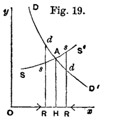

> *...some account of the* **controversy whether "cost of production" or "utility" governs value** *will be given in Appendix I. But it may be well to say a word or two here on this last point.* **We might as reasonably dispute whether it is the upper or the under blade of a pair of scissors that cuts a piece of paper,** *as whether value is governed by utility or cost of production. It is true that when one blade is held still, and the cutting is effected by moving the other, we may say with careless brevity that the cutting is done by the second; but the statement is not strictly accurate,and is to be excused only so long as it claims to be merely a popular and not a strictly scientific account of what happens.*
>
> Principle of Economics - Equilibrium of Normal demand and supply - Book V - Chapter III

###### Short versus Long Run

Marshall partial equilibrium analysis has proven to be very useful to simplify complex problems by focusing on specific channels. Importantly he advocated this approach also when considering the time dimension. This resulted in a a cleaner separation of the short run and the long run. 

> *The element of time is a chief cause of those difficulties in economic investigations which make it necessary for man with his limited powers to go step by step; breaking up a complex question, studying one bit at a time, and at last combining his partial solutions into a more or less complete solution of the whole riddle. In breaking it up, he segregates those disturbing causes, whose wanderings happen to be inconvenient, for the time in a pound called* **Ceteris Paribus**. The study of some group of tendencies is isolated by the assumption other things being equal : the existence of other tendencies is not denied, but their disturbing effect is neglected for a time. The more the issue is thus narrowed, the more exactly can it be handled : but also the less closely does it correspond to real life.
>
> Principle of Economics - Equilibrium of Normal demand and supply - Book V - Chapter V

Writing during Victorian England's industrial peak, Marshall aimed to establish economics as a rigorous science while maintaining its practical relevance. His work successfully displaced Mill's Principles as the standard economics textbook, and his influence on microeconomic teaching continues today. His gradual approach to economic change, captured in the motto "Natura non facit saltum," reflected both his evolutionary perspective and his belief that while capitalism had flaws, it remained the best available system for promoting both economic efficiency and human progress, provided it was properly regulated to serve social ends. This comprehensive approach, bridging classical and neoclassical economics while maintaining focus on real-world applicability, helped establish economics as both an academic discipline and a practical tool for understanding markets and guiding policy.

## PART III: The birth of Macroeconomics and Econometrics

### Macroeconomics

The third part of the course is dedicated to what can be identified as Macroeconomics. The modern distinction between microeconomics and macroeconomics that exist today in every Economic curriculum is probably a fruit of the Keynesian revolution.[^fnky0] As we have seen in part I, modern macro issues such as inflation, the level of activity, cycles and growth were all actively discussed.  The authors of the second part II also discussed those issues even if we did not cover  their thoughts on macro in class. Typically there would be chapters (for example Cournot and Jevons), or books (Walras) in which the step from relative prices determined by the microeconomic behavior of agents to the price levels and aggregate price index would consist in introducing a quantity theory of money. However the rigour used in the previous chapters or books to present the microeconomic theories would vanish. The first two authors we cover can be seen as scholars that incorporated marginalism into more aggregate problems, initiating what is called neoclassical macro (to oppose it to the implicit macro of the Classics), which is still one pillar of modern macro. 

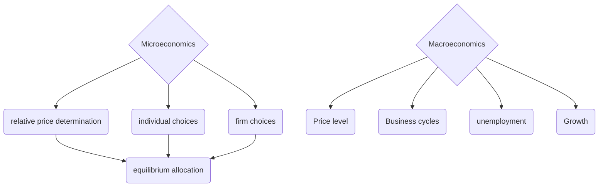
```mermaid
	graph TD
    A{Microeconomics}
    B(relative price determination)
    C(individual choices)
    D(firm choices)
    E(equilibrium allocation)
    AA{Macroeconomics}
    BB(Price level)
    CC(Business cycles)
    DD(unemployment)
    EE(Growth)
    A --> B
    A --> C
    A --> D
    B --> E
    C --> E  
    D --> E  
    AA --> BB
    AA --> CC
    AA --> DD
    AA --> EE
```

#### Knut Wicksell

Knut Wicksell was a highly respected economist who initially received limited international recognition during his lifetime, only gaining broader acclaim in the 1930s when his works were translated into English. He was praised for being a well-rounded economist who mastered mathematical techniques without being dominated by them, took interest in economic policy while maintaining a broad perspective, and understood the challenges of applying pure theory to real-world situations. As noted by Lionel Robbins, Wicksell was unique among his contemporaries for not fitting into any particular school of thought, instead drawing from the best elements of various approaches.

Wicksell's major contributions came through several key works. His "Value, Capital and Rent" (1894) and "Lectures on Political Economy I" (1901) synthesized marginalist-neoclassical economics, particularly focusing on theories of value and distribution. He notably improved upon Böhm-Bawerk's (and Jevons) theory of capital and interest, incorporating it into a Walrasian framework. Later, in "Interest and Prices" (1898) and "Lectures on Political Economy II" (1906), he made significant advances in monetary theory, bridging the gap between price theory and monetary theory. His work on the relationship between interest rates and price levels, particularly his analysis of market versus natural interest rates and their effects on the economy, became especially influential.

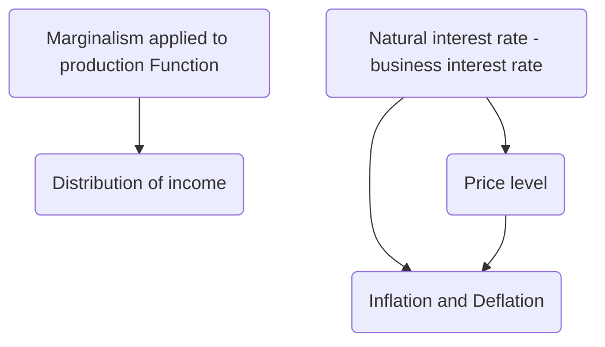
```mermaid
	graph TD
    A(Marginalism applied to production Function)
    B(Distribution of income)
    C(Natural interest rate - business interest rate)
    D(Price level)
    E(Inflation and Deflation)
    A --> B
    C --> D 
    C --> E  
    D --> E
```

In Value, Capital, and Rent he performed a remarkable labour of synthesis. He adopted the marginal utility and marginal productivity theory of value of Jevons, Menger and Marshall, added to it the Böhm-Bawerk analysis of capital, and fused the result in a Walrasian comparative static general equilibrium framework. In this process he became a founder of the marginal productivity (product exhausting) theory of distribution together with Wicksteed. He later refined his theory in his Lectures on Political Economy.

> ...when all the factors of production are increased in the same proportion, the total product also increases exactly proportionately...A more general proof is the following. If we regard the product $P$ s a function of the number of labourers, $a$, and of the number of units of land, $b$, both $a$ and $b$ *being regarded as continuous, then the marginal productivities may be expressed by the partial derivatives of* $P$ *with respect to* $a$ *and* $b$; therefore, if the condition is to be satisfied, we must have
> $$
> a\frac{\partial P}{\partial a}+b\frac{\partial P}{\partial b}=P
> $$
> a partial differential equation, the general integral of which is known to be:
> $$
> P=af\left(\frac{b}{a}\right)
> $$
> in which $f$ is an arbritrary function, i.e. $P$ must be homogenous and linear function of $a$ and $b$. Among the infinite number of functions which satisfy this condition, we may give *as an example $P=a^{\alpha}b^{\beta}$ in which the indices $\alpha$ and $\beta$ are two constant fractions whose sum$=1$.*
>
> Lectures on Political Economy - Production and Distribution- Part II

This passage describes Wicksell's mathematical explanation of constant returns to scale in production. Wicksell is discussing what happens when all factors of production (in this case, labor 'a' and land 'b') are increased in the same proportion. Under constant returns to scale, if you double both inputs, you double the output; if you triple both, you triple the output, and so on.

The equation he presents, $a\frac{\partial P}{\partial a}+b\frac{\partial P}{\partial b}=P$, is known as Euler's homogeneous function theorem. Here's what each part means:

- $\frac{\partial P}{\partial a}$ is the marginal product of labor (how much extra output you get from one more unit of labor)
- $\frac{\partial P}{\partial b}$ is the marginal product of land (how much extra output you get from one more unit of land)
- When you multiply each factor by its marginal product and sum them up, you get the total product P

The solution to this differential equation, $P=af\left(\frac{b}{a}\right)$, is a general form that any constant returns to scale production function must satisfy.  The specific example he gives, $P=a^{\alpha}b^{\beta}$ where $\alpha + \beta = 1$, is what we now call a Cobb-Douglas production function, which is still widely used in economics today to model production with constant returns to scale.

This mathematical formalization was important because it helped demonstrate how competitive markets could achieve equilibrium where each factor is paid its marginal product and the total product is exactly exhausted - a key insight in neoclassical distribution theory.

He then turns to the difficult productive factor capital.

> *To give an account of* **the real nature of capital, its role in production and the grounds upon which its owners, like the owners of land and labour, claim a share in the product, is considerably more difficult than with the other two factors and has led to innumerable controversies among economists**...In the ordinary sense of the term, it includes all auxiliaries to production, with the exception of natural forces in their original form, and direct human labour....If for the moment we leave aside the question of the origin of the productivity (or value-creating power) of capital, and regard it as an empirical fact, we may readily apply to capital the theory developed above---that **the share of the product going to any particular factor of production is determined by its marginal productivity**.
>
> *We may thus regard* **capital** *as a single coherent mass of* **saved-up labour and saved-up land**, which is accumulated in the course of years... **Interest is the difference between the marginal productivity of saved-up labour and land and of current labour and land**.
>
> ...If, in the current year, there are employed in a particular business $a$ workers and $b$ acres of the current year, and $a_1$ labour years and $b_1$ acre years of the preceding year, turned into capital in one form or another, then the total product during the year may be regarded as a function of all these quantities, i.e. $F\left(a,b,a_{1},b_{1}\right)$. The partial derivatives of this function with respect to each of the variables will be on the one hand, $F_{a}=l$,$F_{b}=r$, i.e. wages and rent for current labour and land, and, on the other hand, $F_{a_{1}}=l_{1}\left(>l\right)$,$F_{b_{1}}=r_{1}\left(>r\right)$ what may be called wages (including interest) for the saved-up labour and rent (including interest) for the saved-up land. Equilibrium clearly demands that $l_{1}:l=r_{1}:r$. The two equal quantities 
> $$
> \frac{l_{1}-l}{l}=\frac{r_{1}-r}{r}=i
> $$
> will then each represent the rate of interest on the investment of capital for one year.

Wicksell's approach to capital theory is an extension of his analysis of production factors, though he acknowledges it presents unique challenges compared to land and labor. He defines capital as "saved-up labour and saved-up land," positioning it not as an original factor of production but as a derived one that embodies past inputs stored in productive form. Despite this complexity, Wicksell maintains consistency with his broader theoretical framework by arguing that capital's share of output, like other factors, is determined by its marginal productivity.

To formalize this understanding, Wicksell uses a production function F(a,b,a₁,b₁), where current labor (a) and land (b) are distinguished from their "saved-up" counterparts (a₁,b₁) representing capital. The partial derivatives of this function yield both current factor payments (wages l and rent r) and their "saved-up" equivalents (l₁ and r₁). The key insight emerges in his equation for the interest rate, which shows that interest represents the premium earned by "saved-up" factors over current ones. In equilibrium, this premium must be equal for both saved labor and saved land, providing a unified theory of interest rate determination.

This theoretical construction serves as a crucial bridge between Wicksell's earlier work on production and his later contributions to monetary theory. By integrating Austrian capital theory (and Jevons) with marginal productivity theory of distribution, he creates a framework that not only explains capital returns but also lays the groundwork for his subsequent analysis of natural versus market interest rates. His innovation lies in unifying capital theory with general factor pricing while reconceptualizing interest as a premium on "waiting" rather than merely a return on capital. 

Wicksell made  contributions to monetary theory through his works "Interest and Prices" and "Lectures on Political Economy II." Wicksell was a pioneer of applying an aggregate demand-supply approach with emphasis on the relations between investment and saving, to explain variations in value of money or fluctuations in prices: ‘Any theory of money worthy of the name must be able to show why pecuniary demand for goods exceeds or falls short of the supply of goods in given conditions’. Most versions of the quantity theory had the price level varying directly and proportionately to changes in the quantity of money. In that theory there was no link from the velocity, as affected by bank credit, and quantity of money with individual income dispositions and entrepreneurial production decisions.

> **The Quantity Theory**, on the other hand, even in the form in which it is presented in Ricardo's truly classical writings about money, **is open to too many objections**, as pointed out by later writers, to be accepted without modification...
>
> *The following line of thought seemed capable of leading to a useful conclusion. An excess of money will, according to Ricardo, show itself in two ways---partly through a rise in all prices, partly through a fall in the rate of interest...*

While acknowledging the importance of the quantity theory of money, he identified its limitations and developed a more sophisticated framework. His key innovation was establishing a clear connection between monetary phenomena and real economic decisions through the role of interest rates, moving beyond the simple quantity theory relationship between money supply and prices. Wicksell provided such a link in his hypothesis that price level fluctuations were due to a persistent divergence between the bank rate or market rate of interest and the real/natural rate, defined as the expected rate of return on newly produced capital goods. In his analysis monetary equilibrium and stability of prices required the simultaneous fulfilment of the conditions that: (i) the money rate of interest correspond to the real rate; (ii) at that money rate demand for loans for investment and for cash for real balances equal the supply of savings by individuals and business enterprises; and (iii) that interest rate must be neutral in its effect on prices. Then: ‘. . . equilibrium must ipso facto obtain – if not disturbed by other causes–in the market for goods and services, so that wages and prices will remain unchanged’

> *If the monetary institutions offer their money or their credit on abnormally favourable terms, this must logically lead to an intensified use of money or credit on the part of the public. A rise in prices is the result, and we have seen that prices will continue rising so long as credit remains easy. A tightening of credit has, of course, the opposite effect. A very important qualification is, however, necessary. Though it is called for by the very nature of these phenomena, it is frequently overlooked, and hasty conclusions, which the facts fail to support, are the result.* **The rate of interest charged for loans can clearly never be either high or low in itself, but only in relation to the return which can, or is expected to, be obtained by the man who has possession of money**. It is not a high or low rate of interest in the absolute sense which must be regarded as influencing the demand for raw materials, labour, and land or other productive resources, and so indirectly as determining the movement of prices. **The causative factor is the current rate of interest on loans as compared with what I shall be calling the natural rate of interest on capital. This natural rate is roughly the same thing as the real interest of actual business.**

Wicksell also provided valuable insights into the effects of price level changes on the economy. He was particularly attentive to the social and economic consequences of both inflation and deflation. He noted that inflation disadvantages those with fixed money incomes and lenders, while deflation, despite potentially benefiting workers through increased purchasing power, can lead to business paralysis, unemployment, and falling wages. This analysis of the distributional and real effects of monetary phenomena was quite advanced for its time and remains relevant to modern monetary policy discussions. 

> **Changes in the general level of prices** *have always excited great interest. Obscure in origin, they* **exert a profound and far-reaching influence on the whole economic and social life of a country**.
>
> *..**.A general rise in prices is, of course, to the disadvantage of all those who receive fixed money incomes**, as is the case to-day with a constantly increasing number of social groups. It is also to the disadvantage of all those who derive the whole, or a large part, of their incomes by lending money capital of one kind or another.*
>
> **A lasting fall in the prices of all commodities is generally recognised as no less significant an evil**. While it is true that with the same wages the workers would be able to obtain more of the necessaries of life, this advantage is frequently outweighed by the other consequences of a fall in prices. Business is paralysed, and growing unemployment and falling wages result.

More than a century after Wicksell's seminal work, Michael Woodford published his influential "Interest and Prices" (2003), a book that would become foundational for modern monetary policy in the 21st century. The deliberate echo of Wicksell's title reflected the enduring relevance of his insights, particularly his concept of the natural interest rate, which became central to contemporary monetary theory and central banking practice. Woodford's work, like Wicksell's before him, emphasized the critical role of interest rate management in price stability, demonstrating how Wicksell's framework had anticipated key elements of modern monetary policy, including inflation targeting and the focus on maintaining equilibrium between market and natural rates of interest.

#### Irving Fischer

According to James Tobin, Fisher is regarded as one of the greatest economist America has produced. Fisher’s dedication to the  mathematical method and his skill in using it justify calling him America’s first mathematical economist. Fisher also developed methodologies of quantitative empirical research and was an early and regular user of correlations, regressions and other statistical and econometric tools that later became routine. He is a founder of  the Econometric Society in 1930. James Tobin attributes much of standard neoclassical theory a Fisherian origin as most modern models of capital and interest are essentially variations on Fisher’s theme, the conjunction of intertemporal choices and opportunities. Likewise, his theory of money and prices is the foundation for much of contemporary monetary economics. Fisher published his theory of the determination of interest rates in The Rate of Interest (1907). A revised and enlarged version was published in 1930 as The Theory of Interest. But in this later book the scope of his analysis was broader given the historical events that had occurred.

> THE tremendous expansion of credit during and since the World War to finance military operations as well as post-war reparations, reconstruction, and the rebuilding of industry and trade has brought the problems of capitalism and the nature and origin of interest home afresh to the minds of business men as well as to economists...
>
> ...Inflation during and since the War caused prices to soar and real interest rates to sag in Germany and other nations far below zero: thus impoverishing millions of investors.
>
> Preface 

One of the main innovation of the book is that Fisher extended general equilibrium theory to intertemporal choices and relationships, a crucial step for the analysis of macroeconomic phenomena such as business cycles and growth. Walras had also analysed the dynamic extension of his model, but the level of generalization of Walras was such that the exposition was difficult to follow.  Fisher saw that intertemporal dependences were tricky enough to justify isolating them from the intercommodity complexities and proceeded as if there were just one aggregate commodity to be produced and consumed at different dates. His consumer-saving model in two periods is still presented in modern text book to explain the optimal allocation of consumption across time. But Fisher went well beyond that and presented, first in words, then with a figure and finally using mathematics, a two periods model with consumption, production and a loan market.  Fisher’s theory of individual saving is basically the standard model to this day where a family of indifference curves in the two commodities consumption now $c_1$ and consumption later $c_2$ confront a budget constraint $c_1 + c_2/(1 + r) =y_1 + y_2/(1 + r)$, where the $y$’s are exogenous wage incomes in the two periods and $r$ is the (real)market interest rate. On the side of technology he assumed that the ‘investment opportunities’  available to an individual can be summarized in the terms on which consumption at any date can be traded, with‘ nature’, for consumptions at other dates. Fisher, then, assumed complete intertemporal loan markets cleared by real interest rates, count equations, and show that in principle the equalities of saving and investment at every date determine all interest rates and the paths of consumption and production for all individuals and for the society. Here is the original figure of his book.

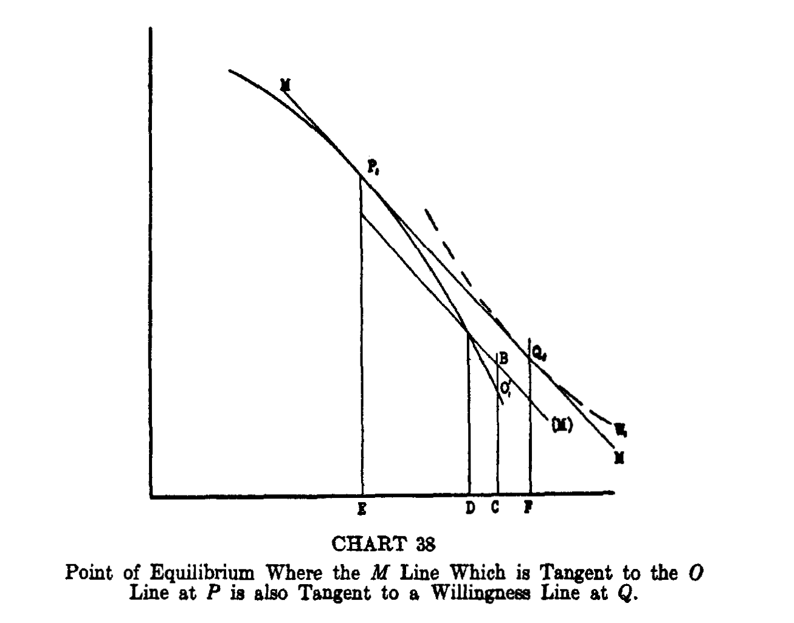

> Chart 38 pictures the double movementof Individual **1.** Starting at $O'_1$,: he moves along the Opportunity line to $P_1$ where the Opportunity line becomes tangent to the $M$  line, then along the $M$ line to $Q_1$ where the *M* line becomes tangent to a $W_1$  line. That is, the fixed rate of interest will cause the individual so to shift that the marginal rate of return overcost (investment opportunity rate and the marginal rate of time preference (degree of impatience) will, each of them, be equal to the market rate of interest. Chart 38 depicts Individual *1’s* adjustment of his rate of investment opportunity and his degree of impatience to the market rate of interest. The rate of interest is, as always, represented in the slope  of the $M$  line, and the rate of return over cost is represented in the slope at $P_1$ of the $O_1$ line. These two slopes are the same, since the two lines are there tangent. The degree of impatience is represented by the identical slopes of the M line and of the $W_1$ line at their point of tangency $Q_1$. Since the M line is a straight line, the slopes of the O, line and the M line at $P_1$ and the slope of the M line and the $W_1$ line at $Q_1$ are all identical and the identity of the opportunity rate, the impatience rate, and the market rate is shown.

---

**The Simplified Fisher model**

- C1, C2: consumption in periods 1 and 2
- Y1, Y2: endowments (or production) in periods 1 and 2
- S: saving in period 1
- I: investment in period 1
- r: interest rate

Consumption:

- C1 = Y1 - S
- C2 = Y2 + (1 + r) * S

Production:

- Y2 = f(I), where f is the production function and f'(I) > 0, f''(I) < 0

Loan Market:

- S(r) = I(r)
- S(r) is the supply of loans (saving) as a function of the interest rate
- I(r) is the demand for loans (investment) as a function of the interest rate

Equilibrium:

- The equilibrium interest rate r* is determined by the equality of saving and investment:
  S(r*) = I(r*)

Utility Maximization:

- Assume a utility function U(C1, C2) with standard properties (increasing, concave)
- The consumer maximizes utility subject to the budget constraint:
  max U(C1, C2) s.t. C2 = Y2 + (1 + r) * (Y1 - C1)

First-Order Conditions:

- The first-order condition for utility maximization implies:
  U1(C1, C2) / U2(C1, C2) = 1 + r, where U1 and U2 are the partial derivatives of U with respect to C1 and C2

Firm's Optimization:

- The firm maximizes profits:
  max f(I) - (1 + r) * I
- The first-order condition for profit maximization implies:
  f'(I) = 1 + r

This model captures the essential features of a two-period economy with a single commodity, where agents make decisions about consumption, saving, and investment based on their endowments, preferences, and the prevailing interest rate. The equilibrium interest rate is determined by the equality of saving and investment in the loan market.

---

His theory clearly shows that the interest rate is determined in equilibrium by preferences, impatience in his words, and by technology, or investment opportunities in his words.

> The relation of both impatience and opportunity to the rate of interest, in my opinion, can be comprehended accurately only by analyzing rigorously these concepts and determining the effect of each upon the income stream. By this procedure, we arrive at a fundamental explanation of the nature of impatience and of return on income invested and see how, by changes in the income stream, these rates are brought into conformity with the rate of interest.
>
> The Theory of Interest - Productivity as a Determinant of Interest Rates

Fischer initial views on macroeconomics were based on the quantity equation, and his famous equation equating the nominal al interest rate to the sum of the real interest rate and the rate of (expected) inflation, $i_t =r_t+\pi^e_{t+1}$, was used to highlight the dichotomy between nominal variables and real variables. He was certainly not the first to identify this dichotomy. All the marginalist economists we have read were able to determine relative prices in equilibrium not the level of prices who depended on the numeraire. The prices expressed in numeraire, namely the legal tender, depended on the quantity of money through the famous older equation which had finally had been stated in mathematical form $$ MV=PY$$. But During the Great Depression Fisher came to quite ad different theory of the business cycle: his ‘debt-deflation theory of depression’ (1932), summarized in the first volume of Econometrica.

> I am offering this paper as embodying, in brief, my present "creed" on the whole subject of so-called "cycle theory." My "creed" consists of 49 "articles" some of which are old and some new.
>
> 13. There may even be a general over-production and in either of two senses: (a) there may be, in general, at a particular point of time, over-large inventories or stocks on hand, or (b) there may be, in general, during a particular period of time, an over-rapid flow of production. The classical notion that over-production can only be relative as between different products is erroneous. Aside from the abundance or scarcity of particular products, relative to each other, production as a whole is relative to human desires and aversions, and can as a whole overshoot or undershoot the equilibrium mark. In fact, except for brief moments, there must always be some degree of general over-production or general under-production and in both senses-stock and flow.
>
> 14. But, in practice, general over-production, as popularly imagined, has never, so far as I can discover, been a chief cause of great dis-equi- librium. The reason, or a reason, for the common notion of over-pro- duction is mistaking too little money for too much goods.
>
> ....
>
> 24. Assuming, accordingly, that, at some point of time, a state of over-indebtedness exists, this will tend to lead to liquidation, through the alarm either of debtors or creditors or both. Then we may deduce the following chain of consequences in nine links: (1) Debt liquidation leads to distress selling and to (2) Contraction of deposit currency, as bank loans are paid off, and to a slowing down of velocity of circula- tion. This contraction of deposits and of their velocity, precipitated by distress selling, causes (3) A fall in the level of prices, in other words, a swelling of the dollar. Assuming, as above stated, that this fall of prices is not interfered with by reflation or otherwise, there must be (4) A still greater fall in the net worths of business, precipitating bank- ruptcies and (5) A like fall in profits, which in a "capitalistic," that is, a private-profit society, leads the concerns which are running at a loss to make (6) A reduction in output, in trade and in employment of labor. These losses, bankruptcies, and unemployment, lead to (7) Pes- simism and loss of confidence, which in turn lead to (8) Hoarding and slowing down still more the velocity of circulation. The above eight changes cause (9) Complicated disturbances in the rates of interest, in particular, a fall in the nominal, or money, rates and a rise in the real, or commodity, rates of interest.

He argues that general overproduction is possible, contrary to classical theory, but has not historically been the primary cause of economic disequilibrium. Instead, he posits that overindebtedness and subsequent debt liquidation are the key drivers of economic crises.

Fisher outlines a nine-step chain of consequences resulting from overindebtedness and debt liquidation:

1. Distress selling
2. Contraction of the money supply and slowdown in velocity of circulation
3. Falling price levels (deflation)
4. Decline in business net worth, leading to bankruptcies
5. Falling profits
6. Reduction in output, trade, and employment
7. Pessimism and loss of confidence
8. Hoarding and further slowing of money velocity
9. Disturbances in interest rates, with falling nominal rates and rising real rates

This theory of debt-driven business cycles, known as the "debt-deflation" theory, was a significant contribution to understanding the Great Depression and became influential in later economic thought.

#### John Maynard Keynes

John Maynard Keynes was one of the most influential economists of the 20th century. His seminal work, The General Theory of Employment, Interest and Money, published in 1936, revolutionized economic thinking and laid the foundation for modern macroeconomics. 

Keynes's intellectual journey began with his early work on probability theory in A Treatise on Probability (1921). He initially took a largely logical, atomistic approach similar to Bertrand Russell, but over time transitioned to a more organic conception of social phenomena, influenced by his later interactions with the philosopher Wittgenstein. Keynes came to emphasize the role of convention, animal spirits, and fundamental uncertainty in economic life.

In the monetary realm, Keynes's Tract on Monetary Reform (1923) and two-volume Treatise on Money (1930) analyzed inflation, central banking, and the business cycle. A key insight was that savings and investment could diverge, causing economic fluctuations. While influential, the Treatise was rooted in a largely static conception of the economy.

Keynes's breakthrough came in The General Theory, which focused on the forces determining output and employment as a whole. He argued that the classical economic postulates of full employment equilibrium only applied in a special case and that persistent involuntary unemployment was possible. This was due to the possibility of a deficiency of aggregate demand, rooted in the volatility of investment.

Investment depended on the marginal efficiency of capital and the state of long-term expectations in an environment of radical uncertainty. Expectations were based on conventional judgements and animal spirits rather than precise probabilistic calculations. Interest rates were determined not by the real forces of thrift and productivity, but by liquidity preference - the desire to hold money as a haven from uncertainty.

Methodologically, Keynes advocated focusing on a small number of key variables in a relevant simplified model, expressed in prose as much as mathematics, as opposed to extensive formal models disconnected from reality. His theory implied an active role for government in maintaining full employment through monetary and especially fiscal policy, though without completely eliminating the market economy and private initiative.

In its broad philosophical sweep, Keynes's General Theory provided a new foundation for managing market economies that dominated the mid-20th century. It implied a middle ground between pure laissez-faire and full socialization, with a permanent but limited economic role for the state. While many of the specific theoretical and policy debates have evolved, the broader Keynesian vision of a mixed economy remains influential to this day.

##### The General Theory

Keynes famous book, the General Theory of Employment, Interest and Money (1936) was a revolutionary work (as Klein 1947, so rightly termed it) which he wrote under the constant stimulus and criticism of his colleagues and students – and with which he changed the face of monetary theory, laid the foundation for its development into macroeconomic theory, and defined the analytical framework and research programme of this theory for decades to come. Keynes was well trained in neo-classic economics[^fnky1] and had made some contributions mentioned above in monetary theory. However in front of the quasi economic and financial collapse of the West he created what he saw as a more general theory on the allocation of aggregate resources than the neoclassical one that he relegated to a special case that would occur under very special, almost laboratory, circumstances. In his novel[^fnky2] theory expectations about the future and a functioning of demand and supply that rejected of Say's law would determine the aggregate employment and level of activity.

> This book is chiefly addressed to my fellow economists. I hope that it will be intelligible to others. But its main purpose is to deal with difficult questions of theory, and only in the second place with the applications of this theory to practice. **For if orthodox economics is at fault, the error is to be found not in the superstructure, which has been erected with great care for logical consistency, but in a lack of clearness and of generality in the premisses.**
>
> ...**A monetary economy, we shall find, is essentially one in which changing views about the future are capable of influencing the quantity of employment and not merely its direction.** *But* **our method** *of analysing the economic behaviour of the present under the influence of changing ideas about the future* **is one which depends on the interaction of supply and demand**, and is in this way linked up with our fundamental theory of value. We are thus led to a more general theory, which includes the classical theory with which we are familiar, as a special case.
>
> The General Theory of Employment, Interest and Money - preface

Keynes starting point is the observation that involuntary unemployment, which during the depression was an obvious reality, is not compatible with the marginalist-neoclassical (which he calls classical) approach to the determination of employment in equilibrium.  Keynes writes that the existing theory addresses the allocations of employment across industries but does not pin down the level of aggregate employment and activity. His solution is that employment might not be determined by the labor supply.

> **Most treatises on the theory of Value and Production** *are primarily concerned with the* **distribution of a given volume of employed resources between different** *uses and with the conditions which, assuming the employment of this quantity of resources,* **determine their relative rewards and the relative values of their products**.
>
> *...But the pure theory of* **what determines the actual employment** *of the available resources has seldom been examined in great detail.*
>
> **The classical theory of employment**--- supposedly simple and obvious--- has been based, I think, on two fundamental postulates, though practically without discussion, namely: I. The wage is equal to the **marginal product** *of labour....II. The utility of the wage when a given volume of labour is employed is equal to the* **marginal disutility** *of that amount of employment.*
>
> *...This postulate is compatible with what may be called* **"frictional" unemployment**....In addition to "frictional" unemployment, the postulate is also compatible with **"voluntary" unemployment**...The classical postulates do **not admit** *of the possibility of the third category, which I shall define below as* **"involuntary" unemployment**.
>
> The General Theory of Employment, Interest and Money - chapter 2

The mechanism that Keynes postulates is that nominal wages will not adjust downwards and that the wage that matters for the supply, determined in the bargaining between workers and entrepreneurs is the nominal wage. If these assumptions are true then it is possible that the actual employment level will not be equal to the full voluntary employment as in the neoclassical theory[^fnky3].

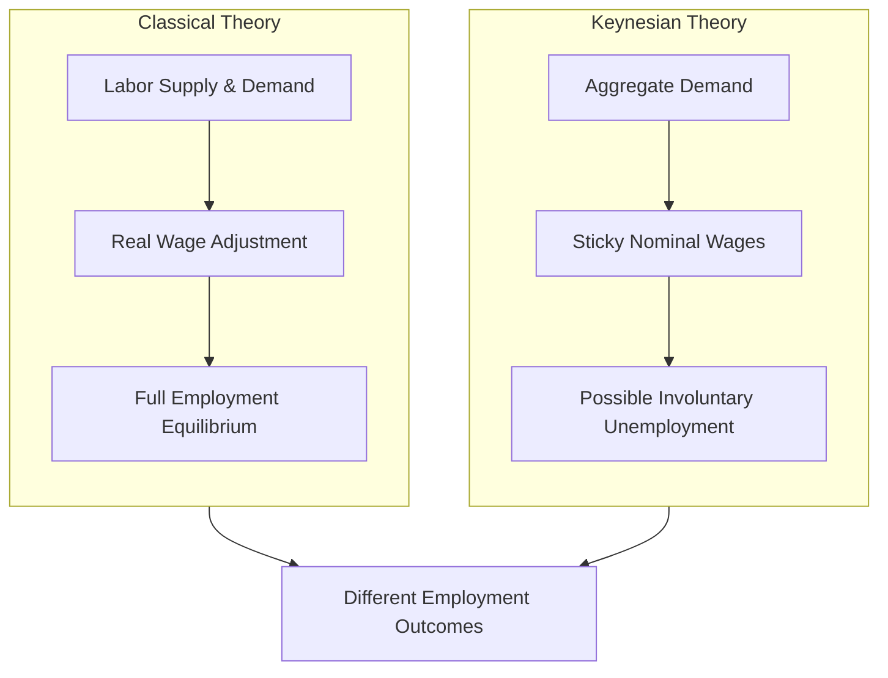
```mermaid
flowchart TB
    subgraph Classical["Classical Theory"]
        direction TB
        C1[Labor Supply & Demand]
        C2[Real Wage Adjustment]
        C3[Full Employment Equilibrium]
        C1 --> C2
        C2 --> C3
    end

    subgraph Keynesian["Keynesian Theory"]
        direction TB
        K1[Aggregate Demand]
        K2[Sticky Nominal Wages]
        K3[Possible Involuntary Unemployment]
        K1 --> K2
        K2 --> K3
    end

    Classical --> D[Different Employment Outcomes]
    Keynesian --> D
```

---

**Classical** **Model**

1. Labor Market:
   $L^s = L^s(W/P)$     # Labor supply as function of real wage
   $L^d = L^d(W/P)$     # Labor demand as function of real wage
   $L^s = L^d$          # Market clearing condition

2. Key Equations:
   $W/P = MPL$          # Real wage equals marginal product of labor
   $MRS = W/P$         # Marginal rate of substitution equals real wage
   $Y = F(L)$          # Production function

3. Equilibrium determined by:
   $L^* : MPL(L^*) = MRS(L^*)$
   W/P adjusts to clear market

---

> *...The traditional theory maintains, in short, that* **the wage bargains** between the entrepreneurs and the workers determine the real wage so that, assuming free competition amongst employers and no restrictive combination amongst workers, the latter can, if they wish, **bring their real wages into conformity with the marginal disutility** of the amount of employment offered by the employers at that wage.
>
> ...To sum up: **there are two objections** to the second postulate of the classical theory. The first relates to the actual behaviour of labour. A fall in real wages due to a rise in prices, **with money-wages unaltered**, does not, as a rule, cause the supply of available labour on offer at the current wage to fall below the amount actually employed prior to the rise of prices....
>
> But the other, more fundamental, objection, which we shall develop in the ensuing chapters, flows from our **disputing the assumption that the general level of real wages is directly determined by the character of the wage bargain**.
>
> *...Since there is imperfect mobility of labour, and wages do not tend to an exact equality of net advantage in different occupations,* **any individual or group of individuals, who consent to a reduction of money-wages relatively to others, will suffer a restive reduction in real wages, which is a sufficient justification for them to resist it**.
>
> The General Theory of Employment, Interest and Money - chapter 2 

Keynes introduces the notion of effective demand as the level of employment determined by the equilibrium between aggregate supply and aggregate demand[^fnky4] refusing the idea that aggregate demand and supply are always equal whatever is the level of employment[^fnky5].

> ...The value of $D$ at the point of the aggregate demand function, where it is intersected by the aggregate supply function, will be called the **effective demand**.
>
> ...**Thus Say's law, that the aggregate demand price of output as a whole is equal to its aggregate supply price for all volumes of output, is equivalent to the proposition that there is no obstacle to full employment**. If, however, this is not the true law relating the aggregate demand and supply functions, there is a vitally important chapter of economic theory which remains to be written and without which all discussions concerning the volume of aggregate employment are futile.
>
> The General Theory of Employment, Interest and Money - chapter 3

Here is in Keynes words a summary of his theory. The large majority of the rest of the book will be devoted to explain each logical piece contained in his theory: the consumption function that depends on income and the marginal propensity to consume, the investment function that depends on the marginal efficiency of capital and the interest rates and how all these pieces fit together to deliver a result that goes against what the Classics and Neo Classics believed[^fnky6].

> A brief summary of the theory of employment... In this summary we shall assume that **the money-wage** *and other factor costs* **are constant** *per unit of labour employed.*
>
> *The outline of our theory can be expressed as follows. When* **employment increases**, **aggregate real income is increased**. The **psychology** *of the community is such that when aggregate real income is increased* **aggregate consumption is increased**, but **not by so much as income. Hence employers would make a loss if the whole of the increased employment were to be devoted to satisfying the increased demand for immediate consumption. Thus, **to justify any given amount of employment there must be an amount of current investment sufficient to absorb the excess of total output over what the community chooses to consume when employment is at the given level***. It follows, therefore, that, given what we shall call the community's propensity to consume, the equilibrium level of employment, i.e. the level at which there is no inducement to employers as a whole either to expand or to contract employment, will depend on the amount of current investment.* **The amount of current investment will depend***, in turn,* **on *what we shall call the inducement to invest; and the inducement to invest will be found to depend* **on the relation between the schedule of the marginal efficiency of capital and the complex of rates of interest on loans of various maturities and risks**. Thus, given the propensity to consume and the rate of new investment, there will be **only one level of employment** *consistent with equilibrium; since any other level will lead to inequality between the aggregate supply price of output as a whole and its aggregate demand price. This level* **cannot be greater than full employment**, i.e. the real wage cannot be less than the marginal disutility of labour. But there is no reason in general for expecting it to be equal to full employment. **The effective demand associated with full employment is a special case**, only realised when the propensity to consume and the inducement to invest stand in a particular relationship to one another. This particular relationship, **which corresponds to the assumptions of the classical theory, is in a sense an optimum relationship**...
>
> ...**It may well be that the classical theory represents the way in which we should like our Economy to behave. But to assume that it actually does so is to assume our difficulties away**
>
> If the propensity to consume and the rate of new investment result in a deficient effective demand***, the actual level of employment will fall short of the supply of labour potentially available at the existing real wage, and* **the equilibrium real wage will be greater than the marginal disutility of the equilibrium level of employment.
>
> The General Theory of Employment, Interest and Money - chapter 3

Keynes first piece is the aggregate consumption function. Today we tend to simplify his analysis by assuming that he said that aggregate consumption is proportional to disposable income. This simplification might be due to the lack of formalization of Keynes in the General Theory but also reflect his own conclusion. Keynes gives a very large list[^fnky7] of objective and subjective[^fnky8] factors that influence the consumption behaviour, which he defines the propensity to consume, with the objective to have a very general theory. The number of influencing factors is so large that it would be difficult to use mathematics to model it. Mathematics is most useful when the focus is on a limited number of factors and even today we do not have formalization with so many channels at play to explain aggregate consumption. He concludes that the propensity to consume is fairly stable and that changes in income are more important than changes in the interest rate in explaining consumption (and saving). Also the exposition in the general theory is in wage units (the wage is the deflator because that is what he takes as constant) which is not always easy to follow. 

> We will therefore define what we shall call the **propensity to consume** as the functional relationship $\chi$ between $Y_{w}$, a given level of income in terms of wage-units, and $C_{w}$ the expenditure on consumption out of that level of income, so that
> $$
> C_{w}=\chi\left(Y_{w}\right)\ \ or\ \ C=W\chi\left(Y_{w}\right).
> $$
> We are left therefore, with the conclusion that in a given situation **the propensity to consume may be considered a fairly stable function**,...
>
> Granted, then, that the propensity to consume is a fairly stable function...what is the normal shape of this function? The fundamental psychological law, upon which we are entitled to depend with great confidence both a priori from our knowledge of human nature and from the detailed facts of experience, is that men are disposed, as a rule and on the average, to increase their consumption as their income increases, but not by as much as the increase in their income...**$\frac{dC_{w}}{dY_{w}}$ is positive and less than unity**.
>
> The General Theory of Employment, Interest and Money - chapter 8

> we are left with the conclusion that **short-period changes in consumption largely depend on change in the rate at which income (measured in wage-units) is being earned and not on changes in the propensity to consume out of a given income**. We must, however, guard against a misunderstanding. The above means that the influence of moderate changes in the rate of interest on the propensity to consume is usually small.
>
> The General Theory of Employment, Interest and Money - chapter 9

Armed with a stable consumption function Keynes introduces the notion of a multiplier to explain how changes in private investment (and public as well) impact the level of output. Here again he gives a number of factors[^fnky9] that would impact the size of the multiplier (even considering a stable marginal propensity to consume)

> *For in given circumstances a definite ratio, to be called the* **Multiplier**, can be established between income and investment...
>
> Let us define, then, $\frac{dC_{w}}{dY_{w}}$ as the **marginal propensity to consume**. This quantity is of considerable importance, because it tells us how the next increment of output will have to be divided between consumption and investment. For $\Delta Y_{w}=\Delta C_{w}+\Delta I_{w}$, where $\Delta C_{w}$ and $\Delta I_{w}$ are the increments of consumption and investment; so that we can write $\Delta Y_{w}=k\Delta I_{w}$ where $1-\frac{1}{k}$  is equal to the marginal propensity to consume. Let us call $k$ the investment multiplier.
>
> *...We have been dealing so far with a net increment of investment. If, therefore, we wish to apply the above without qualification to the effect of ([e.g.) increased public works, we have to assume that there is no offset through decreased investment in other directions, and also, of course, no associated change in the propensity of the community to consume.*
>
> The General Theory of Employment, Interest and Money - chapter 10

If the level of activity and employment is below full employment it means that it is welfare improving (notice that Keynes also uses the notion of utility here) to increase it by spending.

> ...**When involuntary unemployment exists**, the marginal disutility of labour is necessarily less than the utility of the marginal product. Indeed it may be much less. For a man who has been long unemployed some measure of labour, instead of involving disutility, may have a positive utility. If this is accepted, the above reasoning shows how "wasteful" loan expenditure may nevertheless enrich the community on balance....
>
> If the Treasury were **to fill old bottles with bank notes**, bury them at suitable depths in disused coal-mines which are then filled up to the surface with town rubbish, and leave it to private enterprise on well-tried principles of laissez-faire to **dig the notes up again** (the right to do so being obtained, of course, by tendering for leases of the note-bearing territory), there need be no more unemployment and, with the help of the repercussions, the real income of the community, and its capital wealth also, would probably become a good deal greater than it actually is. It would, indeed, be more sensible to build houses and the like; but if there are political and practical difficulties in the way of this, **the above would be better than nothing**.
>
> The General Theory of Employment, Interest and Money - chapter 10

The other important contribution of Keynes, maybe less analysed, is that he produced a theory of volatile private investment. This volatility in private investment is then transmitted to the level of activity through the multiplier as above. A key innovation is the idea that the way agents form expectations on the future value of capital based on psychological features, the famous animal spirits,  which in more recent literature was modeled with higher order expectations. Agents decide investment in comparing the marginal efficiency of capital[^fnky10]with the current level of interest rates[^fnky11]. And as just mentioned the marginal efficiency of capital is subject to "violent" revisions by invenstors resulting in high volatility.

---

**Marginal Efficiency of Capital**

According to Keynes, the marginal efficiency of capital is a measure of the expected future returns on investments over time, denoted as R_t for time periods t=0,1,...n. It is calculated as the discount rate r^e that equates the present value of those future returns to the initial cost of the capital investment K, as expressed in the formula K = \sum_{t=1}^{n} \frac{R_t}{{(1+r^e)}^t}. A higher marginal efficiency of capital indicates higher anticipated returns for a given investment. Keynes posited that, all else equal, the marginal efficiency of capital declines as the level of investment rises.  

To determine the optimal level of investment, one need only compare the marginal efficiency of capital to the interest rate r, which reflects the cost of financing. The challenge, however, is that the expected future returns used to calculate the marginal efficiency of capital are not objective facts, but rather are subjective estimates that depend on the expectations and beliefs of entrepreneurs about the future state of the economy. These expectations are inherently uncertain and subject to change.  

Keynes argued that psychological factors like confidence, sentiment and 'animal spirits' play a crucial role in shaping entrepreneurs' expectations and thus their investment decisions. Consequently, the level of economic activity and employment is highly dependent on these fickle, uncontrollable and unpredictable psychological variables. Investment behavior is driven not just by rational calculation, but by the ever-shifting sands of human emotion and intuition in the face of an unknowable future.

---

> It is important to understand **the dependence of the marginal efficiency of a given stock of capital on changes in expectation**, because it is chiefly this dependence which renders the marginal efficiency of capital subject to the somewhat **violent fluctuations which are the explanation of the Trade Cycle**. In Chapter 22 below we shall show that the succession of Boom and Slump can be described and analysed in terms of the fluctuations of the marginal efficiency of capital relatively to the rate of interest.
>
> The General Theory of Employment, Interest and Money - chapter 11

> ...**A conventional valuation which is established as the outcome of the mass psychology of a large number of ignorant individuals is liable to change violently as the result of a sudden fluctuation of opinion** due to factors which do not really make much difference to the prospective yield; since there will be no strong roots of conviction to hold it steady. In abnormal times in particular, when the hypothesis of an indefinite continuance of the existing state of affairs is less plausible than usual even though there are no express grounds to anticipate a definite change, the market will be subject to waves of optimistic and pessimistic sentiment, which are unreasoning and yet in a sense legitimate where no solid basis exists for a reasonable calculation.
>
> The General Theory of Employment, Interest and Money - chapter 12

These revisions could be justified by changes in fundamentals, however Keynes believes that they also occur because of speculation which he defines as the "the activity of forecasting the psychology of the market" and because of the nature of man.

> The social object of skilled investment should be to defeat the dark forces of time and ignorance which envelop our future. The actual, private object of the most skilled investment to-day is "to beat the gun" , as the Americans so well express it, to **outwit the crowd**, and to pass the bad, or depreciating, half-crown to the other fellow....This battle of wits to anticipate the basis of conventional valuation a few months hence, rather than the prospective yield of an investment over a long term of years, does not even require gulls amongst the public to feed the maws of the professional; **it can be played by professionals amongst themselves**. Nor is it necessary that anyone should keep his simple faith in the conventional basis of valuation having any genuine long-term validity. For it is, so to speak, a game of Snap, of Old Maid, of Musical Chairs--- a pastime in which he is victor who says Snap neither too soon nor too late, who passes the Old Maid to his neighbour before the game is over, **who secures a chair for himself when the music stops**.
>
> *We have reached the* **third degree** where we devote our intelligences to anticipating what average opinion expects the average opinion to be. And there are some, I believe, who practise the fourth, fifth and higher degrees.
>
> *...If I may be allowed to appropriate the term* **speculation for the activity of forecasting the psychology of the market, and the term enterprise for the activity of forecasting the prospective yield of assets over their whole life**, it is by no means always the case that speculation predominates over enterprise.

> *Even apart from the instability due to speculation, there is the instability due to the characteristic of human nature that a large proportion of our positive activities depend on spontaneous optimism rather than on a mathematical expectation, whether moral or hedonistic or economic. Most, probably, of our decisions to do something positive, the full consequences of which will be drawn out over many days to come, can only be taken as a result of* **animal spirits** *of a spontaneous urge to action rather than inaction, and not as the outcome of a weighted average of quantitative benefits multiplied by quantitative probabilities.*
>
> The General Theory of Employment, Interest and Money - chapter 12

Keynes also introduces the idea of liquidity preferences[^fnky13], namely a portfolio decision[^fnky12] between liquid and illiquid assets that determine the interest rate. In his liquidity preference theory, Keynes viewed the interest rate as a monetary variable determined by the supply and demand for money, rather than a real variable equating savings and investments as in neoclassical theory. The demand for money arises from transactions, precautionary motives, and speculative purposes, with the interest rate serving as the liquidity premium for holding non-liquid assets. While monetary policy could potentially influence the real economy through an indirect transmission mechanism, Keynes expressed skepticism about its effectiveness. He argued that the money supply may be endogenous and not fully controlled by authorities, that speculation can destabilize markets and frustrate policy intentions, and that investment decisions depend more on expectations and confidence than the interest rate.

> It should be obvious that the rate of interest cannot be a return to saving or waiting as such. For if a man hoards his savings in cash, he earns no interest, though he saves just as much as before. On the contrary, the mere definition of the rate of interest tells us in so many words that **the rate of interest is the reward for parting with liquidity for a specified period**.
>
> **The rate of interest is not the " price" which brings into equilibrium the demand for resources to invest with the readiness to abstain from present consumption. It is the " price" which equilibrates the desire to hold wealth in the form of cash with the available quantity of cash**...
>
> If this explanation is correct, the quantity of money is the other factor, which, in conjunction with liquidity-preference, determines the actual rate of interest in given circumstances....$M=L(r)$.
>
> The General Theory of Employment, Interest and Money - chapter 13

Keynes believed that the economic system is not always capable of self-equilibrating itself, with the consequence that a crisis can last for a very long time although not leading to a complete collapse but requiring policy intervention.

> *In particular, it is* **an outstanding characteristic of the economic system** *in which we live that, whilst it is subject to severe fluctuations in respect of output and employment, it* **is not violently unstable**. Indeed **it seems capable of remaining in a chronic condition of sub-normal activity for a considerable period without any marked tendency either towards recovery or towards complete collapse**. Moreover, the evidence indicates that full, or even approximately full, employment is of rare and short-lived occurrence. Fluctuations may start briskly but seem to wear themselves out before they have proceeded to great extremes, and an intermediate situation which is neither desperate nor satisfactory is our normal lot. It is upon the fact that fluctuations tend to wear themselves out before proceeding to extremes and eventually to reverse themselves, that the theory of business cycles having a regular phase has been founded. The same thing is true of prices, which, in response to an initiating cause of disturbance, seem to be able to find a level at which they can remain, for the time being, moderately stable.
>
> The General Theory of Employment, Interest and Money - chapter 14

> *Thus* **with markets organised and influenced as they are at present, the market estimation of the marginal efficiency of capital may suffer such enormously wide fluctuations that it cannot be sufficiently offset by corresponding fluctuations in the rate of interest**. Moreover, the corresponding movements in the stock-market may, as we have seen above, depress the propensity to consume just when it is most needed. In conditions of laissez faire the avoidance of wide fluctuations in employment may, therefore, prove impossible without a far-reaching change in the psychology of investment markets such as there is no reason to expect. **I conclude that the duty of ordering the current volume of investment cannot safely be left in private hands.**
>
> The General Theory of Employment, Interest and Money - chapter 22

Keynes conclusions for the conduct of monetary policy are very distant from the idea of controlling inflation and suggest that monetary policy should aim at full employment.

> There is, however, a second, much more fundamental inference from our argument which has a bearing on the future of inequalities of wealth; namely, our theory of the **rate of interest**. The justification for a moderately high rate of interest has been found hitherto in the necessity of providing a sufficient inducement to save. But we have shown that the extent of effective saving is necessarily determined by the scale of investment and that the scale of investment is promoted by a low rate of interest, provided that we do not attempt to stimulate it in this way beyond the point which corresponds to full employment. **Thus it is to our best advantage to reduce the rate of interest to that point relatively to the schedule of the marginal efficiency of capital at which there is full employment**.

> At the present moment people are unusually expectant of a more fundamental diagnosis; more particularly ready to receive it; eager to try it out, if it should be even plausible. But apart from this contemporary mood, **the ideas of economists and political philosophers** both when they are right and when they are wrong, **are more powerful than is commonly understood**. Indeed the world is ruled by little else. Practical men, who believe themselves to be quite exempt from any intellectual influences, are usually the slaves of some defunct economist. Madmen in authority, who hear voices in the air, are distilling their frenzy from some academic scribbler of a few years back. **I am sure that the power of vested interests is vastly exaggerated compared with the gradual encroachment of ideas.**
>
> The General Theory of Employment, Interest and Money - chapter 24

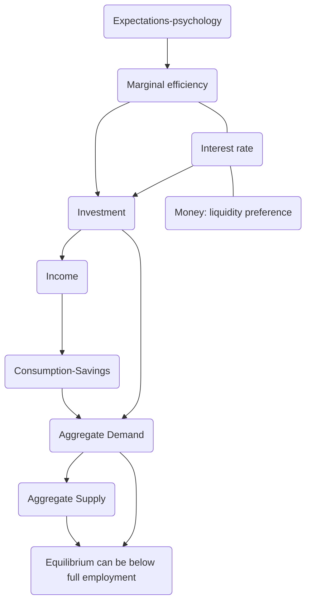
```mermaid
	graph TD
    A(Aggregate Supply)
    B(Aggregate Demand)
    C(Consumption-Savings)
    D(Income)
    F(Investment)
    H(Marginal efficiency)
    L(Expectations-psychology)
    G(Interest rate)
    M(Money: liquidity preference)
    N(Equilibrium can be below full employment)
    B --> A
    C --> B
    F --> B 
    H --> F
    H --- G
    G --- M
    D ---> C
    L --> H
    F --> D
    G --> F
    A --> N
    B --> N
```

Keynes concluded that the state should intervene to ensure full employment and a just income distribution, but without abolishing individualism and private ownership. He advocated for an "administered market" where the state guides the invisible hand, helping it to manifest itself and render it visible. This philosophy sought to preserve the core tenets of a capitalist economy while addressing the deficiencies of laissez-faire in determining output levels and income distribution. Keynes believed that state intervention was necessary to achieve policy goals and maintain the possibility of civilization, positioning economists as guardians of this possibility rather than of civilization itself.

The General Theory had a massive impact on Economics creating dissent and admiration. The lack of formalization of the General Theory also opened the way to many different interpretations. Here the first attempt to formalize part of the ideas of the General Theory by Hicks. This formalization became the famous IS-LM model. All the following quotes are from *MR. Keynes and the "Classics" A suggested Interpretation, J.R. Hicks Econometrica Vol.5 No.2 1937*.

> Mr. Keynes takes as typical of "Classical economics" the later writings of Professor Pigou, particularly The Theory of Unemployment. Now The Theory of Unemployment is a fairly new book, and an exceedingly difficult book; so that it is safe to say that it has not yet made much impression on the ordinary teaching of economics.
>
> For example, Professor Pigou's theory runs, to a quite amazing extent, in real terms. Not only is his theory a theory of real wages and unemployment; but numbers of problems which anyone else would have preferred to investigate in money terms are investigated by Professor Pigou in terms of "wage-goods."
>
> Since our purpose is comparison, I shall try to set out my typical classical theory in a form similar to that in which Mr. Keynes sets out his own theory; ... Thus I assume that I am dealing with a short period in which the **quantity of physical equipment of all kinds available can be taken as fixed**.
>
> 

Model Assumptions

- Labour is homogenous, implying it can move across sectors.
- $w$, the rate of money wages per head, can be taken as given. This is the extreme version of nominal rigidity.
- Let $x,y$, be the outputs of investment goods and consumption goods respectively.
- $N_{x},N_{y}$,be the numbers of men employed in both sectors.
- Capital is fixed therefore production functions depends only on labour

$$
x=f_{x}(N_{x})
$$

and
$$
y=f_{y}\left(N_{y}\right)
$$

- $M$ be the given quantity of money. Namely there is a central bank that fixes $M$ or in any case it is exogenous.
  The central problem of the General Theory is to determine total employment $N=N_x+N_y$. On the production side Hicks assumes perfect competition, which implies that prices, here in nominal terms, are equal to marginal costs:

$$
P_{x}=w\frac{dN_{x}}{dx}
$$

$$
P_{y}=w\frac{dN_{y}}{dy}
$$

(Nominal) Income in the investment sector is $I_{x}=P_{x}x$ and in the consumption sector $I_{y}=P_{y}y$  therefore total income $I$ is
$$
I=w\frac{dN_{x}}{dx}x+w\frac{dN_{y}}{dy}y
$$
On the Demand side first, as for the (neo)-Classics use the plain Quantity theory $\left(Mv=PY\right)$:
$$
M=kI
$$
Therefore if $k$ is given the equation determines (nominal) $I$ for an exogenous $M$. Using the and Investment equation where the amount of investment  depends upon the rate of interest:
$$
I_{x}=C\left(i\right)
$$
we have that equilibrium is
$$
I_{x}=S\left(i,I\right)
$$
To summarize given $M$ and $k$, $I$ is determined, we can then determine $i$ and $I_{x}$. 
Now using $I_{x}=P_{x}x=f_{x}(N_{x})w\frac{dN_{x}}{dx}$ we have $N_{x}$, and using
$$
w\frac{dN_{y}}{dy}f_{y}\left(N_{y}\right)=I-f_{x}(N_{x})w\frac{dN_{x}}{dx}
$$
we have $N_{y}$.

1. In this model if you increase $M$, $I$ increases $S$ for a given $i$ so $I_{x}$ increases and the interest decreases. Employment will increase.
2. If $C(i)$ shifts to the right, "an increase in the inducement to invest", the interest rate increases. If the amount of saving rises, the amount of investment will rise too; labour will be employed more in the investment trades, less in the consumption trades; this will increase total employment if the elasticity of supply in the investment trades is greater than that in the consumption-goods trades-diminish it if vice versa.
3. A rise in the rate of money wages will necessarily diminish employment and raise real wages. $w$ increases, with constant $I$ it has to be that $N_{x,y}$ decrease which implies that the real wage increase.

$$
w\frac{dN_{y}}{dy}f_{y}\left(N_{y}\right)+w\frac{dN_{x}}{dx}f_{x}(N_{x})=I
$$

Important is to realize that Hicks presents the (neo)-Classic model with a nominal wage that is rigid which is not the the common view about neoclassical theory in which prices adjust freely. 
Now Hicks shifts to his interpretation of Keynes closure. The demand of Money depends on the interest rate
$$
M=L\left(i\right)
$$
Investment stays
$$
I_{x}=C\left(i\right)
$$
and saving
$$
I_{x}=S\left(I\right)
$$
where a possible influence of the rate of interest on the amount saved out of a given income is neglected.

>  Now the rate of interest, not income, which is determined by the quantity of money. The rate of interest set against the schedule of the marginal efficiency of capital determines the value of investment; that determines income by the multiplier. Then the volume of employment (at given wage-rates) is determined by the value of investment and of income which is not, saved but spent upon consumption goods.
>
>  It is this system of equations which yields the startling conclusion, that an increase in the inducement to invest, or in the propensity to consume, will not tend to raise the rate of interest, but only to increase employment.

But Keynes recognizes that the demand of Money depends on the interest rate and Income  $$M=L\left(I,i\right)$$

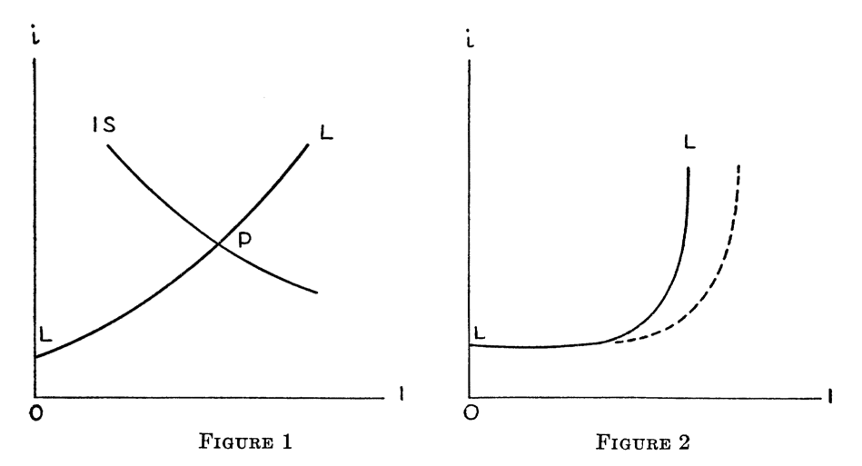

> This brings us to what, from many points of view, is the most important thing in Mr. Keynes' book. It is not only possible to show that a given supply of money determines a certain relation between Income and interest (which we have expressed by the curve LL); it is also possible to say something about the shape of the curve. It will probably tend to be nearly horizontal on the left, and nearly vertical on the right. This is because there is (1) some minimum below which the rate of interest is unlikely to go, and (though Mr. Keynes does not stress this) there is (2) a maximum to the level of income which can possibly be financed with a given amount of money. If we like we can think of the curve as approaching these limits asymptotically. If the supply of money is increased, the curve $LL$ moves to the right\...but the horizontal parts of the curve are almost the same. Therefore, again, it is this doldrum to the left of the diagram which upsets the classical theory.

For Hicks the General Theory of Employment is the Economics of Depression. Hicks also introduces a version where Investment $$I_{x}=C\left(i,I\right)$$ and equilibrium $$I_{x}=S\left(I,i\right)$$.

> As before, Income and interest are determined where the IS and LL curves intersect-where the investment rate of interest equals the money rate. Any change in the inducement to invest or the propensity to consume will shift the IS curve; any change in liquidity preference or monetary policy will shift the LL curve. If, as the result of such a change, the investment rate is raised above the money rate, Income will tend to rise; in the opposite case, Income will tend to fall; the extent to which Income rises or falls depends on the elasticities of the curve.
>
> If there is "full employment" in the sense that any rise in Income immediately calls forth a rise in money wage rates; then it is possible that the CC and SS curves may be moved to the right to exactly the same extent, so that IS is horizontal.
>
> However that may be, if IS is horizontal, we do have a perfectly Wicksellian construction, the investment rate becomes Wicksell's natural rate, for in this case it may be thought of as determined by real causes; if there is a perfectly elastic monetary system, and the money rate is fixed below the natural rate, there is cumulative inflation; cumulative deflation if it is fixed above.
>
> The General Theory of Employment is a useful book; but it is neither the beginning nor the end of Dynamic Economics

### Econometrics

Econometrics was regarded by its first practitioners as a creative synthesis of theory and evidence, with which almost anything and everything could, it seems, be achieved: new economic laws might be discovered and new economic theories developed, as well as old laws measured and existing theories put to the test. This optimism was based on an extraordinary faith in quantitative techniques and the belief that econometrics bore the hallmarks of a genuinely scientific form of applied economics. When econometrics emerged as a distinct activity at the beginning of the twentieth century, its use of statistical methods and data to measure and reveal the relationships of economic theory offered a form of investigation strikingly different from those of nineteenth-century economics, which ranged from the personal introspection and casual observation of classical economics to the detailed empiricism of historical economics. The applied economics of the twentieth century was to be based on a more modern technology: its tools were to be statistical methods, mathematical models and even mechanical calculators. With the appeal of this new technology, econometrics was to become firmly established by the 1940s, and the dominant form of applied economic science thereafter. What was it about the new methods that justified early twentieth-century econometricians' optimism about their approach? The answer lies in the ability of the new statistical methods to provide a substitute for the experimental method. The idea of a scientific or controlled experiment is to reproduce the conditions required by a theory and then to manipulate the relevant variables in order to take measurements of a particular scientific parameter or to test the theory. When the data are not collected under controlled conditions or are not from repeatable experiments, then the relationship between the data and the theoretical laws is likely to be neither direct nor clear-cut. This problem was not, of course, unique to economics; it arose in other social sciences and in natural sciences where controlled experiments were not possible. In this brief introduction to the history of econometric analysis we will focus on two important figures Ragnar Frisch (1895-1973) and Tryge Haavelmo, and only mention Jan Tinbergen. A remarkable aspect is that Frisch and Tinbergen were the first winner of the "Nobel" price in Economics in 1969. The fact that the first Nobel in Economics went to two econometricians is a symptom of the importance that econometrics had for economics. Maybe another interesting aspect is that we present their contributions through papers and not books.

#### Ragnar Frisch

Ragnar Frisch (1895-1973) was a pioneering figure in economics, particularly known for coining the term "econometrics" in 1926 and helping establish it as a new discipline bridging mathematics, statistics, and economics. Along with Joseph Schumpeter, Irving Fisher, and others, he founded the Econometric Society in 1930 and became the first editor of its journal, Econometrica, which he led from 1933 to 1955, with a wartime interruption when Oskar Lange served as acting editor.

His contributions to economic thought were diverse and significant. In consumer theory and production, he developed an axiomatic foundation for utility theory and wrote extensively on production theory, though his book "Theory of Production" wasn't published until 1965, by which time others had published similar works. His work on business cycle analysis was particularly influential, especially his 1933 paper "Propagation Problems and Impulse Problems in Dynamic Economics," which introduced a macroeconomic model that could generate business cycles through the interaction of random shocks and economic structure. This is the contribution we will focus below.

In econometric methods, Frisch emphasized the importance of unifying theoretical-quantitative and empirical-quantitative approaches in economics, insisting that economics should aspire to the rigor of natural sciences. From the 1920s onwards, he also worked extensively on developing systems of national accounts and input-output analysis, though in this area Wassily Leontief ultimately became more influential.

As mentioned above, in recognition of his contributions, Frisch, along with Jan Tinbergen, was awarded the first Nobel Prize in Economics in 1969. As a teacher, he modernized the economics program at the University of Oslo, emphasizing mathematical and statistical methods. In his later years, he became an advocate for economic planning and a critic of what he called "unenlightened financialism." 

Throughout his career, Frisch maintained that economics should be a quantitative science, though in his later years he warned against excessive formalization. His work was characterized by both theoretical rigor and a desire to make economics more empirically grounded and practically useful for policy-making. Some of his more ambitious projects, such as attempting to construct preference functions for politicians, never achieved practical success, revealing perhaps a degree of political naivety despite his technical brilliance. His influence on the field of economics extended far beyond his published works, largely through his tireless advocacy for econometric methods and his vision of economics as a tool for rational policy-making.

We will focus on Frisch fundamental contribution for the theory of business cycles which is a paper called Propagation problems and impulse problems in Dynamic Economics pubblished in 1933. In the paper, Frish builds a minimal dynamic macroeconomic model to explain the duration, frequency and size of business fluctuations. His objective is to propose a methodological framework more than a quantitative/empitical evaluation. He will be extremely successful in this objective as the conceptual framework is still the one we use today in business cycle macroeconomics in what concerns the distinction between propagation and impulse.

>  The majority of the economic oscillations which we encounter seem to be explained most plausibly as free oscillations. 
>
>  *If a cyclical variation is analysed from the point of view of a free oscillation, we have to distinguish between two fundamental problems: first, the* **propagation** *problem; second, the* **impulse** *problem. The propagation problem is the problem of explaining by the structural properties of the swinging system what the character of the swings would be in case the system was started in some initial situation.*
>
>  *This type of analysis is basically different from the kind of analysis that is represented by a system of Walrasian equations; indeed in such a system all the variables belong to the same point of time. In one respect, however, must the dynamic system be similar to the Walrasian: it must be* **determinate**.

Frisch explains the difference the difference between micro and macro economic (dynamic) analysis saying that in the former some parts of the system are given (an idea o partial equilibrium) while in the latter everything is taken into consideration which requires strong simpifying assumptions.[^fnfr1]

To lay down his model Frish presents a "Tableau Economique" in which he distringuishes stocks from flows and suggests what should be the contents of the minimal macroeconomic dynamic model.

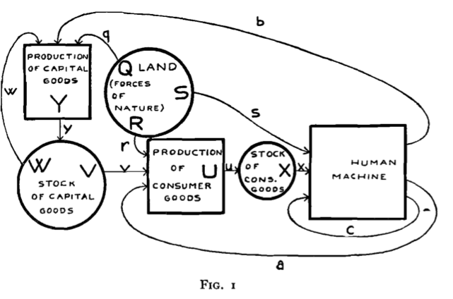

Firsh example toy-model is even simpler and focus on the sole stock of phisical capital to be able to present intelligibly what he sees as the necessary ingredients to construct a model able to exhibit fluctuations in the form of cycles. Capital goods are  used in the production of capital goods, $y$ and consumption goods $x$. This gives a law of motion for the capital stock $Z$.

>  We shall first consider the following case. Let us assume that the yearly consumption is equal to the yearly production of consumers' goods, so that there is no stock of consumers' goods. But let us take account of the stock of fixed capital goods as an essential element of the analysis. The depreciation on this capital stock will be made up by two terms: a term expressing the depreciation caused by the use of capital goods in the production of consumers' goods, and a term caused by the use of capital goods in the production of other capital goods.
>
>  If $h$ and $k$ are the depreciation coefficients in the capital producing industry and in the consumer goods industry respectively, the total yearly depreciation on the nation's capital stock will be $hx+ky$, where $x$ is the yearly production of consumers' goods and $y$ the yearly production of capital goods. Our assumption amounts to saying that $h$ and $k$ are technically given constants.
>
>  Let total capital stock be denoted $Z$. The rate of increase of this stock will obviously be
>  $$
>  \dot{Z}=y-\left(hx+ky\right)
>  $$
>  Since the stationary case is characterized by $\dot{Z}=0$, the stationary levels of $x$ and $y$ must obviously be connected by the relation $y=hx+ky$, i.e.
>  $$
>  y=mx
>  $$
>  where
>  $$
>  m=\frac{h}{1-k}
>  $$

Frisch then consider the fact that consumption goods can increase relative to the stationary state at a rate $\dot{x}$.

> Now let us consider the other factor that effects the annual capital production, namely, the change $\dot{x}$ the annual production of consumption goods.
>
> We are thus led to assume that the yearly production of capital goods can be expressed in a form where there occurs not only the term (2) but also a term that is proportional to $x$, i.e. $y$ will be of the form
> $$
> y=mx+\mu\dot{x}
> $$
> where $m$ and $\mu$ are constants. The constant $m$ expresses the wear and tear on capital goods caused directly and indirectly by the production of one unit of consumption, and $\mu$ expresses the size of capital stock that is needed directly and indirectly in order to produce one unit of consumption per year.

Now to close the model Frisch needs a consumption goods equation. He will borrow on Walras idea of the "encaisse désirée" which is not far from the modern idea of cash in advance.

> *In order to make the problem determinate we need to introduce an equation expressing the* **behaviour of the consumers**. We shall do this by introducing the Walrasian idea of an encaisse desiree.
>
> The encaisse desiree, **the need for cash on hand**, is made up of two parts: cash needed for the transaction of consumer goods and producer goods respectively. The first of these parts may of course always be written as a certain factor $r$ times the sale of consumer goods, and the second part as a certain factor $s$ times the production of capital goods, provided the factors $r$ and $s$ are properly defined. In other words, the encaisse desiree $\omega$ may be written 
>
> $$
> \omega=rx+sy
> $$

This cash on hands however cannot expand without limits and invoking a series of factors Frisch links the rate of consumption to the cash on hand with a negative relationship. 

> it seems plausible to assume that the encaisse desiree $\omega$ will enter into the picture as an important factor which, when increasing, will, after a certain point, tend to diminish the rate of increase of consumption. Assuming as a first approximation the relationship to be linear, we have
> $$
> \dot{x}=c-\lambda\omega
> $$
> where $c$ and $\lambda$ are positive constants. The constant $c$ expresses a tendency to maintain and perhaps expand consumption, while $\lambda$ expresses the reining-in effect of the encaisse desiree.

He can now solve for the consumption rate as a function of the level of comsumption and capital good $\dot{x}=c-\lambda(rx+sy)$. This model results in a first order differential equation and is thereore unable to create oscillations.

> Indeed, by eliminating $\dot{x}$ we get a linear relation between $x$ and $y$. \...we get a linear differential equation in a single variable. The characteristic equation is consequently of degree one, and has therefore only single real root. This means that the variables will develop monotonically as exponential functions. In other words, we shall have a secular trend but no oscillations. The system considered above is thus too simple to be able to explain the developments which we know from observation of the economic world.

How can we generalize the system to create cycles? Frish suggests several routes, Keynes' effective demand approach (notice this is before the pubblication of the General Theory), a debt deflation Fisher's approach a Marxian approach or Aftalion's approach which consist in the modern time to build notion.

> One idea would be to distinguish between saving and investment. The fact that, in an actual situation, there is a difference between these two factors will tend to produce a depression or an expansion. This is Keynes' point of view. It would be exceedingly interesting to see what sort of evolution would follow if such a set of hypotheses were subject to a truly dynamic and determinate analysis. 
>
> Another way of generalizing the set-up would be to introduce the fact that the existence of debts exerts a profound influence on the behaviour of both consumers and producers. This is the leading idea of Irving Fisher's approach to the business cycle problem.
>
> A third direction would be to introduce the Marxian idea of a bias  in the distribution of purchasing power. ...
>
> A fourth direction would be the introduction of Aftalion's point of view with regard to production. The essence of this consists in making a distinction between the quantity of capital goods whose production is *started* and the activity needed in order to *carry to completion* the production of those capital goods whose production was started at an earlier moment.  

This fourth approach is the one chosen by Frish.

> Let $y_{t}$ be the quantity of capital goods whose production is started at the point of time $t$. We shall call $y_{t}$ the "capital starting" or the "production starting," and we shall assume that this magnitude is determined by an equation of the form.... A capital object whose production is started at a certain moment will necessitate a certain production activity during the following time in order to complete the object. The productive activity needed in the period following the starting of the object will, as a rule, vary in a certain fashion which we may, as a first approximation, consider as given by the technical conditions of the production. Let $D_{\tau}$ *be the amount of production activity needed at the point of time* $t+T$ in order to carry on the production of a unit of capital goods started at the point of time $t$. The function $D_{\tau}$ we shall call the "advancement function."
>
> This being so, the amount of production work that will be going on at the moment $t$ will be
> $$
> z_{t}=\int_{\tau=0}^{\infty}D_{\tau}y_{t-\tau}d\tau
> $$
> The magnitude $z_{t}$ we shall call "the carry-on-activity" at the point of time $t$.
>
> In the formula of the encaisse desiree it is now $z$ that will occur instead of $y$, so that the consumption equation will be
> $$
> \dot{x}=c-\lambda\left(rx+sz\right)
> $$
> If the carry-on function $D_{\tau}$; is given, the above system may be solved\....As an example we shall assume 
> $$
> D_{\tau}=\begin{cases}
> 1/\epsilon & 0<\tau<\epsilon\\
> 0 & \tau>\epsilon
> \end{cases}
> $$
> where $\epsilon$ is a technical constant. In this case we get 
> $$
> \epsilon\dot{z}_{t}=y_{t}-y_{t-\epsilon}
> $$
> This is a mixed system of differential and difference equations.

Frish solves the system analytically but to study the properties of the solution he chooses numbers for the parameters, calibrating the model, to obtain solutions qualtitatively, and to some extent quantitatively,  consistent with stylized facts of the data.

> In order to study the nature of the solutions, I shall now insert for the structural coefficients $\epsilon,\mu,m$ , etc., numerical values that may in a rough way express the magnitudes which we would expect to find in actual economic life. **At present I am only guessing very roughly at these parameters, but I believe that it will be possible by appropriate statistical methods to obtain more exact information about them. I think, indeed, that the statistical determination of such structural parameters will be one of the main objectives of the  economic cycle analysis of the future.**

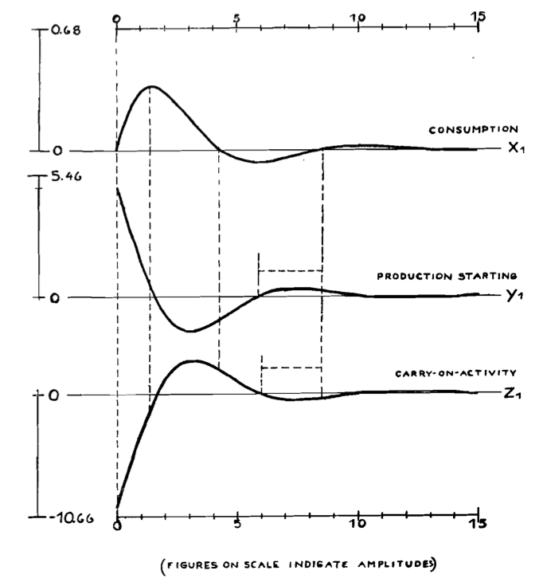

> The primary cycle of 8·57 years  corresponds nearly exactly to the well-known long business cycle.

Frish sees the deterministic model as a map to the propagation mechanism of the business cycle but he still needs to present a solution for the impulse. Here he proposes to introduces shocks to the model following Eugen Slutsky and Udny Yule approaches to time series. The final result he obtains is what we would call a moving average representation of the macroeconomic dynamic model. Frish does not try to gives an interpretation of the shocks but only of the linear weights. 

> There are several alternative ways in which one may approach the impulse problem and try to reconcile the results of the determinate dynamic analysis with the facts. One way which I believe is particularly fruitful and promising is to study what would become of the solution of a determinate dynamic system if it were exposed to a stream of erratic shocks that constantly upsets the continuous evolution, and by so doing introduces into the system the energy necessary to maintain the swings. 
>
> ...is suddenly changed from $\dot{y}_{k}$ to $\dot{y}_{k}+e_{k}$ where $e_{k}$ is the strength of the shock...
>
> If the point $t$ is very far from the initial point $t_{0}$\... the ordinate will be
> $$
> y(t)=\sum_{k=1}^{n}Q\left(t-t_{k}\right)e_{k}
> $$
> That is to say, $y(t)$ is the result of applying a linear operator to the shocks, and the system of weights in the operator will simply be given by the shape of the time curve that would have been the solution of the determinate dynamic system in case the movement had been allowed to go on undisturbed.

#### Tryge Haavelmo

Trygve Haavelmo's fundamental contribution to economics was providing the theoretical foundation for econometric modeling based on modern probability theory and statistical inference. The context for his work, as he explained in his Nobel Prize lecture, emerged from a significant problem in economics of the 1920s and 1930s: while there were "lots of deep thoughts," there was "a lack of quantitative results." Even when economic factors could be identified, measuring their influence remained challenging, especially when multiple factors worked in opposing directions.

A 'probabilistic revolution' occurred in econometrics with the publication of Trygve Haavelmo's 'The Probabilistic Approach in Econometrics' in 1944. It may seem strange that this 'revolution' should have been delayed until mid-century for, from the early days of the twentieth century, economists had been using statistical methods to measure and verify the relationships of economic theory. But, even though these early econometricians used statistical methods, they believed that probability theory was not applicable to economic data. Here lies the contradiction: the theoretical basis for statistical inference lies in probability theory and economists used statistical methods, yet they rejected probability. An examination of this paradox is essential in order to understand the revolutionary aspects of Haavelmo's work in econometrics. His seminal work addressed what he saw as a critical methodological flaw in economic research. As he explained in its preface, while economists were using statistical tools, they were rejecting the very foundation these tools were built upon: 

> it has been considered legitimate to use some of the tools developed in statistical theory without accepting the very foundation upon which statistical theory is built....
>
> ...no tool developed in the theory of statistics has any meaning—except, perhaps, for descriptive purposes—without being referred to some stochastic scheme.

Haavelmo challenged the prevailing view that probability schemes only applied to phenomena like lottery drawings or independent observations. Instead, he argued that "it is not necessary that the observations should be independent and that they should all follow the same one-dimensional probability law." He proposed treating a set of observations as "one observation of n variables following an n-dimensional joint probability law."

His approach to theoretical models was notably pragmatic. He viewed them not as hidden truths to be discovered but as "our own artificial inventions in a search for an understanding of real life." Moreover, he argued that theoretical models gain empirical meaning only when accompanied by some form of experiment: 

> when we set up a system of theoretical relationships and use economic names for the otherwise purely theoretical variables involved, we have in mind some actual experiment... which we could at least imagine arranging, in order to measure those quantities in real economic life.

Haavelmo argued that economic theories needed to represent statistical hypotheses to be properly tested. As he put it, 

> What we want are theories that, without involving us in direct logical contradictions, state that the observations will as a rule cluster in a limited subset of the set of all conceivable observations, while it is still consistent with the theory that an observation falls outside this subset 'now and then.

He saw probability theory as "the only scheme suitable for formulating such theories."

Here we present two concrete  constributions of Haveelmo presented in his 1943 Econometrica paper "The Statistical Implications of a System of Simultaneous Equations": the simlutaneity problem and the how to construct a valid joint distribution of  time series by bypassing the issue of time dependency.

> Measurement of parameters occurring in theoretical equation systems is one of the most important problems of econometrics. If our equations were exact in the observable economic variables involved, this problem would not be one of statistics, but a purely mathematical one of solving a certain system of "observational" equations, having the parameters in question as unknowns. This might itself present complicated and interesting problems, such as the problem of whether or not there is a one-to-one correspondence between each system of values of the parameters and the corresponding set of all values of the variables satisfying the equation system. For example, if we have, simultaneously, a demand curve and a supply curve, the set of possible observations might be just one single intersection point, and knowing that only would not, in general, permit us to draw any inference regarding the slope of either curve.
>
> Real statistical problems arise if the equations in question contain certain stochastical elements ("unexplained residuals"), in addition to the variables that are given or directly observable. And some such element must, in fact, be present in any equation which shall be applicable to actual observations (unless the equation in question is a trivial identity). In other words, if we consider a set of related economic variables, it is, in general, not possible to express any one of the variables as an exact function of the other variables only.
>
> For example, suppose that $X$ and $Y$ are two variables satisfying the following two stochastical relations
> $$
> Y=aX+\epsilon_{1}
> $$
>
> $$
> X=bY+\epsilon_{2}
> $$
>
> where $\epsilon_{1}$ and $\epsilon_{2}$ are assumed to be distributed random variables with variances $\sigma_{1}^{2}$ and $\sigma_{2}^{2}$ respectively. Then, from perhaps think that the expected value of  $Y$, given $X$, should be equal to $aX$. But if $\epsilon_{1}$ and $\epsilon_{2}$ are assumed to be independent, as assumed the statement $E\left(Y|X\right)=aX$ leads to a contradiction. This is seen as follows: $X$ and $Y$ are functions of $\epsilon_{1}$ and $\epsilon_{2}$, viz.,
> $$
> Y=\frac{\epsilon_{1}+a\epsilon_{2}}{1-ab}
> $$
>
> $$
> X=\frac{b\epsilon_{1}+\epsilon_{2}}{1-ab}.
> $$
>
> Therefore $X$ and $Y$ are jointly normally distributed with means equal to zero. If $\rho_{XY}$ be the correlation coefficient between $X$ and $Y$ and $\sigma_{X}^{2}$ and $\sigma_{Y}^{2}$ their variances, one obtains
> $$
> E\left(Y|X\right)=\frac{\sigma_{Y}}{\sigma_{X}}\rho_{XY}=\frac{b\sigma_{1}^{2}+a\sigma_{2}^{2}}{b\sigma_{1}^{2}+\sigma_{2}^{2}}X
> $$
> the right-hand side of which is, in generally different from $aX$.

> In a system of equations, involving certain specified (but not observable) stochastical variables, the observable variables involved may be considered as transformations of the specified stochastical ones . Therefore, the specification of the distribution of these theoretical variables permits us, usually, to calculate the joint distribution of the observable variables, or certain properties of this distribution. This joint distribution should be studied to clarify the stochastical relationship, which the equation system implies with respect to the observable variables.

Here an example of a macreconomic model presented in Haavelmo paper, but where I adopt a more intuitive notation. He handles the simultaneity and time dependency.
$$
\begin{aligned}
C_{t} & =\beta+\alpha Y_{t}+\epsilon_{t}\\
I_{t} & =\theta\left(C_{t}-C_{t-1}\right)+\eta_{t}\\
Y_{t} & =C_{t}+I_{t}\end{aligned}
$$
Substitute for $Y_{t}$ (identity) 
$$
\begin{aligned}
C_{t}\left(1-\alpha\right)-\alpha I_{t} & =\beta+\epsilon_{t}\\
-\theta C_{t}+I_{t} & =-\theta C_{t-1}+\eta_{t}\end{aligned}
$$
and write it into a system 
$$
\begin{bmatrix}1-\alpha & -\alpha\\
-\theta & 1\end{bmatrix}\begin{bmatrix}C_{t}\\
I_{t}\end{bmatrix}=\begin{bmatrix}\beta\\
0
\end{bmatrix}+\begin{bmatrix}0 & 0\\
-\theta & 0
\end{bmatrix}\begin{bmatrix}C_{t-1}\\
I_{t-1}
\end{bmatrix}+\begin{bmatrix}\epsilon_{t}\\
\eta_{t}
\end{bmatrix}
$$

$$
\Gamma_{0}X_{t}=C+\Gamma_{1}X_{t-1}+U_{t}
$$

where $U_{t}\sim N\left(0,D\right)$ and assume further: 1) that $U_{t}$ is independent of $U_{\tau}$ for $t\neq\tau$ and 2) that $U_{t}$ is independent of $X_{\tau}$ for all $t$ and $\tau$. To obtain the likelihood in a  dynamic setting, the starting point is to have the joint probability distribution of $f_{X^{T}}(X^{T};\psi)$ where $X^{T}=X_{T},X_{T-1},..,X_{0}$ is the all sample , $\psi$ are the parameters, and treat is as the likelihood to be maximized. In dynamic settings the marginalization of the joint probability distribution of the data is essential to overcome the time interdependence between the observations. Start by the distribution of the first observation to be $f_{X_{0}}(X_{0};\psi)$ (in a stationary environment think of the unconditional distribution) then consider writing the joint distribution of the first and second observation as the production of the conditional distribution and the marginal distribution:
$$
\begin{aligned}
 f_{X_{1}}(X_{1},X_{0};\psi) & =f_{X_{1}|X_{0}}\left(X_{1}|X_{0};\psi\right)f_{X_{0}}(X_{0};\psi)\end{aligned}
$$
you can do that for the whole sample and get
$$
f_{X^{T}}(X^{T};\psi)=f_{X_{0}}(X_{0};\psi)\prod_{t=1}^{T}f_{X_{t}|X_{t-1}}\left(X_{t}|X_{t-1};\psi\right)
$$
or in logs
$$
L(\psi)=log\left(f_{X_{0}}(X_{0};\psi)\right)+\sum_{t=1}^{T}log\left(f_{X_{t}|X_{t-1}}\left(X_{t}|X_{t-1};\psi\right)\right)
$$
Now using the above model.
$$
\begin{aligned}
L(\psi) & =-\left(Tn/2\right)+\left(T/2\right)log\left|\Gamma_{0}\right|^{2}-\left(T/2\right)log\left|D\right|\\
& -0.5\sum_{t=1}^{T}\left[\left(\Gamma_{0}X_{t}-C-\Gamma_{1}X_{t-1}\right)'D^{-1}\left(\Gamma_{0}X_{t}-C-\Gamma_{1}X_{t-1}\right)\right]\end{aligned}
$$
and find the parameters by maximizing it (can use the reduced form if exactly identified, order and rank condition). Haavelmo adds in his 1944 paper:

> The patient reader, now at the end of our analysis, might well be left with the feeling that the approach we have outlined, although simple in point of principle, in most cases would involve a tremendous amount of work. He might remark, sarcastically, that it would take him a lifetime to obtain one single demand elasticity. And he might be inclined to wonder: Is it worth while? Can we not get along, for practical purposes, by the usual short-cut methods, by graphical curve- fitting, or by making fair guesses combining our general experiences with the inference that appears reasonable from the particular data at hand? In other quantitative sciences the discovery of laws, even in highly specialized fields, has moved from the private study into huge scientific laboratories where scores of experts are engaged, not only in carrying out actual measurements, but also in working out, with painstaking precision, the form ulae t ments to be made. Should we expect less in economic research, if its results are to be the basis for economic policy upon which might depend billions of dollars of national income and the general economic welfare of millions of people?

## PART IV: Formalizations and advances: 1920's-1960's

#### Frank Ramsey

Frank Ramsey belongs to this course for his two contributions in economics are today the backbone of optimal taxation analysis and optimal consumption saving behaviour in macroeconomics. Both appeared in the Economic Journal, then edited by J.M. Keynes. The first, ‘A Contribution to the Theory of Taxation’, published in 1927, laid the foundation for the modern theory of commodity taxation. The second is ‘A Mathematical Theory of Saving’, published in 1928 laid the foundation of modern dynamic macroeconomics.

##### Optimal taxation - Public Finance

Frank Ramsey's brilliant 1927 paper ‘A contribution to the theory of taxation’, is a landmark in the economics of public finance. Nearly a half century later, through the work of Diamond and Mirrlees (1971) and Mirrlees (1971), his paper can be thought of as launching the field of optimal taxation and revolutionising public finance. Here, he addresses a question which he says was posed to him by A. C. Pigou: given that commodity taxes are distortionary, what is the best way of raising revenues, i.e. what is the set of taxes to raise a given revenue which maximises utility. The answer is now commonly referred to as Ramsey taxes. The basic insight was that taxes should be set so as to reduce the consumption of each good (along its compensated demand curve) equi-proportionately.  Ramsey showed that efficient taxation required imposing a complete array of taxes – not just a single tax. A large number of small distortions, carefully constructed, is better than a single large distortion.

> The problem I propose to tackle is this: a given revenue is to be raised by proportionate taxes on some or all uses of income, the taxes of different uses being possibly at different rates: how should these rates being adjusted in order that the decrement of utility may be minimum?

> We denote $u=F\left(x_{1}...x_{n}\right)$ the net utility of producing and consuming (or saving) these quantities of commodities. Suppose taxes are levied on the different commodities at a rate $\lambda_{1},\lambda_{2},..,\lambda_{n}$ per unit in money whose marginal utility is unity.

> I.e., u is to be maximum subject to $\sum\lambda_{r}x_{r}=R$ (where $\lambda_{r}$ is $\frac{\partial u}{\partial x_{r}}$ )...and so we have
> $$
> \begin{aligned}
> \frac{\lambda_{1}}{\sum_{s}x_{s}\frac{\partial\lambda_{s}}{\partial x_{s}}} & =\frac{\lambda_{2}}{\sum_{s}x_{s}\frac{\partial\lambda_{s}}{\partial x_{d}}}=...=\frac{\lambda_{n}}{\sum_{s}x_{s}\frac{\partial\lambda_{s}}{\partial x_{n}}}\\
> & =\frac{R}{\sum_{r}\sum_{s}\frac{\partial\lambda_{s}}{\partial x_{d}}x_{r}x_{s}}=-\theta	\space (say)
> \end{aligned}
> $$
> i.e the production of each commodity should be diminished in the same proportion.

Ramsey presents his first result in a very general case which makes the reader struggling to immediately absorb his result. Intuitively his approach is to solve for the tax rates that maximize welfare subject to the constraints that all agents, consumers and firms, are behaving optimally.  Here is a one good simplified version that partially summarizes his reasoning. First define the net utility of a consumer/worker as
$$
U\left(x,m\right)-V\left(l\right)
$$
where $x$ is the good, $m$ is money and $l$  labor. Consider also the production side where for simplicity you can think of a the worker producing itself using a technology
$$
x=f\left(l\right)
$$
then define $$l=f^{-1}\left(x\right)\equiv g\left(x\right)$$. The cost minimization for the consumer/worker/producer gives the following labor demand:
$$
wg'(x)=p
$$
where $p$ is the price and $w$ is the money labor cost . The optimal decision of consumption and labor supply of the consumer/worker/producer is found by maximizing 
$$
u\left(x,m\right)=U\left(x\right)-V\left(g\left(x\right)\right)
$$
subject to $m+\left(px+\Lambda(x)	\right)=wg(x)$, where $p$ is the price, $\Lambda$ is the tax payment and $wg(x)$  labor revenues. The optimal condition is therefore
$$
U_x\left(x,m\right)-V'\left(g(x)\right)=\mu \left(p+\lambda	-wg'(x)\right) \\
U_m\left(x,m\right)=\mu= 1\ \ (assumption)
$$
where $\lambda$ is the derivative of $\Lambda$ which using the optimal labor demand condition and the definition of $u$ reduces to
$$
u'(x)=\lambda(x).
$$
Notice that if the tax is zero $u'(x)=0$  so the tax decrease the quantity in equilibrium.  Now we have the allocation in equilibrium with all the optimality conditions respected and we can turn to the question of optimal taxation. This is obtained by maximizing the utility subject to a given revenue collected by the tax
$$
max\ u(x)\\
s.t.\\ R=\lambda(x) x
$$
The Lagrangian of the maximization problem is $L=u\left(x\right)-K\left(R-\lambda\left(x\right)x\right)$  where $u'(x)=\lambda(x)$ and the first order condition $u'\left(x\right)=-K\left(\lambda\left(x\right)+x\frac{\partial\lambda}{\partial x}\right)$ or
$$
\frac{u'\left(x\right)}{xu''\left(x\right)}=-\frac{K}{(1+K)}=-\theta
$$
Ramsey expressions are for multiple goods, and this is the crucial part of the result, namely that all the decrease in the goods due to the constraint of raising $R$ with taxes on the goods needs to decrease their production proportionally (the same equation will hold for the other goods). Ramsey presents other results an especially important one is (in the case of ad valorem taxes)[^fnram2]

> We can now consider the more general problem: a given revenue is to be raised by means of fixed taxes $\mu_{1}...\mu_{n}$ on $m$ commodities and by taxes to be chosen at discretion on the remainder. 

> First suppose that all commodities are independent and have their own supply an demand equations....hence if we denote by $\rho_r$ and $\epsilon_r$ the elasticities of demand and supply...
> $$
> \mu_{r}=\frac{\left(\frac{1}{\epsilon_{r}}+\frac{1}{\rho_{r}}\right)\theta}{1-\frac{\theta}{\rho_{r}}}
> $$
> For infinitesimal taxes 
> $$
> \frac{\mu_{1}}{\frac{1}{\epsilon_{1}}+\frac{1}{\rho_{1}}}=...\frac{\mu_{n}}{\frac{1}{\epsilon_{n}}+\frac{1}{\rho_{n}}}
> $$
> i.e. the tax ad valorem on each commodity should be proportional to the sum of the reciprocals of its supply and demand elasticities...If any one commodity is absolutely inelastic, either for supply or for demand, the whole of the revenue should be collected off it.

##### Optimal saving - Macroeconomics

In his second paper Ramsey asked how much of its income should a nation save and derived a remarkably simple rule, usually known as the Keynes-Ramsey rule, as Keynes provided a non-technical argument for the result. Ramsey’s formulation of the problem served as a model for almost all subsequent studies of optimal economic growth. He assumed a one good world, in which labour with a stock of capital would produce a flow of output, part of which was consumed, and the balance was saved and thereby added to the stock of capital. The objective,
or criterion, was to achieve the maximum level of enjoyment, summing over all time, where enjoyment was the utility of consumption, $U(C)$, less disutility of working, $V(L)$. He assumed that there was no population growth, no technical progress, and no discounting of utility, ‘a practice which is ethically indefensible and arises merely from the weakness of the imagination’

> *The first problem I propose to tackle is this:* **how much of its income should a nation save?**...
>
> The rate of saving multiplied by the marginal utility of money should always be equal to the amount by which the total net rate of enjoyment of utility falls short of the maximum possible rate of enjoyment.
>
> ...various simplifying assumptions: we have to suppose that our community goes on for ever without changing either in numbers or in its capacity for enjoyment or on its aversion to labour; can be calculated...and added...no new invention...
>
> *...it is assumed that* **we do not discount later enjoyments in comparison with earlier ones, a practice which is ethically indefensible and arises merely from the weakness of the imagination**; we shall however in Section II include such a rate of discount in some of our investigations.

He further supposed that there was a ‘maximum obtainable rate of enjoyment’ called Bliss, B, either because of capital or consumption saturation. As neither population grows nor future utilities are discounted, Ramsey then argues, rather informally, that it must be desirable to save enough to eventually reach bliss, or approximate to it indefinitely. To stop short means forgoing a finite amount of utility, which, summed over an infinite time horizon, is infinitely costly.

> Let us then denote by $x(t)$ and $a(t)$ the total rates of consumption and labour of our community and by $c(t)$ it capital at time $t$. Its income is taken to be a general function of the amount of labour and capital, and will be called $f(a,c)$;\...
> $$
> \frac{dc}{dt}+x=f\left(a,c\right)
> $$

>  Now let us denote by $U(x)$ the total rate of consumption $x$, and by  $V(a)$ the total rate of disutility of a rate of labour $a$; and the corresponding marginal rates we will call $u(x)$ and $v(a)$; The first of these comes from equating the marginal disutility of labour at any time to the product of the marginal efficiency of labour by the marginal utility of consumption at that time
>  $$
>  v(a)=\frac{\partial f}{\partial a}u(x)
>  $$

>  The second equates the advantage of an increment $\Delta x$ of consumption at time $t$, to that derived by postponing it for an infinitesimal period $\Delta t$, which will increase its amount to $\Delta x\left(1+\frac{\partial f}{\partial c}\Delta t\right)$since $\frac{\partial f}{\partial c}$ gives the rate of interest earned by waiting. This gives
>  $$
>  u\left\{x(t)\right\}=\left\{1+\frac{\partial f}{\partial c}\Delta t\right\}u\left\{x\left(t+\Delta t\right)\right\}
>  $$
>
>
>  or in the limit
>  $$
>  \frac{d}{dt}u\left(x\left(t\right)\right)=-\frac{\partial f}{\partial c}.u\left(x\left(t\right)\right)
>  $$
>  This equation means that $u(x)$, the marginal utility of consumption, falls at a proportionate rate given by the rate of interest. 

This last equation implies that accumulation occurs until the marginal utility of consumption or the marginal productivity of capital vanishes. To make the solution determinate he introduces the bliss point $B$ and propose an easier route to find the solution.[^frams3]

In addition to this contribution, the paper also contained various remarkable extensions. It considers the choice of savings rate for an individual facing constant factor prices, who wishes to optimize his lifetime consumption pattern,
and as such provides a positive theory of lifecycle savings. It shows that if utility is to be discounted, then it must be discounted at a constant rate if one is to escape the contradiction ‘that successive generations are motivated by the same system of preferences’. Finally, Ramsey shows that if a society consists of individuals who differ in their rate of discount, and if it is in steady state, then the equilibrium would be attained by a division of society into two classes, the thrifty enjoying bliss and the improvident at the subsistence level. In short, he characterizes the long-run general equilibrium of a society of heterogeneous individuals. [^frams4]

> In assuming the rate of discount constant\....$\rho$\...
> $$
> \frac{d}{dt}u\left(x\left(t\right)\right)=-u\left(x\left(t\right)\right)\left\{ \frac{\partial f}{\partial c}-\rho\right\}
> $$
> Then in a state of equilibrium there will be no saving and
> $$
> \frac{\partial f}{\partial c}=\rho
> $$

> ...different people discount future utility at different rates, and, quite apart from the time factor, are not so interested in their heirs as in themselves.

Frank Ramsey's 1928 paper "A Mathematical Theory of Saving" stands as a remarkable achievement in economic theory, particularly considering he wrote it at just 25 years of age. What makes this work particularly extraordinary is how it anticipated several major theoretical developments that wouldn't emerge until decades later. These include the foundations of optimal growth theory (later developed by Cass and Koopmans in the 1960s), the permanent income/life cycle theory of consumption, and the overlapping generations model. 

Perhaps most striking about Ramsey's contribution is how many of his insights remained dormant in the literature for so long, only to be independently rediscovered by later economists. For instance, the concepts he developed preceded Friedman's permanent income hypothesis and Modigliani's life cycle model by some 30 years, and his discussion of wealth inequality based on different discount rates among individuals foreshadowed much later work in that field. Tragically, Ramsey died at just 27 years old, having published only two economics papers. Yet these two works - this one and his 1927 paper on taxation - opened up entire new fields of economic research. Today, the Ramsey-Cass-Koopmans model stands as a cornerstone of macroeconomics, though Ramsey's original insights went far beyond just optimal growth theory, demonstrating a breadth of vision that was truly ahead of its time.

#### Paul Samuelson

Paul Samuelson emerged as arguably the most influential mainstream economist in the three decades following World War II. His seminal work, "Foundations of Economic Analysis" (1947), fundamentally shaped how economic theory would be conducted in the post-war period.

The Foundations evolved between 1936 and 1941, driven by what Samuelson saw as "economic puzzles" that needed solving. Taking physics as his ideal model and embracing a positivistic philosophy of science, Samuelson aimed to provide a unified mathematical treatment of diverse economic fields. He famously reversed Marshall's cautionary stance against mathematical translations of economic doctrines, believing instead that mathematics was an essential language for economics. However Samuelson maintained a balanced perspective, demonstrating how mathematical approaches have enhanced economic understanding while being mindful of their constraints. This balance reflects his broader contribution to economics: bringing mathematical rigor to the field while keeping sight of its practical applications and limitations. He argued that mathematical symbolism forced economists to explicitly state their premises, making economic reasoning more rigorous and transparent. This mathematical approach, combined with his emphasis on empirically meaningful results, helped establish a new standard for economic theorizing that would influence the discipline for decades to come.

His work rested on two fundamental pillars. The first was the principle of maximization, applicable to microeconomic problems like consumer behavior and firm theory. The second was what he called the "correspondence principle," which established a connection between comparative statics and dynamics, stating that the hypothesis of dynamic stability could help answer comparative equilibrium questions.

In the Foundations, Samuelson structured his analysis into two main parts. The first part, comprising 70% of the book, focused on comparative statics, covering topics like maximizing behavior, cost and production theory, consumer behavior, and welfare economics. The second part addressed dynamics, including equilibrium stability and dynamical theory. His treatment of consumer and firm theory, while similar to Hicks's work in "Value and Capital," was developed independently.

A key innovation was his approach to comparative statics, where he showed how economic systems could be analysed through parameters and variables connected by equilibrium conditions. He emphasized that "meaningful theorems" should be hypotheses about empirical data that could potentially be refuted under ideal conditions.

In welfare economics, Samuelson built upon Abram Bergson's work, developing a generalized welfare function to clarify Pareto optimality and Adam Smith's "invisible hand" doctrine. 

 Samuelson made fundamental contributions to nearly all branches of economic theory: consumer theory and welfare, capital theory, dynamics and general equilibrium, international trade, finance, and macroeconomics.  He was the 1970 recipient of the Nobel Prize in Economic Science (remember from Part III that the first prize was awarded in 1969 to Jan Tinbergen and Ragnar Frisch); excerpts from the citation read:

>  By his many contributions, Samuelson has done more than any other contemporary economist to raise the level of scientific analysis in economic theory. . . . He has rewritten considerable parts of central economic theory, and has in several areas achieved results which now rank among the classical theorems of economics.

Samuelson's steady stream of output is not only astounding in quantity, but also always stimulating and often seminal, if not entirely new.

##### Welfare Economics

His most cited work is "The pure theory of public expenditure" (1954). In this paper "The Pure Theory of Public Expenditure," Samuelson develops a ground-breaking theoretical framework for understanding public goods and government expenditure. He begins by distinguishing between two types of goods: private consumption goods that can be divided among individuals, and collective consumption goods (public goods) that everyone can enjoy simultaneously without diminishing others' consumption. The paper establishes the mathematical conditions for optimal provision of these public goods, building on but going beyond the earlier work of economists like Wicksell.

A key insight of the paper is that while private goods can be efficiently allocated through decentralized market pricing, public goods present a fundamental problem that makes market solutions impossible. Specifically, individuals have an incentive to understate their true preferences for public goods (what would later be called the "free-rider problem"), making it impossible to reach optimal provision through voluntary market mechanisms. This means that even with perfect knowledge of preferences, no decentralized pricing system can efficiently provide public goods - some form of collective decision-making is required. Samuelson concludes by noting that this moves us from pure economics into the domain of "welfare politics," suggesting that public finance necessarily involves political as well as economic considerations. This paper laid the theoretical foundation for modern understanding of public goods and helped establish public economics as a distinct field.

> 1. Assumptions. 
>
> ...Therefore, I explicitly assume two categories of goods: ordinary private consumption goods $\left(X_1,...,X_n\right)$ which can be parcelled out among different individuals $\left(1,2,...,i,...,s\right)$ ...and collective consumption goods $\left(X_{n+1},...,X_{n+m}\right)$ which all enjoy in common in the sense that each individual's consumption of such good leads to no subtraction from any other individual's consumption of that good...
>
> ...I assume each individual has a consistent set of ordinal preferences with respect to his consumption of all goods which can be summarized by a regularly smooth and convex utility index $u^i=u^i\left(X_1^i,...,X_{n+m}^i\right)$...
>
> ...I assume a regularly convex and smooth production-possibility schedule relating total of all outputs, private and collective, or $F\left(X_1,...,X_{n+m}\right)=0$, with $F_j>0$ and ratios $F_j/F_n$ Determinates and subject to the generalized laws of diminishing returns.
>
> If we wish to make normative judgements concerning the relative ethical desirability of different configurations...we must be presented ... with a social welfare function...It is not a "scientific" task of the economist to "deduce" the form of this function;...$U=U\left(u^1,...,u^s\right)$ with $U_j>0$.
>
> 2. Optimal Conditions
>
> In terms of these norme, there is a "best state of the world"
> $$
> \frac{u_j^i}{u_r^i}=\frac{F_j}{F_r} \space \space \space \space  (1)  \\
> \sum_{i=1}^s\frac{u_{n+j}^i}{u_r^i} = \frac{F_{n+j}}{F_r}\space \space \space \space (2) \\
> \frac{U_iu^i_q}{U_qu^q_k}=1 \space \space \space \space (3)
> $$
> ...Alone (1) represents  that subit of relations whoch devines the Pareto-optimal utility frontière and which by itself represents what I regard as the unnecessarily narrow version of what once was called the "new welfare economics". 
>
> The new element added here is the set (2), which constitutes a pure theory of government expenditure on collective consumption goods.
>
> 3. Impossibility of decentralized spontaneous solution.
>
> ...it is well known that an "analogue calculating machine" can be provided by competitive market pricing, (a) ...production functions satisfy ...constant returns to scale and generalized diminishing returns and (b) ...indifference contour have regular convexity...(3) ...all goods are private. We can...
> $$
> p_1X_1^i+p_2X_2^i+...+p_nX_n^i=L^i
> $$
> where $L^i$ is a lump-sum tax for each individual so selected in algebraic value as to lead to the "best" state of the world...
>
> Now all the above remains valid if collective consumption is not zero but is instead explicitely set at its optimum values determined by (1), (2) and (3). However no decentralized pricing system can serve to determine optimally these levels of collective consumption.

##### Overlapping Generation model

The second most cited paper of Samuelson is "An exact consumption-loan model of interest without the social contrivance of money" (1958). In this paper he introduces the Overlapping Generation Model (although Allais had done it in French in 1947), the general equilibrium determination of the interest rate in an exchange economy, the possibility of having non optimal solutions in a decentralized dynamic competitive economy and the role of social arrangements such as social security or money in permitting to achieve optimality in such decentralized economy. Samuelson starts by presenting an economy where the usual assumptions behind an interest rate (Bohm's assumptions) are not present: no subjective discount rate, no technology progress and no storability.

> Let us assume that men enter the labor market at about the age of twenty. They work for forty-five years or so and then live for fifteen years in retirement. (As children they are part of their parent's consumptions,...)...
>
> Break each life up to thirds: men produce one unit of product in period 1 and one unit in period 2; in period 3 they retire and produce nothing...
>
> I suppose that each man's tastes can be summarizedby an ordinal utility function of the three période of his life: $U\left(C_1,C_2,C_3\right)$.
>
> ...nothing is said about whether, subjectively, men systematically discount future consumptions...we are not supposing that society is getting more prosperous as time passes...no storage...
>
> Under these assumptions, what will be the equilibrium path of interest rates ? 
>
> ...Let $R_t=1/(1+i_t)$ ....the price of tomorrow's chocolates in terms of today's chocolates...
>
> We seek the equilibrium levels of $R_t,R_{t+1},...$ that will clear the competitive markets in which future goods exchange against each other.
>
> The simplest case to tackle to answer this question is that of a stationary population...births are given by $B_t=B$ ...
>
> Subject to this constraint he will, for each given $R_t$ and $R_{t+1}$ determine the optimal $\left (C_1,C_2,C_3\right)$ to maximize $U\left(C_1,C_2,C_3\right)$...I shall work with ... "net saving" ($S$)
> $$
> S_1\left(R_t,R_{t+1}\right)+R_tS_2\left(R_t,R_{t+1}\right)+R_tR_{t+1}S_3\left(R_t,R_{t+1}\right)=0
> $$
> ...the fundamental equilibrium condition
> $$
> 0=B_tS_1\left(R_t,R_{t+1}\right)+B_{t-1}S_2\left(R_{t-1},R_{t}\right)+B_{t-2}S_3\left(R_{t-2},R_{t-1}\right)
> $$
> for every $t$.
>
> 

> Now $B_t=\left(1+m\right)^t$...
>
> Theorem: Every geometrically growing consumption-loan economy has an equilibrium market rate of interest exactly equal to its biological percentage growth rate.

The model examines a simplified economy where people live for three periods - two productive working periods followed by retirement - with no durable goods or physical capital that can be stored. The paper shows that in this pure consumption-loan economy without money, the competitive market leads to inefficient outcomes with negative interest rates, rather than achieving the "biological" optimal interest rate that equals the population growth rate.

The paper then demonstrates how the introduction of money as a social contrivance can help achieve the socially optimal outcome. By serving as a store of value, money enables intergenerational transfers that can support retiree consumption and achieve the biological interest rate. However, this requires an ongoing social compact where each generation accepts money as valuable, pointing to the importance of social institutions beyond pure market mechanisms. The paper concludes by suggesting that money's role as a store of value may be less about maintaining stable prices and more about facilitating optimal lifetime consumption patterns that would otherwise require more explicit social security arrangements. This work laid important theoretical foundations for understanding monetary economics, social security, and intergenerational transfers.

##### Neoclassical Synthesis

Another important contribution of Samuelson is in Macroeconomics and consists in pushing forward what has come to be known as the neoclassical synthesis. Tobin describes the neoclassical synthesis as Samuelson’s greatest contribution to macroeconomics. We will look at this aspect and its influence when we address the contributions of Solow and Modigliani.

#### Robert Solow

Robert Solow received the Nobel prize in 1987 for his research on growth theory. The two seminal contributions occurred in 1956 and 1957: ‘A contribution to the theory of economic growth’, Quarterly Journal of Economics (1956), and ‘Technical change and the aggregate production function’, Review of Economics
and Statistics (1957). These two papers, which introduced what came to be called ‘the Solow model’ and ‘the Solow residual’, respectively, are still, almost 50 years later, among the most widely cited papers in all of economics. Next, in a 1960 a paper titled ‘Investment and technical progress’, Solow introduced the important  idea that new technology might have to be ‘embodied’ in new capital. In collaboration with Arrow, Hollis Chenery, and B. S. Minhas, he invented the constant-elasticity-of-substitution (CES) production function in their paper ‘Capital-labor substitution and economic efficiency’ (1961). He also found time to collaborate with Samuelson in bringing the Phillips curve to America.

##### Economic Growth

Why is the Solow model so important in the history of economic thought? Solow had long been interested in production theory and viewed factor proportions – at least at the aggregate level – as more variable than fixed. So he proposed making just one change in the Harrod–Domar model: replacing the fixed-coefficients technology that we saw when we analysed the classics  by a more conventional neoclassical production function. 

The neoclassical production function with factor substitution introduced by Solow in a growth model was revolutionary because it resolved a critical limitation of the Harrod-Domar model's fixed-coefficient production function. In the Harrod-Domar framework, capital and labor had to be used in fixed proportions, which created a precarious "knife-edge" balance for stable growth - any deviation from the required saving rate or labor force growth rate would lead to either perpetual unemployment or perpetual excess capacity. Solow's introduction of smooth factor substitution through a continuous, twice-differentiable production function with diminishing returns transformed this rigid framework by allowing the economy to adjust its capital-labor ratio in response to changes in factor prices. This flexibility meant that if labor became relatively abundant, firms could shift to more labor-intensive production techniques, and vice versa if capital became relatively abundant. The ability to substitute between factors provided an automatic stabilizing mechanism that helped ensure convergence to a stable growth path, regardless of the saving rate or labor force growth rate. This not only made the model more realistic but also provided a theoretical foundation for understanding how economies could maintain balanced growth despite varying factor endowments and macroeconomic conditions.

> All theory depends on assumptions which are not quite true. That is what makes it theory...When the results of a theory seem to flow specifically from a special crucial assumption, then if the assumption is dubious, the results are suspect.
>
> ...this fundamental opposition of warranted and natural rates turns out in the end to flow from the crucial assumption that production takes place under conditions of fixed proportions...One usually thinks of the long run as the domain of the neoclassical analysis, the land of the margin.

The model Solow presented is therefore the Harrod-Domar model with a production function that allow substitution between capital and labor:

>There is only one commodity, output as a whole, whose rate of production is designated $Y(t)$...The fraction of output saved is a constant $s$, so that the rate of saving is $sY(t)$...
>
>Net investment is then just the rate of increase of this capital stock...
>$$
>\dot{K}=sY
>$$
>Output is produced with the help of two factors of production capital and labor, whose rate of input is $L(t)$...
>$$
>Y=F\left(K,L\right)
>$$
>...we proceed more in the spirit of the Harrod model. As a result of exogenous population growth the labor force increases at a constant relative rate $n$...Thus
>$$
>L(t)=L_0e^{nt}
>$$
>..to get
>$$
>\dot{K}=sF\left(K,L_0e^{nt}\right)
>$$
>we have the basic equation which determines the time path of capital accumulation that must be followed if all available labor is to be employed.

Having laid down the model Solow then shows that there is always a capital accumulation path consistent with $n$. He introduces $r=\frac{K}{L}$ the capital labor ratio and transforms the previous equation in per capita

> ...and dividing out the common factor we arrive finally at
> $$
> \dot{r}=sF(r,1)-nr
> $$

and shows the stability of the system, contrary to the fixed coefficient of Harrod and Domar, in the famous figure which belong to every introductory macroeconomics textbook

> The basic conclusion of this analysis is that, when production takes place under the usual neoclassical conditions of variable proportions and constant returns to scale, no simple opposition between natural and warranted rates of growth is possible. There may not be -in fact in the case of the Cobb-Douglas function there never can be - any knife-edge. The system can adjust to any given rate of growth of the labor force, and eventually approach a state of steady proportional expansion.

He then present several extensions the most famous one is the introduction of neutral technological change $Y=A(t)F(K,L)$ (he does it using a Cobb-Douglas). He also considers a variable saving rate, a labor supply that depends on the real wage and briefly study more Keynesian version with rigid wage.  But the Solow model accomplished more. Contrary  to what had been common intuition until 1956 the model shows that the economy’s growth rate ($n$ in this case, or
$n + g$ with exogenous technical progress) is independent of its saving rate $s$. How can that be true when, in the model, saving is the same as investment? The answer, which was surprising at the time but is now a commonplace, is that a society’s propensity to save affects its level of output, as shown but not its steady-state growth rate.

##### The Solow Residual

Solow's second paper picked up on the diminishing returns point. It had two main purposes: to verify that, as an empirical matter, returns to capital are in fact diminishing; and to estimate the relative contributions of technological progress
and capital deepening to growth.

> If $Q$ represents output and $K$ and $L$ represent capital and labor inputs in "physical" units, then the aggregate production function can be written as...special form
> $$
> Q=A(t)f\left(K,L\right)
> $$
> and the multiplicative factor $A (t)$ measures the cumulated effect of shifts over time. Differentiate totally with respect to time and divide by Q and one obtains
> $$
> \frac{\dot{Q}}{Q}=\frac{\dot{A}}{A}+Af_K\frac{\dot{K}}{Q}+Af_L\frac{\dot{L}}{Q}
> $$
>
> Where dots indicate time derivatives. Now define $w_k=\frac{\partial Q}{K}\frac{K}{Q}$ and $w_L=\frac{\partial Q}{L}\frac{L}{Q}$ the relative shares of capital and labor...we might just as well assume the conclusion, namely that F is homogeneous of degree one...Let $Q/L=q$, $K/L=k$...
> $$
> \frac{\dot{q}}{q}=\frac{\dot{A}}{A}+w_K\frac{\dot{k}}{k}
> $$
> Now all we need to disentangle the technical change index $A(t)$ are series for output per man hour, capital per man hour, and the share of capital.

Solow (and those who have followed in his tradition) solved the previous equation for the residual , $\frac{\dot{A}}{A}$, that will take Solow name given that all the other terms are measurable. Doing so for the years 1909–1949 led Solow to the conclusion that only about one-eighth of the advance of $q$  over those 40 years could be attributed to capital deepening, leaving about seven-eighths to ‘the residual’. This surprising (at the time) conclusion has, of course, changed numerically over the years as Solow’s technique was refined and replicated on newer data. But the qualitative finding that technological change is far more important than capital deepening has held up extremely well.

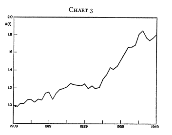

What about the shape of the aggregate production function (9)? Does it really display the curvature implied by diminishing returns? By using his synthetic time series on $A(t)$, it was a simple matter of arithmetic to compute a time series on $f(k)$ and then to inspect the shape.

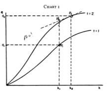

Eyeballing the scatter plot gave Solow ‘an inescapable impression of curvature, of persistent but not violent diminishing returns’.

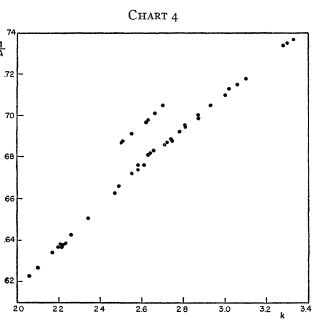

##### The Neoclassical Synthesis

The term ‘neoclassical synthesis’ appears to have been coined by Paul Samuelson to denote the consensus view of macroeconomics which emerged in the mid 1950s in the United States. Unlike the old neoclassical economics, the new synthesis did not expect full employment to occur under laissez-faire; it believed, however, that, by proper use of monetary and fiscal policy, the old classical truths would come back into relevance. Because prices and wages eventually adjusted to clear markets, and because policy could avoid prolonged disequilibrium anyway, macroeconomic research could progress along two separate lines. One could study long-run movements in output, employment and capital, ignoring business cycle fluctuations as epiphenomena along the path and using the standard tools of equilibrium analysis: ‘Solving the vital problems of monetary and fiscal policy by the tools of income analysis will validate and bring back into relevance the classical verities’ . Or one could instead study short-run fluctuations around that trend, ignoring the trend itself. This is indeed where most of the breakthroughs had been made by the mid-1950s.  Perhaps the most notorious component of the neoclassical synthesis is the 1960 Samuelson–Solow ‘Analytic aspects of anti-inflation policy’, which presents a United States Phillips curve. The paper discusses the difficulties of distinguishing cost–push from demand–pull inflation. Samuelson and Solow then plot the scatter of percentage changes in average hourly earnings in manufacturing against the unemployment rate (the years plotted are not specified, but include the Thirties). The discussion that follows considers alternative points on the Phillips curve as policy choices for the next few years. But the authors warn explicitly that the discussion is short-term, and that it would be wrong to think that the menu of choices represented by the Phillips curve "will maintain its same shape in the longer run. . .".

> It is no wonder then that economists have been debating the possible causations involved in inflation: demand-pull versus cost-push; wage-push versus more general Lerner "seller's inflation"; and the new Charles Schultze theory of "demand-shift" inflation...
>
> Consider also the question of the relation between money wage changes and the degree of unemployment. We have A. W. Phillips' interesting paper on the U. K. history since the Civil War.
>
> ...the period 1861-1913, during which the trade-union movement was rather weak, shows a fairly close relationship between the percent change in wage rates and the fraction of the labor force unemployed...A Closer Look at the American Data. 
>
> 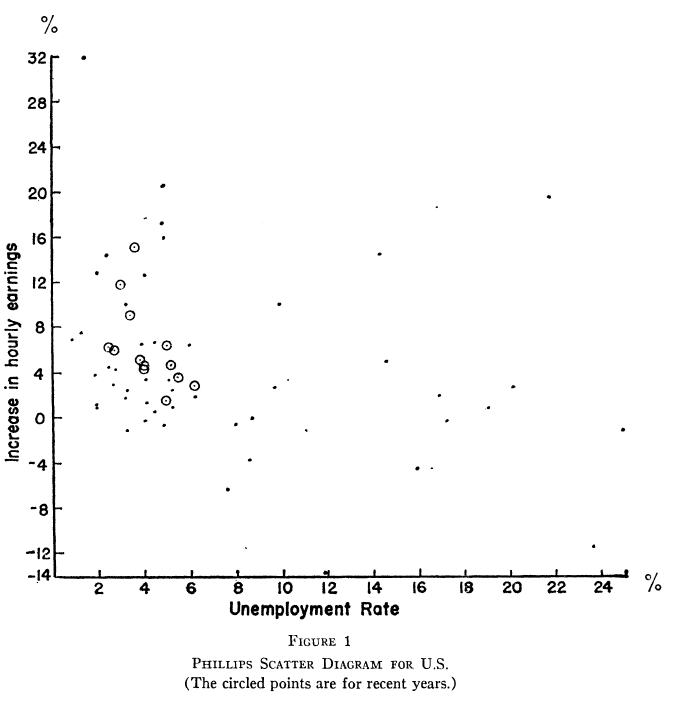
>
> ...Wage rates do tend to rise when the labor market is tight, and the tighter the faster. What is most interesting is the strong suggestion that the relation, such as it is, has shifted upward slightly but noticeably in the forties and fifties...
>
> 1. In order to have wages increase at no more than the 2.2 per cent per annum characteristic of our productivity growth, the American economy would seem on the basis of twentieth-century and postwar ex- perience to have to undergo something like 5 to 6 per cent of the civilian labor force's being unemployed. That much unemployment would appear to be the cost of price stability in the years immediately ahead.
> 2. In order to achieve the nonperfectionist's goal of high enough output to give us no more than 3 per cent unemployment, the price index might have to rise by as much as 4 to 5 per cent per year. That much price rise would seem to be the necessary cost of high employment and production in the years immediately ahead.
>
> ...All of our discussion has been phrased in short-run terms, dealing with what might happen in the next few years. It would be wrong, though, to think that our Figure 2 menu that relates obtainable price and unemployment behavior will maintain its same shape in the longer run. What we do in a policy way during the next few years might cause it to shift in a definite way...

The neoclassical synthesis approach to Macroeconomics became at that time the dominant paradigm. It consisted in using Keynesian based macro policies to steer the economy along the Phillips Curve and use structural reforms for improving the allocation efficiency in the Long Run. The short run approach was supported by large macro econometrics models developed by Laurence Klein, Franco Modigliani and others. Yet the short run approach would quickly came under scrutiny and challenged by monetarists and later "new neoclassical" economists.

#### Franco Modigliani

Franco Modigliani entered economics in 1939 during the Keynesian revolution, becoming one of the champions of the "new gospel." He would later win the Nobel Prize in 1985 for his pioneering studies of saving and financial markets, though as Samuelson noted, he "could have been a multiple Nobel winner" given the breadth of his contributions.

##### Liquidity Preference

His first major contribution came in 1944 with "Liquidity Preference and the Theory of Interest and Money," which sought to integrate Keynesian and classical monetary theory. The paper provided a mathematical system of nine simultaneous equations that became the standard interpretation of Keynes's General Theory, particularly in the United States. Modigliani's key insight was showing that unemployment equilibrium resulted primarily from wage rigidity rather than liquidity preference. This work set the foundation for the "neoclassical synthesis" that would dominate economic thinking for the next three decades. The objective of the article was:

> to reconsider critically some of the most important old and recent theories of the rate of interest and money and to formulate, eventually, a more general theory that will take into account the vital contributions of each analysis as well as the part played by different basic hypotheses.
>
> ...the only rigorous procedure is to set up a complete "Walrasian" system and to determine the equilibrium prices and quantities of each good: but this system is cumbersome and not well suited to an essentially literary exposition such as we intend to develop here. The alternative is to work with a reduced system:...
>
> $$M=L(r,Y)$$
>
> $$I=I(r,Y)$$
>
> $$S=S(r,Y)$$
>
> $$Y\equiv{PX}$$
>
> $$X=X(N)$$
>
> $$W=X'(N)P$$
>
> $$C\equiv{Y-I}$$

Then he adds the equation relating the wage rate and the supply of labor—unlike Hicks (1937) who assumed exogenous fixed nominal wages, Modigliani explicitly introduces the labor market. This equation, Modigliani writes, “takes a substantially different form in the ‘Keynesian’ system as compared with the ‘classical’ systems” . Under the classical hypothesis the last equation of the system takes the form: $$N=F(W/P)$$ or in inverse form: $$W=F^{-1}(N)P$$.

In the Keynesian system, Modigliani writes, “the supply of labor is assumed to be perfectly elastic at the historically ruling wage rate, say $w_0$ ”...The Keynesian form is: $$W=\alpha w_0+\beta	F^{-1}(N)P$$ where $\alpha$ and $\beta$ are: $\alpha=1,\beta=0, for N\leq{N_0}$ or $\alpha=0,\beta=1, for N\ge{N_0}$ where $\N_0$ is said to be full employment.

> Equations and inequalities  thus state that, unless there is "full employment" ($N=N_0$), the wage rate is not really a variable of the system but a datum, a result of "history" or of "economic policy" or of both. 

He then analysis in depth the demand for money separating transactions and portfolio decisions.

> Since we have maintained throughout this paper that, in general, saving and lending are independent decisions, we must clearly agree that the "daily" rate of interest is determined by the demand for and supply of money to hold...
>
> Thus, to complete our theory, we must be able to explain what determines the level of long-run equilibrium. At this point we find that our answer is not unique since it depends on the assumptions concerning the form of the supply-of-labor schedule.
>
> I. As long as wages are flexible, the long-run equilibrium rate of interest is determined exclusively by real factors...
>
> II. If wages are rigid it is still true that the long-run equilibrium rate of interest is determined by the propensities to save and to invest but the situation is now more complicated;...
>
> III. Finally our theory of the rate of interest becomes even less uniform when we take into account the "Keynesian case....

##### Life Cycle

His second major contribution was the development of the Life-Cycle Hypothesis of saving, initially formulated with his student Richard Brumberg in the early 1950s. This work challenged Keynes's view that the saving-income ratio would rise with aggregate income. Instead, Modigliani and Brumberg argued that saving patterns were essentially tied to individuals' life cycles, with people saving to provide for retirement and accommodate variations in income over their lifetimes. They maintained that the proportion of income saved was fundamentally independent of income level, departing from Keynes's position that higher incomes led to higher saving rates.

##### The Theory of Corporate Finance

The third major contribution came in corporate finance through his collaboration with Merton Miller. Their work in 1958 produced what became known as the Modigliani-Miller theorems, which established two fundamental "irrelevance propositions": first, that a firm's market value is independent of its financial structure (the mix of debt and equity financing), and second, that market value is independent of dividend policy. These insights, published in "The Cost of Capital, Corporation Finance and the Theory of Investment," overturned conventional wisdom about corporate financing and became cornerstones of modern finance theory.

Modigliani's work also had practical applications. In the late 1960s, he developed an econometric model of the U.S. economy for the Federal Reserve, working with Albert Ando to create what became known as the FMP (Federal Reserve-MIT-University of Pennsylvania) Model. This model incorporated many of his theoretical insights and was used by the Federal Reserve for policy-making and forecasting.

Throughout his career, Modigliani showed a remarkable ability to combine theoretical innovation with practical applicability. His work consistently challenged existing paradigms while offering new frameworks that better explained economic behavior. Whether in macroeconomics, consumption theory, or corporate finance, his contributions fundamentally reshaped how economists thought about these areas, establishing theoretical foundations that continue to influence economic thinking today.

#### Milton Friedman

Milton Friedman (1912-2006) received the Nobel prize in 1977 and is widely regarded as a very important economist of the 20th century. He is famous for his rehabilitation of money as a major determinant of macroeconomic outcomes. 

##### The permanent Income Hypothesis

For many academic economists, "A Theory of the Consumption Function" (1957) is his greatest work. Friedman showed that the Keynesian concept of household behaviour was fundamentally flawed (Franco Modigliani did the same in independent work we mentioned above) , arguing that people adjusted their consumption to variations in their long-term expected (‘permanent’) income.   One  important proposition that emerged from Keynes’s General Theory  was that households expanded their consumption spending by an amount less than the increase in their current income, and that this relationship was sufficiently stable to form the basis for the multiplier through which an increase in autonomous expenditure at the macro level generated a considerably larger increase in real aggregate demand. Friedman building on Irving Fisher theory challenges the Keynesian consumption function.  

> Keynes took it for granted that current consumption expenditure is a highly dependable and stable function of current income...that the amount of aggregate consumption mainly depends on the amount of aggregate income (both measured in terms of wage units). He termed it a fundamental psychological rule of any modern community that, when its real income is increased, it will not increase its consumption by an equal absolute amount.
>
> 
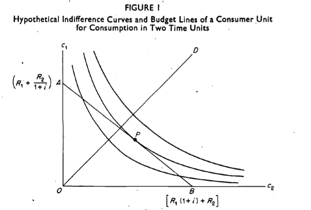

>
> Let $R_{1}$ and $R_{2}$ be the consumer unit's expected receipts in year 1 and 2 respectively, and $i$ the interest rate. The maximum amount the unit can spend in year 1 if it spends nothing in year 2 is  $R_{1}+[R_{2}/(1+i)]$, that is, its receipts in year 1 plus the maximum loan it can repay with its receipts in year 2. The maximum amount it can spend in year 2 if it spends nothing in year 1 is $R_{1}(1+i)+R_{2}$\...
>
> Changes in $R_{1}$ and $R_{2}$ affect consumption in year 1 only  through their effect on what we may term the consumer unit's wealth in year 1, or
> $$
> W_{1}=R_{1}+\frac{R_{2}}{1+i}.
> $$
>
> One way, already suggested, is to take $W_{1}$ and $i$ as the two variables and to write the consumption function as
> $$
> c_{1}=f\left(W_{1},i\right).
> $$
> savings are then given by
> $$
> s_{1}=R_{1}-c_{1}=R_{1}-f\left(W_{1},i\right)
> $$
>
> The designation of current receipts as income in statistical studies is an expedient enforced by limitations of data\...In the simple example considered here, $W_{1}$ is the consumer unit's wealth in year 1 and $iW_{1}$, its income in this sense for year 1.
>
> Let us use the terms **permanent income** and permanent consumption to refer to the concepts relevant to the theoretical analysis, so as to avoid confusion with the frequent usage of income as synonymous with current receipts\...For indifference curves satisfying these assumptions, the consumption function defined by (2.4) assumes a particularly simple form, namely, 
> $$
> c_{p,1}=k\left(i,u\right)y_{p,1}=k\left(i,u\right)iW_{1}
> $$
> where the function has been written so that it can be regarded as applying to an indefinitely long horizon, and not to two years. While $k$ does not depend on the level of wealth or permanent income; it obviously does depend on the interest rate. It also depends on any factors that determine the shape of the indifference curves, symbolized in (2.5) by the variable $u$ (for utility factors).
>
> The introduction of **uncertainty adds a new reason for holding wealth** to the two motives present under certainty---straightening out the consumption stream and earning interest. This new motive is the availability of a **reserve for emergencies**---for unexpectedly low receipts, on the one hand, or unexpectedly high levels of consumption on the other\...This effect of uncertainty therefore, like the other, establishes no presumption against the form assigned to the consumption function in (2.5). It requires only that the ratio of nonhuman wealth to income be included as a variable determining $k$, the ratio of consumption to permanent income
> $$
> c_{p}=k\left(i,w,u\right)y_{p}=k\left(i,w,u\right)iW
> $$
> where $w$ stands for the ratio of nonhuman wealth to permanent income\...
>
> **Aggregate consumption depends therefore not only on the precise form of equation (2.6) but also on the distribution of consumer units by these variables**\....Then aggregate consumption is
> $$
> c_{p}^{*}=\int\int\int\int f\left(i,w,u,y_{p}\right)k\left(i,w,u\right)y_{p}didwdudy_{p}
> $$
> The magnitudes termed permanent income and permanent consumption that play such a critical role in the theoretical analysis cannot be observed directly for any individual consumer unit. The most that can be observed are actual receipts and expenditures during some finite period, supplemented, perhaps, by some verbal statements about expectations for the future. The theoretical constructs are ex ante magnitudes; the empirical data are ex post. Yet **in order to use the must be established between the theoretical constructs and the observed magnitudes.**
>
> **But even when they are carried as far as is at all feasible, the resulting magnitudes, interpreted as estimates of permanent income and permanent consumption, are not consistent with equation** (2.6)...We are thus driven either to reject equation (2.6), which is what earlier workers have done, or to resort to more indirect means of establishing a correspondence between the theoretical constructs and the observed magnitudes, which is what I propose to do; One indirect means is to use evidence for other time periods and other consumer units to interpret data for one consumer unit for one period.
>
> *In its most general form our hypothesis about, the consumption function, which we shall hereafter refer to as the permanent income hypothesis, is given by the three equations*
> $$
> c_{p}=k\left(i,w,u\right)y_{p}
> $$
>
> $$
> y=y_{p}+y_{t}
> $$
>
> $$
> c=c_{p}+c_{t}
> $$
>
> $$
> \rho_{y_{t}y_{p}}=\rho_{c_{t}c_{p}}=\rho_{y_{t}c_{t}}=0
> $$
>
> *Suppose we have observations on consumption and income for a number of consumer units, for all of whom the* k *of equation (2.6) can be taken to be numerically the same. Let us proceed, as is usually done in family budget studies, to estimate from these data a relation between consumption and income. For simplicity, let the relation to be estimated be linear, say:*  $$c=\alpha+\beta y$$
>
> \...The least squares estimates of $\alpha$ and $\beta$ (call these $a$ and $b$)\...are 
> $$
> b=\frac{\sum\left(c-\bar{c}\right)\left(y-\bar{y}\right)}{\sum\left(y-\bar{y}\right)^{2}}
> $$
>
> $$
> a=\bar{c}-b\bar{y}
> $$
>
> $$
> b=k\frac{\sum\left(y_{p}-\bar{y}_{p}\right)^{2}}{\sum\left(y-\bar{y}\right)^{2}}=kP_{y}
> $$
>
> *...Our hypothesis gives a major role to certain features of the income distribution generally neglected in consumption studies.* **It asserts' that some of the most strikingly uniform characteristics of computed regressions between consumption and income are simply a reflection of the inadequacy of measured income as an indicator of long-run income status.** *In consequence, differences among various groups of consumer units in observed marginal propensities to consume may not reflect differences in underlying preferences for consumption and wealth at all; they may reflect primarily the different strength of random forces, including errors of measurement, in determining measured income.*

---

##### Simplified PIH

In the PIH that we saw in the first part $C=Y^{P}$. Now current income $Y=Y^{T}+Y^{P}$. It is fair to assume that $Y^{T}$ has mean zero and is uncorrelated with $Y^{P}$. Consider now the regression $$C_{i}=a+bY_{i}+e_{i}$$

using our assumptions we have that $b_{OLS}=\frac{Cov(Y,C)}{Var(Y)}=\frac{Var(Y^{P})}{Var(Y^{P})+Var(Y^{T})}$

$a_{OLS}=\bar{C}-b_{OLS}\bar{Y}=(1-b_{OLS})Y^{P}$

---

##### The Natural rate of Unemployment

Another line of disagreement with the neoclassical synthesis was the Phillips Curve. In his presidential address to the American Economic Association, Friedman showed that the view of macroeconomic policy as a trade-off between unemployment and inflation was fundamentally flawed (1968). In the long run there was no such trade-off, while in the short run the trade-off took place only during the adjustment to the new inflationary environment, and then only because people were temporarily surprised by the new environment.

> Professional controversy about the relation between inflation and unemployment has been intertwined with controversy about the relative role of monetary, fiscal, and other factors in influencing aggregate demand. One issue deals with how a change in aggregate nominal demand, however produced, works itself out through changes in employment and price levels...
>
> ...The first stage was the acceptance of a hypothesis associated with the name of **A. W. Phillips (1958)** that there is **a stable negative relation between the level of unemployment and the rate of change of wages**---high levels of unemployment being accompanied by falling wages, low levels of unemployment by rising wages. The wage change in turn was linked to price change by allowing for the secular increase in productivity and treating the excess of price over wage cost as given by a roughly constant markup factor.
>
> 

>
> ...This relation was widely interpreted as a causal relation that offered a stable trade-off to policymakers. They could choose a low unemployment target, such as $U_L$. In that case they would have to accept an inflation rate of A.
>
> Unfortunately for this hypothesis, additional evidence failed to conform with it.
>
> The phenomenon of simultaneous high inflation and high unemployment increasingly forced itself on public and professional notice, receiving the unlovely label of "stagflation."
>
> Some of us were skeptical from the outset about the validity of a stable Phillips curve, primarily on theoretical rather than empirical grounds (Friedman 1966a, 1966b, 1968a, 1968b). What mattered for employment, we argued, was not wages in dollars or pounds or kronor but real wages...
>
> 

>
> *..we (in particular, E. S. Phelps [1967, 1970] and myself [1968b]) developed an alternative hypothesis that distinguished between the short-run and long-run effects of unanticipated changes in aggregate nominal demand..This alternative hypothesis is depicted in figure 2. Each negatively sloping curve is a Phillips curve like that in figure 1 except that it is for a particular anticipated or perceived rate of inflation, defined as the perceived average rate of price change, not the average of perceived rates of individual price change (the order of the curves would be reversed for the second concept). Start from point E and let the rate of inflation for whatever reason move from* A *to* B *and stay there. Unemployment would initially decline to* $U_L$ at point *F*, moving along the curve defined for an anticipated rate of inflation $[(1/P)(dP/dt)]$ of A. As anticipations adjusted, the short-run curve would move upward, ultimately to the curve defined for an anticipated inflation rate of B. Concurrently unemployment would move gradually over from F *to* G.
>
> what matters is not inflation per se but **unanticipated inflation**; there is no stable trade-off between inflation and unemployment; there is a **"natural rate of unemployment" ($U_N$)** which is consistent with the real forces and with accurate perceptions.
>
> The "natural rate of unemployment," a term I introduced to parallel Knut Wicksell's "natural rate of interest," is not a numerical constant but depends on "real" as opposed to monetary factors---the effectiveness of the labor market, the extent of competition or monopoly, the barriers or encouragements to working in various occupations, and so on.
>
> Much current economic research is devoted to exploring various aspects of this second stage---the dynamics of the process, the formation of expectations, and the kind of systematic policy, if any, that can have a predictable effect on real magnitudes. We can expect rapid progress on these issues. (Special mention should be made of the work on "rational expectations," especially the seminal contributions of John Muth, Robert Lucas, and Thomas Sargent; see Muth [1961], Gordon [1976].)

Throughout the 1960s the trade-off between unemployment and inflation appeared more and more illusory. Unemployment went up but inflation did not go down; it also increased. Into the 1970s and particularly during the great inflationary recession of 1974/75, when both inflation and unemployment reached new highs in most Organisation for Economic Co-operation and Development (OECD) countries, it appeared that only Friedman’s view made any sense. Like Keynes’s General Theory, it was one of the very few contributions that changed both the approach of professional economists and the policies adopted by finance ministers.

## Part V: The mathematization of Economics

#### John Von Neumann

#### Kenneth Arrow	

## References  

- Antoine Augustin Cournot (1838). (English version 1897) Researches into the Mathematical Principles of the Theory of Wealth. Macmillan.
- Edgeworth, Francis Ysidro. 1881. Mathematical psychics; an essay on the application of mathematics to the moral sciences. London: C.K. Paul.
- Marshall, Alfred. Principles of Economics (1890) ; an Introductory Volume. London :Macmillan, 1920.
- Knut Wicksell 1934 Lectures on Political Economy, Volume I-II: General Theory.
- Knut Wicksell 1898 Interest and Prices, Translation published by the Royal Economic Society, London, 1936.
- J.R. Hicks,  MR. Keynes and the "Classics" A suggested Interpretation, Econometrica Vol.5 No.2 1937
- Ragnar Frisch 1933 Propagation problems and impulse problems in Dynamic Economics.
- Tryge Haavelmo 1943 The Statistical Implications of a System of Simultaneous Equations
- Tryge Haavelmo 1944 The Probability Approach in Econometrics Econometrica.
 - John Maynard Keynes 1936 The General Theory of Employment, Interest and Money.
- Irwing Fisher, The Theory of Interest Rate 1930
- Irving Fisher, The Debt-Deflation Theory of Great Depressions, Econometrica , Oct., 1933, Vol. 1, No. 4 (Oct., 1933), pp. 337-357
- Sandmo, Agnar. (2011). Economics evolving : a history of economic thought. Princeton, N.J : Princeton University Press.
- Pareto, Vilfredo, 1896 Manual of Political Economy: A Critical and Variorum Edition," OUP Catalogue, 2014 Oxford University Press, edited by Montesano, Aldo & Zanni, Alberto & Bruni, Luigino & Chipman, John S. & McLure, Michael.
- Stanley Jevons The Theory of Political Economy (London: Macmillan, 1888) 3rd ed
- Screpanti, Ernesto & Zamagni, Stefano, 1995. "An Outline of the History of Economic Thought," OUP Catalogue, Oxford University Press
- Economics evolving : a history of economic thought.  Princeton, N.J :  Princeton University Press.
- Friedman, Milton (1957). A Theory of Consumption Function. Princeton University Press
- Friedman, Milton. 1968. “The Role of Monetary Policy” American Economic Review 58(1): 1-17
- Frank Ramsey. A contribution to the theory of taxation Economic Journal 37: 47–61. 1927
- Frank Ramsey. A mathematical theory of saving. Economic Journal 38: 543–549. 1928
- Modigliani, Franco. “Liquidity Preference and the Theory of Interest and Money.” *Econometrica*, vol. 12, no. 1, 1944, pp. 45–88. 
- Samuelson, Paul A. “The Pure Theory of Public Expenditure.” The Review of Economics and Statistics, vol. 36, no. 4, 1954, pp. 387–89
- Samuelson, Paul A. “An Exact Consumption-Loan Model of Interest with or without the Social Contrivance of Money.” Journal of Political Economy, vol. 66, no. 6, 1958, pp. 467–82.
- Samuelson, Paul A., and Robert M. Solow. “Analytical Aspects of Anti-Inflation Policy.” The American Economic Review, vol. 50, no. 2, 1960, pp. 177–94
- Solow, Robert M. (February 1956). "A contribution to the theory of economic growth". Quarterly Journal of Economics.
- Solow, Robert M. (1957). "Technical change and the aggregate production function". Review of Economics and Statistics.
- Heilbroner, R. L. (1996). Teachings from the worldly philosophy. New York, W.W. Norton.
- Marx, K., & Engels, F. (1867,1884,1895). Capital; a critique of political economy. New York, International Publishers.
- Mill, J.S. (1848) "Principles of Political Economy with some of their Applications to Social Philosophy"
- Screpanti, Ernesto & Zamagni, Stefano, 1995. "An Outline of the History of Economic Thought," OUP Catalogue, Oxford University Press
- Sandmo, Agnar.  (2011).  Economics evolving : a history of economic thought.  Princeton, N.J :  Princeton University Press.
- P.A. Samuelson “A Corrected Version of Hume’s Equilibrating Mechanism for International Trade.” In Flexible Exchange Rates and the Balance of Payments: Essays in Memory of Egon Sohmen, John S. Chipman and Charles P. Kindleberger, 141–158. Amsterdam: North- Holland, 1980.
- P.A. Samuelson “The Canonical Classical Model of Political Economy.” Journal of Economic Literature 16, no. 4 (1978): 1415–1434.
- Ricardo, David (1817), On the Principles of Political Economy and Taxation (1 ed.), London: John Murray 
- Smith, Adam, (1776), An Inquiry into the Nature and Causes of the Wealth of Nations, McMaster University Archive for the History of Economic Thought. **

